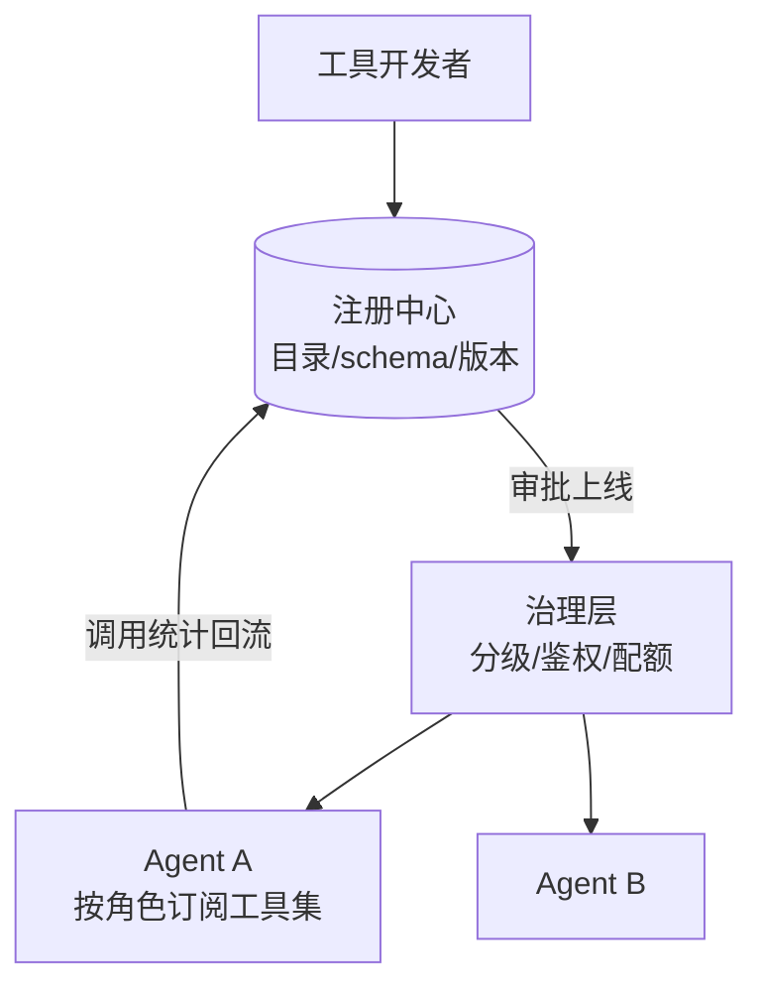

# 工具注册中心

> **一句话**：工具注册中心是 Agent 的「能力目录」：统一注册、版本管理、鉴权注入、健康检查与使用统计——工具一多，这里就是治理枢纽。

## 先看结论

- 注册中心管五件事：目录（有哪些工具）、schema（怎么调）、鉴权（谁能调）、健康（可用性）、用量（谁在用、用多少）
- 工具即版本化资产：schema 变更走 review + 回归，破坏性变更升 major 版本
- MCP 把「注册」分布化了，但企业仍需一层「内部目录」：审批、分级、统计
- 描述质量要监控：工具选择错误率高的工具，先修 description 而不是换模型

## 核心机制

### 1. 为什么需要中心：选择准确率随工具数下降

工具注册不是「建个数组」，而是把工具当**可治理资产**。原因在 [工具选择与路由](../07-planning/tool-selection-routing.md) 已经说明：模型的选择准确率随可见工具数上升而下降，且每个 schema 都在每一轮占用上下文。注册中心是唯一能同时掌握「有哪些工具、谁在用、效果如何」的地方。

$$
\text{治理能力}=\text{目录完整性}\times\text{元数据质量}\times\text{用量可见性}
$$

缺任何一项，工具面就会随团队扩张而腐烂：重复工具、无人维护工具、过时 schema 混在一起，模型选择准确率自然下滑。

### 2. 注册中心管五件事

| 职责 | 具体内容 | 不做会怎样 |
|---|---|---|
| 目录 | 有哪些工具、归属哪个域 | 重复与影子工具 |
| Schema | 参数定义、版本 | 调用失败率上升 |
| 鉴权 | 哪个 Agent/租户能调 | 越权调用 |
| 健康 | 可用性、超时、错误率 | 死工具被反复调用 |
| 用量 | 调用量、成功率、成本 | 无法判断去留与优化 |

**用量数据是决策依据**：某工具调用量高但成功率低 → 优先修它的 description 或实现；90 天零调用 → 下线，别让模型的选择面持续腐烂。

### 3. 版本化：把 schema 当 API 契约

工具 schema 就是对外契约，应遵守与 API 相同的版本纪律：

$$
\text{schema 变更}\;\Longrightarrow\;
\begin{cases}
\text{兼容变更（加可选字段）} & \text{升 minor，跑回归}\\
\text{破坏变更（改必填/删字段）} & \text{升 major，通知订阅方}
\end{cases}
$$

破坏性变更必须走回归，且回归集应包含「工具选择正确率」用例——因为**改一句 description 就可能让某条路径的选择率骤降**。

## 注册中心架构



## 注册表最小实现

```python
TOOLS = {}

def tool(name, description, schema, risk="low", version="1.0.0"):
    def deco(fn):
        TOOLS[name] = {"fn": fn, "description": description,
                       "schema": schema, "risk": risk, "version": version}
        return fn
    return deco

@tool("refund", "对订单执行退款", {...}, risk="high")
async def refund(order_id: str, amount: float):
    ...   # 注册时声明风险级 → 执行管道按级走审批
```

关键点：**风险级在注册时声明**，执行管道据此决定是否审批。这样「治理策略」与「工具实现」解耦——新增工具不需要改执行层代码（见 [权限控制与沙箱隔离](../10-evaluation-safety/permission-sandbox.md)）。

## 源码案例

- **DeepSeek Harness：作用域注册表**（[仓库](https://github.com/deepseek-ai/deepseek-harness)）：工具注册按 Agent 作用域隔离，执行走受控管道；工具 schema 在每步 `preStep` 动态组装进请求——「注册 → 治理 → 注入」三层清晰分层
- **Claude Code 的工具治理面**（逆向分析，[架构深拆](https://gist.github.com/yanchuk/0c47dd351c2805236e44ec3935e9095d)）：内置工具 + MCP 工具统一进权限管道；工具延迟加载由注册层控制「模型可见性」；工具变更直接影响上下文预算——**工具注册即上下文工程**
- **OpenAI Agents SDK**（[文档](https://openai.github.io/openai-agents-python/)）：装饰器自动从函数签名与 docstring 生成 schema——注册体验的标杆，docstring 即工具描述

## 最佳实践

- 每个工具带元数据：owner、risk 级、SLA、用量上限
- schema 变更走 CI 回归：跑「工具选择正确率」评估集
- 死工具清理：90 天零调用的工具下线或归档
- 目录外工具视为「影子权限」：MCP 接入的工具同样要进分级与统计

## 常见误区

- ❌ 工具注册 = 建个数组：没有版本与统计的工具面无法治理，出了问题不知道谁的锅
- ❌ 鉴权写死在工具代码里：鉴权策略要可配置（按 Agent/租户），否则每接一个新 Agent 就要改一遍工具代码
- ❌ MCP 接入绕过治理：第三方 Server 的工具同样要进分级与统计
- ❌ 只看调用量不看成功率：高频低成功率的工具是最该优先修的
- ❌ 不做版本管理：破坏性 schema 变更会静默打断所有调用方

## 小练习

盘点你项目的全部工具：做成注册表（名称/owner/风险级/版本/月调用量/成功率），找出三个「无主」工具并决定去留，再指出哪一个最该先修 description。

## 参考资料

- [Anthropic: Writing effective tools for agents](https://www.anthropic.com/engineering/writing-tools-for-agents)
- [OpenAI Agents SDK 文档](https://openai.github.io/openai-agents-python/)
- [Tool Use](../05-tool-protocol/tool-use.md) / [MCP](../05-tool-protocol/mcp.md)

## 相关知识点

- [Tool Use](../05-tool-protocol/tool-use.md)
- [MCP](../05-tool-protocol/mcp.md)
- [工具选择与路由](../07-planning/tool-selection-routing.md)
