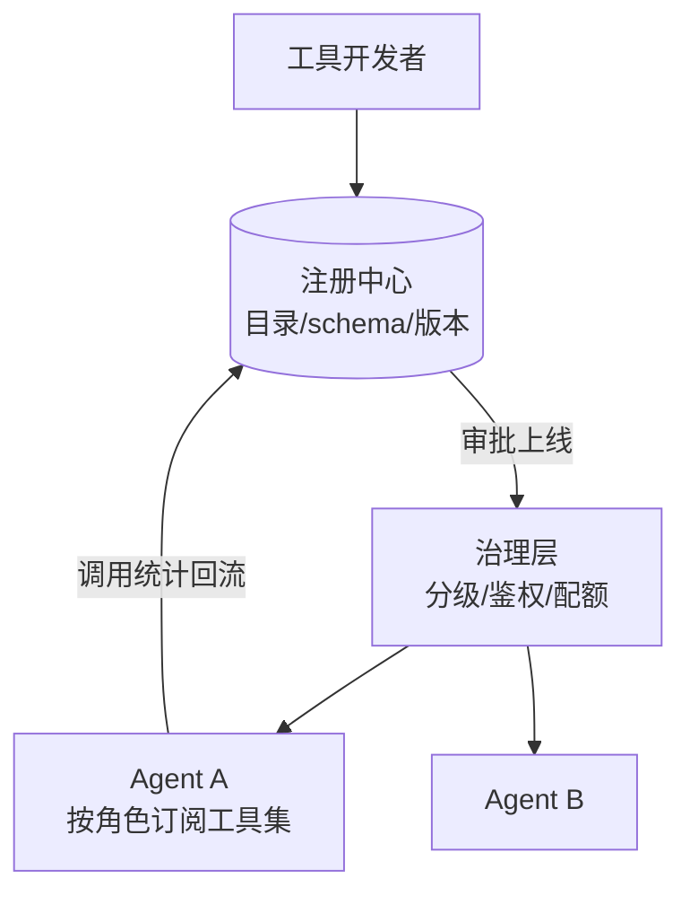

# 🚀 工具注册中心

> **一句话**：工具注册中心是 Agent 的「能力目录」：统一注册、版本管理、鉴权注入、健康检查与使用统计——工具一多，这里就是治理枢纽。
> **难度**：⭐️⭐️ 进阶
> **标签**：`#engineering` `#tooling`

## 📌 先看结论

- 注册中心管五件事：目录（有哪些工具）、schema（怎么调）、鉴权（谁能调）、健康（可用性）、用量（谁在用、用多少）
- 工具即版本化资产：schema 变更走 review + 回归，破坏性变更升 major 版本
- MCP 把「注册」分布化了，但企业仍需一层「内部目录」：审批、分级、统计
- 描述质量监控：工具选择错误率高的工具，先修 description 而不是换模型

## 🖼️ 注册中心架构



## 💻 注册表最小实现

```python
TOOLS = {}

def tool(name, description, schema, risk="low", version="1.0.0"):
    def deco(fn):
        TOOLS[name] = {"fn": fn, "description": description,
                       "schema": schema, "risk": risk, "version": version}
        return fn
    return deco

@tool("refund", "对订单执行退款", {...}, risk="high")
async def refund(order_id: str, amount: float):
    ...   # 注册时声明风险级 → 执行管道按级走审批
```

## 📦 源码案例

- **DeepSeek Harness：`core/tools` 作用域注册表**（[仓库](https://github.com/deepseek-ai/deepseek-harness)）：工具注册按 Agent 作用域（scope）隔离，执行走受控管道；工具 schema 在 preStep 动态组装进请求——「注册 → 治理 → 注入」三层清晰分层
- **Claude Code 的工具治理面**（逆向分析，[架构深拆](https://gist.github.com/yanchuk/0c47dd351c2805236e44ec3935e9095d)）：内置工具 + MCP 工具统一进权限管道；工具延迟加载（ToolSearch）由注册层控制「模型可见性」；工具变更影响上下文预算——工具注册即上下文工程
- **OpenAI Agents SDK**（[文档](https://openai.github.io/openai-agents-python/)）：`@function_tool` 装饰器自动从函数签名+docstring 生成 schema——注册体验的标杆，docstring 即工具描述的工程化

## ✅ 最佳实践

- 每个工具带元数据：owner（谁维护）、risk 级、SLA、用量上限
- schema 变更走 CI 回归：跑「工具选择正确率」评估集（→ [工具选择与路由](../07-planning/tool-selection-routing.md)）
- 死工具清理：90 天零调用的工具下线或归档，别让模型的选择面持续腐烂

## ⚠️ 常见误区

- ❌ 工具注册 = 建个数组：没有版本与统计的工具面无法治理，出了问题不知道谁的锅
- ❌ 鉴权写死在工具代码里：鉴权策略要可配置（按 Agent/租户），否则每接一个新 Agent 就要改一遍工具代码
- ❌ MCP 接入绕过治理：第三方 Server 的工具同样要进分级与统计，目录外工具 = 影子权限

## 🧪 小练习

盘点你项目的全部工具：做成注册表（名称/owner/风险级/版本/月调用量），找出三个「无主」工具并决定去留。

## 📚 相关知识点

- [Tool Use](../05-tool-protocol/tool-use.md)
- [MCP](../05-tool-protocol/mcp.md)
