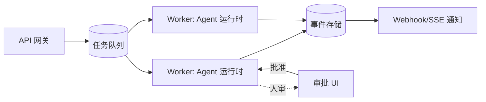

# Agent 工作流编排

> **一句话**：生产视角的编排 = 编排引擎选型 + 可靠性配套（队列、幂等、超时、人审中断）——模式理论见规划章，这里讲工程落地。

> 编排的五种模式与选型逻辑见 [工作流编排（规划章）](../07-planning/workflow-orchestration.md)。本页聚焦**生产工程**。

## 先看结论

- 生产编排的四个硬需求：持久化状态、断点恢复、人工中断、超时与重试策略——没有这四样不要接真实流量
- 引擎选型光谱：自研循环 → 轻量工作流引擎 → 图框架（LangGraph）→ 云托管平台
- 幂等性是命门：LLM 调用与工具执行都可能重复，副作用动作要带幂等键
- 长任务 = 异步任务：同步 HTTP 挂着等 Agent 跑完是事故之源

## 核心机制

### 1. 交付语义：为什么「恰好一次」要靠幂等实现

分布式系统里消息的交付语义只有两种可靠形态：

$$
\underbrace{\text{至多一次}}_{\text{可能丢}} \qquad \underbrace{\text{至少一次}}_{\text{可能重}}
$$

**「恰好一次」无法通过传输层保证**，只能由「至少一次投递 + 幂等消费」合成：

$$
\text{恰好一次的副作用}=\text{至少一次投递}+\underbrace{\text{幂等键}}_{\text{去重}}
$$

对 Agent 尤其重要，因为循环中每一步都可能被重放（重试、断点恢复、故障转移）。幂等键的常见形态：把 `(task_id, step_id)` 或业务唯一键带上，副作用工具据此判断「这一步是否已执行过」。

### 2. 持久化执行（durable execution）

长任务的核心诉求是「进程可死可重生，任务不丢」。实现方式是**把每一步的输入输出落盘**，重放时跳过已完成的步骤：

$$
\text{恢复}=\text{从最后一条已完成记录继续}
$$

这与 [状态机与事件驱动](state-machine-event-driven.md) 的事件溯源是同一原理。自研循环、LangGraph 的 checkpoint、Temporal 一类的持久化工作流引擎，都是这条思路的不同实现层次。

### 3. 超时要分层

单一全局超时无法定位问题，应按层设置：

| 层级 | 典型值 | 超时后的动作 |
|---|---|---|
| 单次模型调用 | 30–120s | 重试或降级到小模型 |
| 单次工具执行 | 10–60s | 重试或换工具 |
| 单个人审节点 | 分钟–天 | 默认拒绝（更安全）或升级 |
| 整个任务 | 分钟–小时 | 中止并保留 checkpoint |

**人审节点的默认动作要慎重**：超时后「默认拒绝」比「默认通过」安全，因为放行是不可逆的（见 [Human-in-the-loop](../02-agent-basics/human-in-the-loop.md)）。

## 生产参考架构

## 工程含义

- **任务异步化**：提交返回 `task_id`，进度走轮询/SSE，完成走 webhook——用户关页面不影响任务。
- **副作用工具有幂等键**：防止重试造成重复退款、重复发信。
- **按用户/租户限流**：同一用户并发 10 个任务会瞬间打爆模型配额。
- **灰度开关**：按流量比例切换新 prompt / 新模型，出问题可秒级回滚。
- **编排逻辑放代码**：拓扑与调度应可测试、可版本化，模型只做节点内决策。

## 源码案例

- **DeepSeek Harness：Headless 与多表面**（[仓库](https://github.com/deepseek-ai/deepseek-harness)）：同一运行时暴露 CLI / Web / Headless 多种入口，事件流贯穿——「编排内核与接入面分离」的生产架构范本
- **Temporal / Inngest 等持久化工作流引擎**：把「长任务断点恢复」变成基础设施能力（durable execution），人审节点即「等外部信号」的工作流步骤——与 Agent 编排天然契合
- **LangGraph 的 checkpoint + interrupt**（[仓库](https://github.com/langchain-ai/langgraph)）：状态图 + 持久化 + 中断原语，把上述四件套做进框架
- **Claude Code 的会话恢复**（逆向分析）：会话转写落盘 + 恢复命令——单机版的「编排持久化」，思想同构：状态在进程外，进程可死可重生

## 生产清单

- [ ] 任务异步化：提交返回 task_id，进度走轮询/SSE
- [ ] 每个副作用工具有幂等键
- [ ] 超时分层：模型调用 / 工具 / 人审 / 全局各设上限
- [ ] 人审节点有 SLA 与超时默认动作（默认拒绝更安全）
- [ ] 灰度开关：按流量比例切换新 prompt/新模型
- [ ] 任务可重放：事件存储可回放到任意检查点

## 常见误区

- ❌ 用框架 = 有可靠性：图框架不自带队列与幂等，生产配套仍要自建
- ❌ Agent 跑在请求线程里：用户关页面 = 任务死，长任务必须队列化
- ❌ 忽略并发控制：同一用户并发多个任务会打爆配额，要按用户/租户限流
- ❌ 认为传输层能保证恰好一次：只能靠幂等消费合成
- ❌ 全局一个超时：无法定位是哪一层卡住

## 小练习

把你的 Agent Demo 改造成生产架构：列出需要补齐的组件（队列？事件存储？审批 UI？幂等键？），给出优先级与估算工作量，并说明哪一步的超时最容易被忽略。

## 参考资料

- [Temporal 文档](https://docs.temporal.io/)（持久化执行）
- [Google SRE Book: Handling Overload](https://sre.google/sre-book/handling-overload/)
- [LangGraph 文档](https://langchain-ai.github.io/langgraph/)
- [12-Factor Agents](https://github.com/humanlayer/12-factor-agents)

## 相关知识点

- [状态机与事件驱动](state-machine-event-driven.md)
- [部署与扩缩容](deployment-scaling.md)
- [Human-in-the-loop](../02-agent-basics/human-in-the-loop.md)
