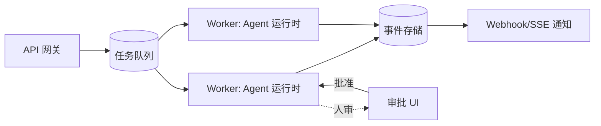

# 🚀 Agent 工作流编排

> **一句话**：生产视角的编排 = 编排引擎选型 + 可靠性配套（队列、幂等、超时、人审中断）——模式理论见规划章，这里讲工程落地。
> **难度**：⭐️⭐️ 进阶
> **标签**：`#engineering`

> 编排的五种模式与选型逻辑见 [工作流编排（规划章）](../07-planning/workflow-orchestration.md)。本页聚焦**生产工程**。

## 📌 先看结论

- 生产编排的四个硬需求：持久化状态、断点恢复、人工中断、超时与重试策略——没有这四样不要接真实流量
- 引擎选型光谱：自研循环（Pi 式）→ 轻库（Inngest/Temporal + LLM）→ 图框架（LangGraph）→ 平台（云端托管）
- 幂等性是命门：LLM 调用与工具执行都可能重复，副作用动作要带幂等键
- 长任务 = 异步任务：同步 HTTP 挂着等 Agent 跑完是事故之源

## 🖼️ 生产参考架构

## 📦 源码案例

- **DeepSeek Harness：Headless 与多表面**（[仓库](https://github.com/deepseek-ai/deepseek-harness)）：同一运行时暴露 CLI / Web / Headless 多种入口（Surface 层），事件流贯穿——「编排内核与接入面分离」的生产架构范本；其 apps/cli 与 apps/web 共享 packages/core 全部能力
- **Temporal / Inngest 的 Agent 化**：工作流引擎正在成为 Agent 编排新宠——持久化执行（durable execution）天然解决「长任务断点恢复」；人审节点即「等外部信号」的 workflow step
- **Claude Code 的会话恢复**（逆向分析）：会话转写落盘 + `--resume` 恢复——单机版的「编排持久化」，思想同构：状态在进程外，进程可死可重生

## ✅ 生产清单

- [ ] 任务异步化：提交返回 task_id，进度走轮询/SSE
- [ ] 每个副作用工具有幂等键（防止重试重复退款）
- [ ] 超时分层：模型调用 60s / 工具 30s / 任务全局上限
- [ ] 人审节点有 SLA 与超时默认动作（默认拒绝更安全）
- [ ] 灰度开关：按流量比例切换新 prompt/新模型

## ⚠️ 常见误区

- ❌ 用框架 = 有可靠性：LangGraph 不自带队列与幂等，生产配套仍要自建
- ❌ Agent 跑在请求线程里：用户关页面 = 任务死，长任务必须队列化
- ❌ 忽略并发控制：同一用户并发 10 个 Agent 任务打爆配额，要按用户/租户限流

## 🧪 小练习

把你的 Agent Demo 改造成生产架构：列出需要补齐的组件（队列？存储？审批 UI？），估算工作量优先级。

## 📚 相关知识点

- [状态机与事件驱动](state-machine-event-driven.md)
- [部署与扩缩容](deployment-scaling.md)
