# 12 应用案例


**一句话**：Agent 落地的难度排序大致是：编程 < 数据分析 < 客服 < 研究 < 行业关键业务——验证手段越客观，Agent 越早可用。本章逐场景拆解模式、代表项目与落地要点。


## 场景地图

| 场景 | 成熟度 | 客观验证 | 代表项目/案例 |
|---|---|---|---|
| [编程 Agent](coding-agent.md) | 高 | 测试通过 | Claude Code、Pi、DeepSeek Harness、OpenHands |
| [数据分析](data-analysis-agent.md) | 高 | SQL/图表正确性 | 各家 Notebook Agent |
| [浏览器自动化](browser-automation.md) | 中 | 任务状态 | Playwright MCP、browser-use |
| [客服 Agent](customer-service-agent.md) | 中 | 解决率人工评 | 分诊+知识库模式 |
| [企业知识库](enterprise-knowledge-base.md) | 高 | 引用准确率 | RAG 全家桶 |
| [研究 Agent](research-agent.md) | 中 | 事实核查 | Anthropic 多 Agent 研究系统 |
| [个人助理](personal-assistant.md) | 中 | 用户满意度 | 各家语音助手 |
| [通用 Agent 产品](general-agent-products.md) | 中高 | 验收清单 | ChatGPT Work / Cowork / 浏览器代办 |
| [实时语音 Agent](voice-agent.md) | 中 | 听感与打断 | GPT-Live-1 等实时 API |
| [RPA](rpa.md) | 中 | 流程完成率 | UI 自动化 + LLM |
| [教育 Agent](education-agent.md) | 中 | 学习效果评估 | 苏格拉底式辅导 |
| [游戏 Agent](game-agent.md) | 早期 | 胜率/行为分 | NPC、自对弈 |
| [行业 Agent](industry-agents.md) | 早期 | 合规+准确率 | 医疗/金融/法律 |

## 落地顺序地图

本章的场景不是并列清单，而是一条「验证客观度」递减的梯队——越靠左边验收越机器化，Agent 越早可用：

```mermaid
%%{init: {"theme":"base","themeVariables":{"primaryColor":"#F4EBFD","primaryBorderColor":"#9333EA","primaryTextColor":"#1F2937","secondaryColor":"#E7D2FA","tertiaryColor":"#FBF7FE","lineColor":"#C48FF3","actorBkg":"#F6EFFD","actorBorder":"#9333EA","actorTextColor":"#1F2937","signalColor":"#B370F0","noteBkgColor":"#ECDAFB","noteBorderColor":"#9333EA","noteTextColor":"#1F2937","labelBoxBkgColor":"#F4EBFD","labelBoxBorderColor":"#9333EA"}}}%%
flowchart LR
    A["编程 Agent：测试通过即验收"] --> B["数据分析：SQL 结果可机检"]
    B --> C["企业知识库：引用准确率可测"]
    C --> D["客服 / 浏览器 / 研究：人工评估占比升高"]
    D --> E["行业关键业务：合规审计 + 人审拍板，门槛最高"]
```

## 阅读建议

- 找「我能抄的作业」：每个场景页都有「可复用的模式」小节
- 编程 Agent 页是全书案例密度最高的一页：**Claude Code、Pi、DeepSeek Harness 三大 harness 的横向深拆**，读懂它就读懂了 Agent 工程的当前形态
- 2026 产品面看 [通用 Agent 产品](general-agent-products.md) 与 [18 前沿章](../18-frontier-2026/README.md)

## 读完能做到

- [ ] 用「验证客观度递减」给场景排落地顺序（编程 < 数据分析 < 客服 < 研究 < 行业），并解释为什么编程 Agent 最早可用（测试即验收）
- [ ] 横向说出 Claude Code / Pi / DeepSeek Harness 三者的差异：工具哲学（~27 内置 / 4 原子 / 插件化）、循环（三层 prompt / ~300 行 agentLoop / turn-step 状态机）、上下文管理
- [ ] 为数据分析 Agent 立「数值零幻觉」铁律：数字一律来自 SQL/代码执行，配总量对账和「数字 + 口径 + 不确定性」结论三件套
- [ ] 设计客服分诊（意图→RAG 答疑→窄权限业务→升级转人工），写出三条「必须转人工」触发条件和工具层的红线策略谓词
- [ ] 判断一个浏览器任务走 DOM 还是视觉，说清「有 API 别用浏览器、能 DOM 就 DOM」以及关键步骤截图断言兜底

## 章末自测

1. **回忆**：为什么说企业知识库的头号失败不是检索算法而是「文档本身烂」？权限过滤为什么必须放在检索层而非生成层？（提示：见 enterprise-knowledge-base.md）
2. **应用**：用引用忠实度指标审阅一份研究报告：怎么统计、覆盖了几角度、哪条论断最该补一手来源？（提示：见 research-agent.md）
3. **判断**：「客服 Agent 就该追求全自动解决率」——用「违规放行一次的损失远大于多转几次人工」和 τ² 的策略遵守口径评价。（提示：见 customer-service-agent.md）

