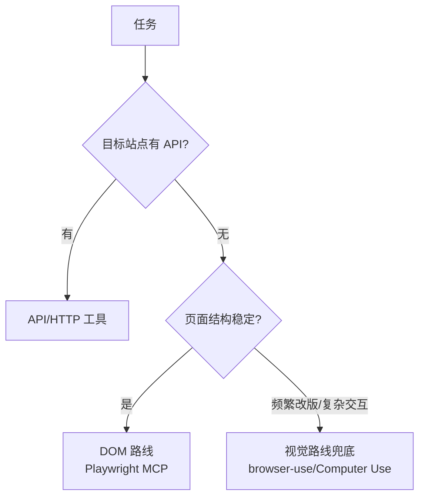

# 💼 浏览器自动化

> **一句话**：浏览器自动化 Agent = 让 AI 像人一样点网页：数据采集、表单填报、端到端测试；技术选型上 DOM 路线打主力、视觉路线做兜底。
> **难度**：⭐️⭐️ 进阶
> **标签**：`#application`

> 技术原理见 [Computer Use / Browser Use](../05-tool-protocol/computer-use-browser-use.md)，本页聚焦**应用落地**。

## 📌 先看结论

- 先问灵魂问题：有 API 吗？有 → 别用浏览器；没有/不给 → 浏览器自动化登场
- 最稳组合：Playwright MCP（结构化 DOM 操作）+ 关键步骤截图验证 + 失败时视觉模型兜底
- 高价值场景：竞品价格监控、内部老系统（无 API）操作、跨系统数据搬运、E2E 测试生成
- 合规提醒：遵守目标站点条款与 robots，登录态操作要授权与审计

## 🖼️ 混合选型

## 📦 源码案例

- **Playwright MCP**（[microsoft/playwright-mcp](https://github.com/microsoft/playwright-mcp)）：微软官方，把页面转 accessibility 快照、用 ref 引用元素——Claude Code、DeepSeek Harness、Pi 均可直接接入；读它的工具定义（click/fill/snapshot）就是「DOM 路线工具设计」的标准答案
- **browser-use**（[GitHub](https://github.com/browser-use/browser-use)）：开源视觉+DOM 混合 Agent，自带重试与等待策略；其源码是学习「网页变化时的工程兜底」（元素找不到 → 滚动 → 截图 → 视觉定位）的最佳材料
- **Claude Computer Use 参考实现**（[文档](https://docs.anthropic.com/en/docs/agents-and-tools/computer-use)）：Docker 虚拟桌面 + 截图循环，适合非浏览器 GUI；每天从快照重置的环境设计值得所有自动化项目借鉴
- **真实工作流**：Claude Code 用 Playwright MCP 做「写完代码 → 自动打开页面验证 UI」的闭环——编程与浏览器自动化组合的典型生产力场景

## ✅ 落地要点

- 等待策略前置：显式等待元素/网络空闲，sleep 是最后手段
- 关键动作设检查点：提交订单前截图 + 数据断言，失败即停（别刷单）
- 会话与凭据管理：cookie 存储加密、登录操作审计、验证码场景转人工

## ⚠️ 常见误区

- ❌ 全视觉路线刷浏览器：token 成本高一个量级且更脆，DOM 能解决就 DOM
- ❌ 脚本思维（写死 xpath）：页面改版全崩；用语义定位（accessibility 角色/文本）+ 失败自愈
- ❌ 无限重试硬闯：被封 IP/触发风控还不停 = 事故，要识别风控信号并熔断

## 🧪 小练习

用 Playwright MCP 给你的 Agent 接入浏览器能力，实现「打开某新闻站 → 抽取今日头条标题列表 → 存 CSV」；然后故意改版页面结构，观察失败模式与自愈能力。

## 📚 相关知识点

- [Computer Use / Browser Use](../05-tool-protocol/computer-use-browser-use.md)
- [错误恢复与重试](../07-planning/error-recovery-retry.md)
