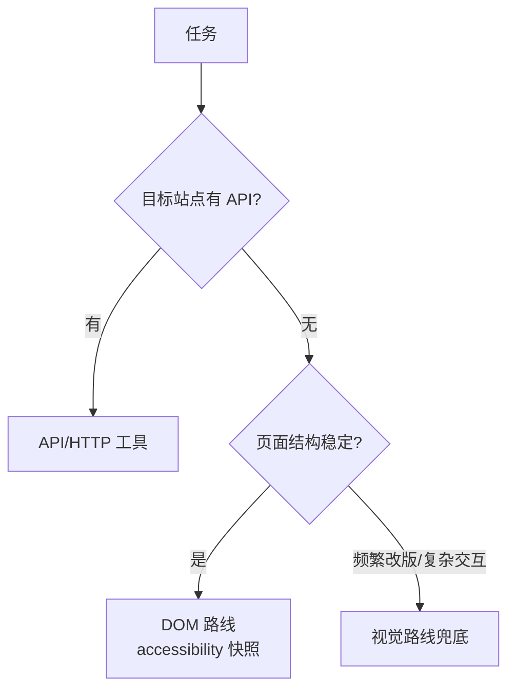

# 浏览器自动化

> **一句话**：浏览器自动化 Agent = 让 AI 像人一样点网页：数据采集、表单填报、端到端测试；技术选型上 DOM 路线打主力、视觉路线做兜底。

> 技术原理见 [Computer Use / Browser Use](../05-tool-protocol/computer-use-browser-use.md)，本页聚焦**应用落地**。

## 先看结论

- 先问灵魂问题：有 API 吗？有 → 别用浏览器；没有/不给 → 浏览器自动化登场
- 最稳组合：结构化 DOM 操作 + 关键步骤截图验证 + 失败时视觉模型兜底
- DOM 路线比纯视觉便宜一到两个数量级，且更稳定——**能 DOM 就 DOM**
- 高价值场景：竞品价格监控、内部老系统（无 API）操作、跨系统数据搬运、E2E 测试生成
- 合规提醒：遵守目标站点条款与 robots，登录态操作要授权与审计

## 核心机制

### 1. 两条路线的成本差在哪

视觉路线的每一步都要把整屏截图送进模型，成本与「页面复杂度」正相关：

$$
\text{cost per step}\;\propto\;\underbrace{\text{screenshot tokens}}_{\text{分辨率平方} \times \text{patch}}\;+\;\text{history}
$$

而 DOM/accessibility 路线只把**结构化元素树**（可裁剪到相关子树）送进模型：

$$
\text{cost}_{\text{DOM}}\;\ll\;\text{cost}_{\text{vision}}
$$

两者的差距不是常数，而是随页面变复杂而放大。所以工程原则是：**用 DOM 做事，用视觉兜底**（DOM 找不到元素时才截图定位）。

### 2. 稳定性来自「语义定位」

脚本思维用 XPath/CSS 选择器写死路径，页面一改版就崩。可靠做法是**语义定位**：

$$
\text{locator}=\text{role}+\text{accessible name}+\text{text}
$$

即用 accessibility 角色（button/textbox/link）与可见文本定位元素。这类定位对 DOM 结构调整不敏感，是浏览器自动化从「脆弱脚本」走向「可维护系统」的关键。

### 3. 混合策略的决策点

| 条件 | 路线 | 理由 |
|---|---|---|
| 目标站点有 API | HTTP/API 工具 | 最稳、最省、可测试 |
| 页面结构稳定 | DOM（accessibility 快照） | 便宜、精确、可断言 |
| 频繁改版 / 复杂交互（拖拽、canvas） | 视觉兜底 | 结构不可依赖，只能看 |
| 登录 + 多步表单 | DOM + 检查点截图 + 断言 | 既要有结构精度，也要可验证 |

## 混合选型

## 工程含义

- **等待策略前置**：显式等待元素出现/网络空闲，`sleep` 是最后手段（固定等待既慢又不可靠）。
- **关键动作设检查点**：提交订单前截图 + 数据断言，失败即停——**别让 Agent 在错误状态下继续提交**。
- **风控信号要熔断**：识别验证码、429、异常跳转等信号后立即停止并上报，不要硬闯（见 [错误恢复与重试](../07-planning/error-recovery-retry.md)）。
- **凭据与会话管理**：cookie 加密存储、登录操作审计、验证码场景转人工。
- **动作要可回放**：记录每一步的 locator 与结果，失败时才能定位是「页面变了」还是「逻辑错了」。

## 源码案例

- **Playwright MCP**（[microsoft/playwright-mcp](https://github.com/microsoft/playwright-mcp)）：微软官方，把页面转 accessibility 快照、用 ref 引用元素——主流 harness 均可直接接入；读它的工具定义（click/fill/snapshot）就是「DOM 路线工具设计」的标准答案
- **browser-use**（[GitHub](https://github.com/browser-use/browser-use)）：开源视觉 + DOM 混合 Agent，自带重试与等待策略；其源码是学习「页面变化时的工程兜底」（元素找不到 → 滚动 → 截图 → 视觉定位）的最佳材料
- **Claude Computer Use 参考实现**（[文档](https://docs.anthropic.com/en/docs/agents-and-tools/computer-use)）：虚拟桌面 + 截图循环，适合非浏览器 GUI；「每天从快照重置环境」的设计值得所有自动化项目借鉴
- **真实工作流**：用浏览器 MCP 做「写完代码 → 自动打开页面验证 UI」的闭环——编程与浏览器自动化组合的典型生产力场景

## 常见误区

- ❌ 全视觉路线刷浏览器：token 成本高一个量级且更脆，DOM 能解决就 DOM
- ❌ 脚本思维（写死 xpath）：页面改版全崩；用语义定位 + 失败自愈
- ❌ 无限重试硬闯：被封 IP / 触发风控还不停 = 事故，要识别信号并熔断
- ❌ 用固定 sleep 等页面：既慢又不可靠，应等待具体条件
- ❌ 不做动作断言：Agent 「以为点成功了」而实际没生效，会连锁出错

## 小练习

用浏览器 MCP 给你的 Agent 接入浏览器能力，实现「打开某新闻站 → 抽取今日头条标题列表 → 存 CSV」；然后故意改版页面结构，观察失败模式与自愈能力，并统计 DOM 路线与截图路线各自的 token 成本。

## 参考资料

- [Playwright 文档](https://playwright.dev/) / [microsoft/playwright-mcp](https://github.com/microsoft/playwright-mcp)
- [browser-use](https://github.com/browser-use/browser-use)
- [Anthropic: Computer Use](https://docs.anthropic.com/en/docs/agents-and-tools/computer-use)

## 相关知识点

- [Computer Use / Browser Use](../05-tool-protocol/computer-use-browser-use.md)
- [错误恢复与重试](../07-planning/error-recovery-retry.md)
