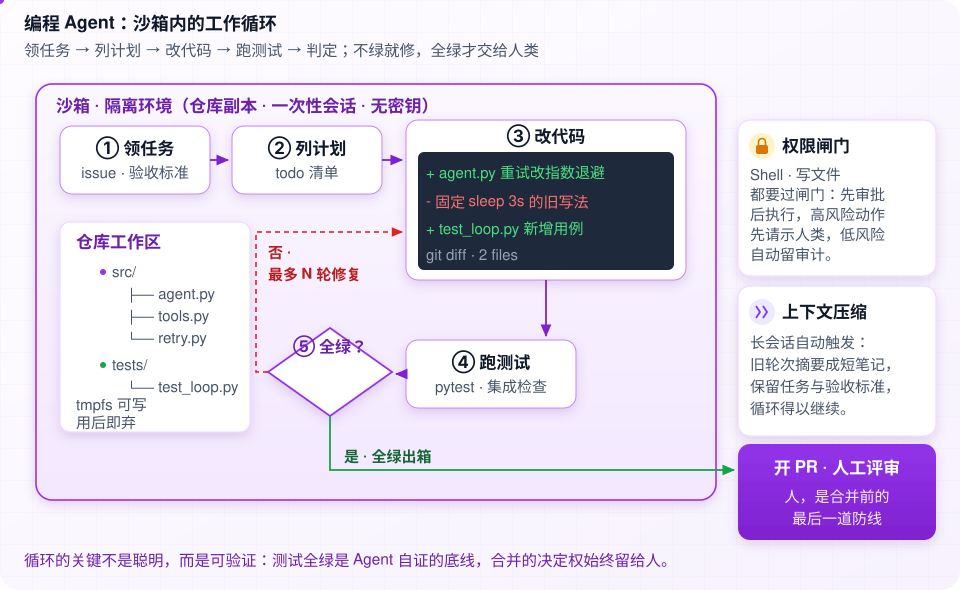
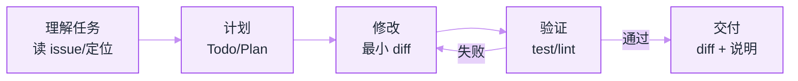
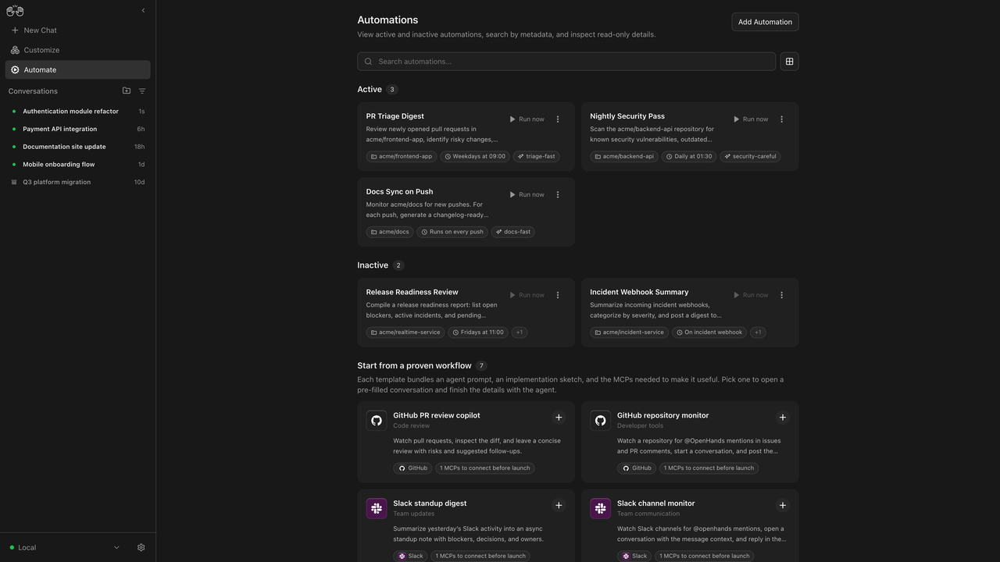

# 编程 Agent


**一句话**：编程是 Agent 第一落地场景——验证客观（测试）、反馈明确（报错）、语料丰富（GitHub），本章深拆三大代表性 harness：Claude Code、Pi、DeepSeek Harness。
  **难度**：进阶
  **标签**：`#application` `#agent`


## 先看结论

- 编程 Agent = 模型 + harness；同一模型换 harness 成绩可差 20%+（SWE-bench 实证）
- 三条产品路线：闭源标杆（Claude Code）、极简开源（Pi）、平台化插件（DeepSeek Harness）
- 成功要素高度一致：小而正交的工具集、上下文精细管理、错误驱动修正、人审高危动作

## 三大 Harness 横向深拆

| 维度 | Claude Code | Pi（原 pi-mono） | DeepSeek Harness |
|---|---|---|---|
| 开源情况 | 闭源（社区逆向分析） | MIT 开源，~40K | MIT 开源（2026.08 v0.1） |
| 技术栈 | TypeScript（Node） | TypeScript monorepo | TypeScript + Cordis 插件框架 |
| 工具哲学 | ~27 个内置工具 + MCP 扩展 | **4 个原子工具**（read/write/edit/bash） | 插件化工具面，标准/极简/PTC/创造四模式 |
| System Prompt | 模块化注册、五级优先级、三层组装 | <1000 token 极简 | 分区组装，每步动态生成 |
| 循环实现 | query 主循环 + 流式 generator + 权限管道 | ~300 行 agentLoop 双嵌套循环 | turn/step 状态机（idle/maintenance/running） |
| 状态与记忆 | CLAUDE.md + TodoWrite + 转写文件 | 树形 JSONL 会话文件 | append-only 事件流 + 投影 |
| 上下文管理 | auto-compact / microcompact / snip 三档压缩 | 三条压缩机制守水位 | 投影层压缩，日志永不丢 |
| 多 Agent | 子 Agent 隔离（独立上下文/worktree） | 极简，靠多进程 | Supervisor–Worker 为主 + 混合编排 |
| 安全模型 | 权限管道 + allowlist + 危险命令确认 | YOLO 默认，沙箱外置 | Hook→审批→权限→沙箱(landlock)→超时 全插件 |
| 适合谁 | 想用最强生产力工具的人 | 学 harness 原理、想自己魔改的人 | 想搭企业级可插拔平台的人 |

### 逐个看门道

**Claude Code——「产品级 runtime」教科书**（逆向资料：[提示词全集](https://github.com/Piebald-AI/claude-code-system-prompts)、[架构深拆](https://gist.github.com/yanchuk/0c47dd351c2805236e44ec3935e9095d)）

- 系统提示词不是一段文案而是三层系统：默认 blocks（缓存友好）→ effective 选择器（按模式）→ attachment 动态提醒（token 预算、Todo 提醒）
- 子 Agent 隔离设计：全新消息列表、克隆文件缓存、独立磁盘转写、可选 git worktree
- 教训：它的强大来自「prompt 组装 + 工具治理 + 权限 + 压缩」的**系统工程**，不是某个神秘 prompt

**Pi——「少即是多」的活证明**（[earendil-works/pi](https://github.com/earendil-works/pi)，libGDX 作者 Mario Zechner 作品）

- 四个原子工具覆盖 90% 编码工作；扩展由 Agent 自己写自己装（热加载）
- ~300 行核心循环 + 25+ Hooks：每读一遍都会刷新对「Agent 本质」的认识
- 哲学：「提供原语，而非成品」；OpenClaw 等项目直接基于它构建

**DeepSeek Harness——「一切皆插件」的平台化答案**（[仓库](https://github.com/deepseek-ai/deepseek-harness)，2026-08-13 MIT 开源）

- 模型、工具、技能、会话、沙箱、存储、**连 Agent Loop 本身**都可替换（Cordis 插件）
- 事件溯源架构：所有轨迹进 append-only 日志，恢复/分叉/审计/回放同源
- PTC 模式（程序化工具调用）预示方向：模型写代码组合多轮工具调用，省 token 且确定性强
- 读源码路线：`docs/architecture.md` → `packages/core/agent-loop/src/agent.ts` → `packages/core/session` → `packages/core/tools`

## 编程 Agent 的通用模式

通用模式落到产品界面上，是 OpenHands 的 Automate 视图：

*来源：OpenHands 官方仓库 README 的产品截图（[assets.openhands.dev/screenshot/automation-preview.png](https://assets.openhands.dev/screenshot/automation-preview.png)），访问日期 2026-09-22。*

这张图说明编程 Agent 已经不只是「一个终端里的循环」：左侧五条会话（`Authentication module refactor`、`Payment API integration`…）是**并行任务队列**，卡片上的 `acme/frontend-app` + `Weekdays at 09:00` + `triage-fast` 三个标签分别是**仓库范围、触发时机、模板**——把上面那条通用循环固化成可复用的定时自动化。底部那排「Start from a proven workflow」模板（GitHub PR review copilot、Slack standup digest）则是把 Agent 交付成**带预置验收路径的产品**，而不是留个 CLI 让用户自己悟。注意每张卡都有 `Run now` 与只读详情——**能随时手动插一脚，是这类平台的基本安全阀**。

## 其他值得研究的开源项目

| 项目 | 特色 | 链接 |
|---|---|---|
| OpenHands | 全功能开源编程 Agent（原 OpenDevin），SWE-bench 常客 | [GitHub](https://github.com/All-Hands-AI/OpenHands) |
| SWE-agent | Princeton 出品，提出 ACI（Agent-Computer Interface）设计学 | [GitHub](https://github.com/SWE-agent/SWE-agent) |
| Aider | 轻量结对编程，repo-map 上下文方案独树一帜 | [GitHub](https://github.com/Aider-AI/aider) |
| OpenAI Codex CLI | 开源终端 Agent，Rust 实现 | [GitHub](https://github.com/openai/codex) |
| Gemini CLI | Google 开源终端 Agent | [GitHub](https://github.com/google-gemini/gemini-cli) |
| block/goose | Block（Square）开源的可扩展 Agent | [GitHub](https://github.com/block/goose) |

## 落地误区

- ❌ 用 IDE 补全的心态用 Agent：给足上下文（issue、约束、验收标准），任务描述质量决定产出
- ❌ 全自动无验证：至少配 CI 测试 + diff review；高危动作（部署、迁移）永远人批
- ❌ 忽视仓库「文档即上下文」：CLAUDE.md/AGENTS.md 类项目记忆文件能显著提升跨会话表现

## 度量一次修复的成本

编程 Agent 的优劣不能只看「修好了没有」，还要看代价：

$$
\text{单次修复成本}=\underbrace{\text{步数}\times\overline{\text{单步 token}}}_{\text{模型调用}}+\underbrace{\text{失败重试成本}}_{\text{走弯路}}+\underbrace{\text{沙箱/CI 算力}}_{\text{测试执行}}
$$

同一模型换 harness，步数与重试次数常差出一倍以上——这正是 [SWE-bench](../13-resources/benchmarks/swe-bench.md) 强调「模型 + harness」的原因。选型时应固定模型、横评 harness，比较成功率、平均步数与单任务成本三个指标。

## 2026 补充：第四条线是托管 harness

上表三条是 **自持/产品化开源与闭源 harness**（Claude Code / Pi / DeepSeek Harness）。2026-09 起还要加上 **模型厂商托管 harness** 这条平行路线——你提供工具、知识与验收文件，厂商维护循环、压缩、权限管道与沙箱：

| 路线 | 形态 | 代表 | 何时选 |
|---|---|---|---|
| 闭源产品 harness | 终端/IDE 产品 | Claude Code | 个人与团队生产力，不自己魔改 |
| 极简开源 harness | 库 + 原语 | Pi | 学原理、深度定制 |
| 平台化插件 harness | 可替换一切的运行时 | DeepSeek Harness | 企业私有化、审计与多租户 |
| **托管 harness** | 一次 API call | **OpenAI Agents API**（2026-09-10）· **Claude Agent SDK** | 长时程云端任务、不想自运维压缩/子 Agent/沙箱 |

编码能力读数仍是厂商公布量级（非统一 harness 复测）：Terminal-Bench 4.0 上 GPT-6 Astra 约 **57.9%**、Claude Fable 5.1 约 **55.8%**——比较时必须带 effort、防护与任务集版本，读榜纪律见 [评估 2026](../18-frontier-2026/eval-2026.md)，完整对比见 [2026 前沿模型地图](../18-frontier-2026/frontier-models-2026.md)。分叉决策见 [模型原生 vs 自建 Harness](../18-frontier-2026/model-native-vs-harness.md)。

工程含义：**harness 已是采购项**。无论走哪条线，AGENTS.md / CLAUDE.md 类项目记忆、最小权限、测试门禁仍是你自己的责任。

## 小练习

用 Pi 或 OpenHands 在真实 issue 上跑一次修复全程：记录步数、token、失败重试次数；对照本章的「通用模式」找出它哪一步最弱。

## 实战手记

- **决定耗时的往往是仓库本身**：同一个任务，在有 AGENTS.md、测试边界清晰、测试套件一分钟内能跑完的仓库里，和什么都没有的仓库比，完成耗时和 token 消耗能差出三五倍。推广前先把两三个仓库的验证闭环修好，回报比换模型直接得多。
- **人审时间先高后低**：经验值上，上线初期团队审 Agent 提的 PR，花的时间不比自己动手写少——这是信任建设的正常成本，不是失败信号。跑上几个月后，审阅通过率和合并率通常才稳定到六到七成，那时再考虑放宽低风险类别的审查。
- **最常见的失败是「对但不干净」**：测试过了，但 diff 改多了、或者绕过了根因打个补丁——这类案例比直接失败高一个量级。把「变更文件数上限」「不得改动测试目录之外的业务逻辑」这类约束写进审查清单，比事后返工省心得多。

## 参考资料

- [12-Factor Agents](https://github.com/humanlayer/12-factor-agents)
- [OpenHands（原 All-Hands，自主编码 Agent 的开源主力）](https://github.com/All-Hands-AI/OpenHands)
- [SWE-agent（把仓库交互封装成接口的对照实现）](https://github.com/SWE-agent/SWE-agent)
- [aider（终端里的结对编程 Agent，git 语义最扎实）](https://github.com/Aider-AI/aider)
- [Codex CLI（OpenAI 的开源终端 Agent）](https://github.com/openai/codex)
- [Gemini CLI（Google 的开源终端 Agent）](https://github.com/google-gemini/gemini-cli)
- [Goose（Block 的本地可扩展编码 Agent）](https://github.com/block/goose)
- [Claude Code 系统提示词全集（护栏与工具说明的现网原文）](https://github.com/Piebald-AI/claude-code-system-prompts)

## 相关知识点

- [感知—规划—行动循环](../02-agent-basics/perception-planning-action.md)
- [记忆压缩、遗忘与摘要](../06-memory-rag/memory-compression-forgetting.md)
- [工具权限与沙箱](../05-tool-protocol/tool-permission-sandbox.md)
- [模型原生 vs 自建 Harness](../18-frontier-2026/model-native-vs-harness.md)
- [SWE-bench](../13-resources/benchmarks/swe-bench.md)
- [OpenAI Agents API](../18-frontier-2026/openai-agents-api.md)
- [Claude Agent SDK](../18-frontier-2026/claude-agent-sdk.md)
