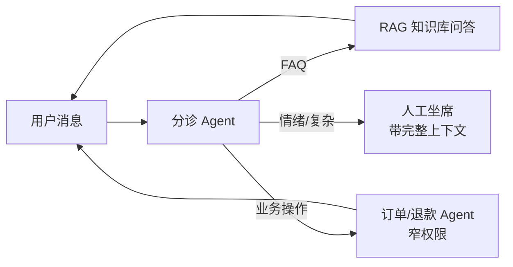

# 客服 Agent

> **一句话**：客服是 Agent 商业化最卷的赛道：分诊路由 + 知识库问答 + 工单操作 + 平滑转人工——技术不难，难在口径一致、权限收窄与情绪兜底。
> **难度**：入门
> **标签**：`#application`

## 先看结论

- 标准架构：意图分诊（Swarm/handoff 的天然场景）→ 知识库 RAG 答疑 → 业务系统操作（查订单/退款）→ 复杂/情绪升级转人工
- 三条红线：不承诺政策外补偿、不泄露内部信息、不与用户陷入对抗——写进 system prompt 并用 guardrail 强制
- 转人工不是失败：设置清晰的升级触发（情绪词、重复失败、高价值客户），无缝带上下文转接
- 评估用「解决率 + 转人工率 + 用户满意度」三指标，别只看自动化率；2026 应加 **策略遵守**（τ²-bench 口径），见 [评估 2026](../18-frontier-2026/eval-2026.md)
- 2026 架构分叉：自建 handoff 网 vs 托管 harness（[Agents API](../18-frontier-2026/openai-agents-api.md) / [Claude Agent SDK](../18-frontier-2026/claude-agent-sdk.md)）——长工单、跨系统并行排查更适合托管

## 架构图

## 核心机制：三条红线做成执行约束

红线不能只写在 prompt 里。一种工程写法是给每个工具挂策略谓词：

$$
\text{allow}(tool, args)\iff
\underbrace{amount\le\tau}_{\text{金额阈值}}
\wedge\;\underbrace{policy\text{.covers}(args)}_{\text{政策覆盖}}
\wedge\;\underbrace{\neg\text{blockedTopic}(t)}_{\text{敏感话题}}
$$

不满足则**串行**阻塞并升级人工——这与 guardrail 的**并行**内容安检是两层，不能互相替代（对照 [OpenAI Agents SDK](../09-frameworks/openai-agents-sdk.md) 的 guardrail 设计）。

## 源码案例

- **OpenAI Agents SDK 的客服范式**（[官方文档](https://openai.github.io/openai-agents-python/)）：SDK 文档的示例域就是「客服分诊 + 退款 + 技术支持」——handoffs + guardrails 的设计直接以客服为第一场景；分诊 Agent → 专线 Agent 的移交图与本章架构一一对应
- **τ-bench 的启示**（Sierra 出品，见 [基准测试](../10-evaluation-safety/benchmarks.md)）：模拟「用户 + 策略文档 + 工具」的客服环境，考的不只是答对，还有**策略遵守**（该退才退、该核身核身）——客服 Agent 的评估就该这么测；2026 代际 τ² 与长任务读法见 [评估 2026](../18-frontier-2026/eval-2026.md)
- **DeepSeek Harness 的审批插件**（[仓库](https://github.com/deepseek-ai/deepseek-harness)）：退款类工具挂在「审批 = always」的策略上，金额超阈值转人工确认——把业务红线做成执行管道配置而非 prompt 恳求
- **Anthropic 的多 Agent 客服实践**：其工程博客与多 Agent 研究系统的经验（任务契约、并行广度）广泛被客服多 Agent 架构借鉴（[博客](https://www.anthropic.com/engineering/built-multi-agent-research-system)）

## 2026 产品面

| 变化 | 对客服的含义 |
|---|---|
| 托管 harness（Agents API / Agent SDK） | 长工单、多系统并查不必自建压缩与子 Agent 编排；见 [模型原生 vs 自建 Harness](../18-frontier-2026/model-native-vs-harness.md) |
| τ² / 策略遵守进入主流考核 | 「自动化率」单独看会误判；违规放行一次的损失远大于多转几次人工 |
| MCP 作为业务系统接入层 | 订单、库存、CRM 工具化后，分诊网不必为每个系统写适配器；协议分层见 [2026 协议栈](../18-frontier-2026/protocol-stack-2026.md) |
| 实时语音热线 | 电话客服需要打断与听感指标，不能照搬文本 Agent 验收标准（→ [实时语音 Agent](voice-agent.md)） |

## 落地要点

- 知识库口径治理：政策文档版本化，RAG 检索带生效日期过滤，杜绝「新旧政策混答」
- 工具权限极窄：客服 Agent 的退款工具只允许「查 + 发起」，执行要人工或规则复核
- 情绪识别升级： sentiment 阈值触发转人工 + 致歉话术，别让用户和模型吵第三轮
- 转接必须带状态：意图摘要 + 已收集字段 + 已尝试动作；用户重复叙述 = 差评
- 灰度看「违规放行率」而不只看解决率：先放 5% 流量，红线工具全部人审

## 常见误区

- ❌ 追求全自动解决率：强行兜住的「解决」会变成投诉，该转就转是设计不是失败
- ❌ 知识库一挂就上线：检索口径错误比不回答更伤品牌，先跑 [持续评估](../11-engineering/continuous-evaluation.md)
- ❌ 上下文不随转工单流转：用户重复叙述三次需求 = 差评预定
- ❌ 把 guardrail 当权限：内容安检拦不住「多退了一次款」的副作用，权限必须在工具层

## 小练习

设计电商客服的分诊规则：列出 5 类意图、各自的接管 Agent 与工具权限；写出「必须转人工」的三条触发条件。

## 参考资料

- [OpenAI Agents SDK 文档](https://openai.github.io/openai-agents-python/)
- [τ-bench](https://github.com/sierra-research/tau-bench) · [评估 2026](../18-frontier-2026/eval-2026.md)
- [Anthropic 多 Agent 研究系统](https://www.anthropic.com/engineering/built-multi-agent-research-system)
- [2026 协议栈](../18-frontier-2026/protocol-stack-2026.md)

## 相关知识点

- [Swarm](../08-multi-agent/swarm.md)
- [RAG 基础](../06-memory-rag/rag-basics.md)
- [权限控制与沙箱隔离](../10-evaluation-safety/permission-sandbox.md)
- [OpenAI Agents SDK](../09-frameworks/openai-agents-sdk.md)
