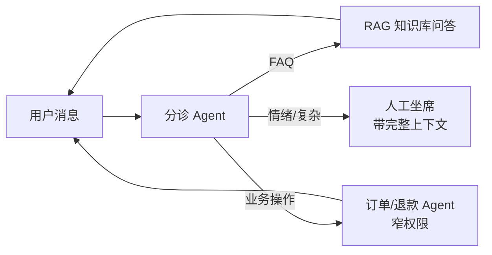

# 💼 客服 Agent

> **一句话**：客服是 Agent 商业化最卷的赛道：分诊路由 + 知识库问答 + 工单操作 + 平滑转人工——技术不难，难在口径一致、权限收窄与情绪兜底。
> **难度**：⭐️ 入门
> **标签**：`#application`

## 📌 先看结论

- 标准架构：意图分诊（Swarm/handoff 的天然场景）→ 知识库 RAG 答疑 → 业务系统操作（查订单/退款）→ 复杂/情绪升级转人工
- 三条红线：不承诺政策外补偿、不泄露内部信息、不与用户陷入对抗——写进 system prompt 并用 guardrail 强制
- 转人工不是失败：设置清晰的升级触发（情绪词、重复失败、高价值客户），无缝带上下文转接
- 评估用「解决率 + 转人工率 + 用户满意度」三指标，别只看自动化率

## 🖼️ 架构图

## 📦 源码案例

- **OpenAI Agents SDK 的客服范式**（[官方文档](https://openai.github.io/openai-agents-python/)）：SDK 文档的示例域就是「客服分诊 + 退款 + 技术支持」——handoffs + guardrails 的设计直接以客服为第一场景；分诊 Agent → 专线 Agent 的移交图与本章架构一一对应
- **τ-bench 的启示**（Sierra 出品，见 [基准测试](../10-evaluation-safety/benchmarks.md)）：模拟「用户 + 策略文档 + 工具」的客服环境，考的不只是答对，还有**策略遵守**（该退才退、该核身核身）——客服 Agent 的评估就该这么测
- **DeepSeek Harness 的审批插件**（[仓库](https://github.com/deepseek-ai/deepseek-harness)）：退款类工具挂在「审批 = always」的策略上，金额超阈值转人工确认——把业务红线做成执行管道配置而非 prompt 恳求
- **Anthropic 的多 Agent 客服实践**：其工程博客与多 Agent 研究系统的经验（任务契约、并行广度）广泛被客服多 Agent 架构借鉴（[博客](https://www.anthropic.com/engineering/built-multi-agent-research-system)）

## ✅ 落地要点

- 知识库口径治理：政策文档版本化，RAG 检索带生效日期过滤，杜绝「新旧政策混答」
- 工具权限极窄：客服 Agent 的退款工具只允许「查 + 发起」，执行要人工或规则复核
- 情绪识别升级： sentiment 阈值触发转人工 + 致歉话术，别让用户和模型吵第三轮

## ⚠️ 常见误区

- ❌ 追求全自动解决率：强行兜住的「解决」会变成投诉，该转就转是设计不是失败
- ❌ 知识库一挂就上线：检索口径错误比不回答更伤品牌，先跑 [持续评估](../11-engineering/continuous-evaluation.md)
- ❌ 上下文不随转工单流转：用户重复叙述三次需求 = 差评预定

## 🧪 小练习

设计电商客服的分诊规则：列出 5 类意图、各自的接管 Agent 与工具权限；写出「必须转人工」的三条触发条件。

## 📚 相关知识点

- [Swarm](../08-multi-agent/swarm.md)
- [RAG 基础](../06-memory-rag/rag-basics.md)
