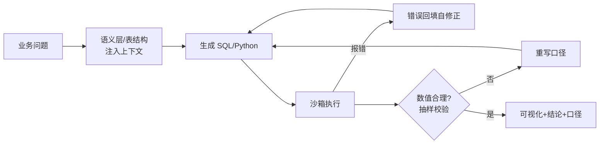

# 数据分析 Agent

> **一句话**：数据分析 Agent = 会写 SQL/Python、会看数据、会画图并给出结论的「初级分析师」；成败关键在「数值零幻觉」与「结论可复现」。
> **难度**：入门
> **标签**：`#application`

## 先看结论

- 标准管线：理解问题 → 探查 schema → 写 SQL/代码执行 → 校验结果 → 可视化 → 结论+口径说明
- 铁律：数字必须来自工具执行（SQL 返回、代码输出），禁止模型「口算」——分析场景的幻觉是直接的业务事故
- 语义层（metrics layer）是规模化关键：指标口径统一定义，避免「每个会话算出来的 GMV 不一样」
- 代码解释器（Code Interpreter）模式：让模型写 Python 在沙箱执行，比只靠 SQL 灵活得多
- 2026：托管 harness 的长会话 + 子 Agent 并行，让「多表排查 → 假设 → 复验」的整夜分析任务变得可交付（见 [OpenAI Agents API](../18-frontier-2026/openai-agents-api.md)、[Claude Agent SDK](../18-frontier-2026/claude-agent-sdk.md)）

## 管线图

## 核心机制：校验与口径

**1. 数值必须可回放。** 定义一次分析的可复现性：

$$
\text{reproducible}\iff
\text{SQL/Code}\;\vdash\;\text{table snapshot}\;\Rightarrow\;\text{same numbers}
$$

表快照 ID + 查询文本进审计日志；缺一就无法向业务解释「上周怎么算的」。

**2. 对账是最便宜的防幻觉。** 总量与分组和必须闭合：

$$
\Big|\sum_{i} m_i - m_{\text{total}}\Big| \le \varepsilon
$$

失败先怀疑口径/空值/时区，而不是「模型不够聪明」。

**3. 结论置信度要显式。** 样本少、表延迟、指标定义争议时，输出应降级为「线索」而不是「决策依据」。

## 源码案例

- **DeepSeek Harness 的 PTC 模式**（[仓库](https://github.com/deepseek-ai/deepseek-harness)）：程序化工具调用让模型把「查库 → 清洗 → 统计 → 画图」写成一段 Python 一次执行——数据管线类任务天然适合 PTC：多轮交互变单段代码，中间结果不出沙箱
- **AutoGen 的数据分析 duo**（[microsoft/agent-framework](https://github.com/microsoft/agent-framework)）：经典用法是「分析师 Agent 写代码 + Proxy Agent 沙箱执行」，论文里的数据任务案例多基于此——代码执行-报错-修正循环的教科书
- **Code Interpreter 模式**：OpenAI Advanced Data Analysis 与开源实现（如 [E2B](https://github.com/e2b-dev/E2B) 沙箱）——「执行环境即产品」：文件上传、依赖预装、超时控制都是产品能力
- **语义层工具**：dbt semantic layer / Cube（[GitHub](https://github.com/cube-js/cube)）——把「GMV 怎么算」从 prompt 挪到指标定义，Agent 引用指标而非拼 SQL 口径
- **2026 托管路线**：Agents API 把压缩、tool search、子 Agent 并行收进运行时——适合「并行探查多张日志表 / 多条假设线再合并」；开源对照仍是 [Pi](https://github.com/earendil-works/pi) 与 [codex](https://github.com/openai/codex)

## 2026 产品面

| 变化 | 对数据分析 Agent 的含义 |
|---|---|
| 长时程 + 自动压缩 | 「先探查两小时再出报告」从运维负担变成 API 能力；但压缩会丢中间口径，关键中间表要落盘 |
| 子 Agent 并行 | 分组排查、异常归因可并行；合并时必须统一口径，否则数字对不上 |
| MCP 接数据源 | 仓库/湖/BI 指标作为 MCP tool，Agent 不必为每个引擎学一套 SDK（见 [2026 协议栈](../18-frontier-2026/protocol-stack-2026.md)） |
| 缓存读降价 | 长会话里 schema 与样本表反复引用，cache hit 主导账单；模型经济性见 [前沿模型地图](../18-frontier-2026/frontier-models-2026.md) |

编程榜（Terminal-Bench 等）不能直接证明「业务数字算得对」；分析场景应在自己的数据集上做回归（读榜纪律见 [评估 2026](../18-frontier-2026/eval-2026.md)）。

## 落地要点

- Schema 注入精简：几百张表全塞上下文必爆，按问题路由相关表 + 列描述（→ [工具选择与路由](../07-planning/tool-selection-routing.md)）
- 数值校验自动化：总量对账（各维度之和 = 总计）、异常值检测（环比 >10 倍先怀疑）
- 结论强制三件套：数字 + 口径（SQL/代码）+ 不确定性说明
- 沙箱默认出网关闭：分析 Agent 不该顺手把 CSV 传到公网；权限模型见 [工具权限与沙箱](../05-tool-protocol/tool-permission-sandbox.md)
- 指标争议先升级：语义层覆盖不到的口径，宁可回人工，也不要让模型现场发明定义

## 常见误区

- ❌ 模型直接回答数据问题：训练数据里没有你的业务数据，「去年营收」它只能编
- ❌ SQL 报错就放弃：报错回填重试（列名错了、类型不匹配）通常 1–2 次内自愈，这是该场景最成熟的自我修正循环
- ❌ 忽略数据新鲜度：Agent 不知道表多久更新一次，口径里必须带数据时间戳
- ❌ 用「跑得久」冒充「分析深」：没有假设检验与对账的长会话只是更贵的试错

## 小练习

给 Agent 接一个样例数据库，问「上个月销量 Top5 的产品」：观察它的 SQL 生成-报错-修正过程，记录哪个环节最容易产生错误结论。

## 参考资料

- [deepseek-harness](https://github.com/deepseek-ai/deepseek-harness) · [E2B](https://github.com/e2b-dev/E2B) · [Cube](https://github.com/cube-js/cube)
- [OpenAI Agents API](../18-frontier-2026/openai-agents-api.md)
- [评估 2026](../18-frontier-2026/eval-2026.md) · [2026 协议栈](../18-frontier-2026/protocol-stack-2026.md)

## 相关知识点

- [浏览器、代码、文件系统工具](../05-tool-protocol/browser-code-filesystem-tools.md)
- [幻觉问题](../10-evaluation-safety/hallucination.md)
- [模型原生 vs 自建 Harness](../18-frontier-2026/model-native-vs-harness.md)
