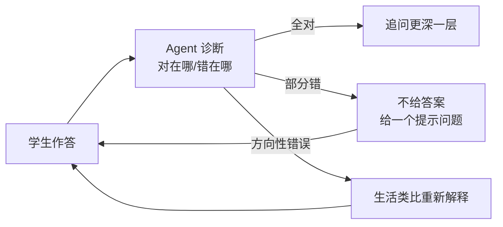

# 💼 教育 Agent

> **一句话**：教育 Agent 的最高形态不是「给答案的百科全书」而是「会提问的苏格拉底」：个性化辅导 + 学习路径规划 + 批改反馈，核心挑战是「不剥夺思考」。
> **难度**：⭐️ 入门
> **标签**：`#application`

## 📌 先看结论

- 三个产品形态：辅导教练（苏格拉底式提问）、批改助教（结构化反馈）、学习规划师（路径与 spaced repetition）
- 核心设计张力：直接给答案提高「短期满意度」但伤害学习效果——提示策略要偏「引导」而非「代劳」
- 学情记忆是差异化关键：错题本、知识状态追踪（Knowledge Tracing）、根据遗忘曲线安排复习
- 评估要测「学习增益」而非「对话满意度」：前后测对比才是硬指标

## 🖼️ 苏格拉底式辅导循环

## 📦 源码案例

- **可汗学院 Khanmigo**（[官网](https://www.khanacademy.org/khan-labs)）：GPT-4 时代苏格拉底辅导的标杆产品——「不直接给答案」写进系统 prompt 的产品级实践；其公开的设计理念文章是教育 Agent prompt 设计的必读材料
- **Speak / 多邻国 Max**：语言学习场景的对话练习 + 即时纠错——「角色扮演 + 发音/语法反馈」的工具组合模式
- **斯坦福小镇的方法迁移**（[论文](https://arxiv.org/abs/2304.03442)）：其「记忆流 + 反思」架构被广泛用于学情记忆——把学生的历史错误作为情景记忆检索，辅导时「记得你上次栽在负数上」
- **开源参考**：各类「AI tutor」开源项目（如基于 LangChain 的 tutor 模板）——重点看它们的 system prompt 如何平衡「提示」与「给答案」

## ✅ 落地要点

- 防依赖设计：连续两次不会才降级提示；解题步骤「分步解锁」而非一次全给
- 错题知识图谱：把错误映射到知识点缺口，复习规划按缺口+遗忘曲线排程
- 家长/教师面板：AI 的辅导过程可回看——教育场景的可解释性是信任基础（→ [可解释性](../10-evaluation-safety/explainability.md)）

## ⚠️ 常见误区

- ❌ 把聊天机器人当辅导老师：没有学情记忆与教学策略的「AI 答疑」只是高级搜索
- ❌ 越流畅越好：秒答一切的老师培养不出思考者，引入「思考等待」是特性不是 bug
- ❌ 忽视年龄段适配：儿童场景的语言、内容安全边界（→ [越狱防护](../10-evaluation-safety/jailbreak.md)）要求高得多

## 🧪 小练习

写一个「初中数学辅导」的 system prompt：包含苏格拉底规则（何时给提示/何时给答案/何时讲类比）、鼓励性语言约束、防直接抄答案机制。

## 📚 相关知识点

- [Prompt Engineering](../04-prompt-reasoning/prompt-engineering.md)
- [记忆类型](../06-memory-rag/memory-types.md)
