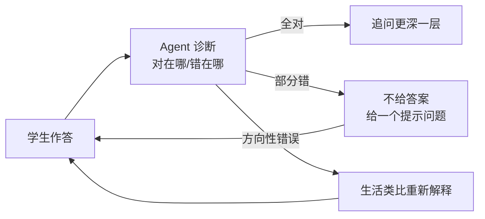

# 教育 Agent

> **一句话**：教育 Agent 的最高形态不是「给答案的百科全书」而是「会提问的苏格拉底」：个性化辅导 + 学习路径规划 + 批改反馈，核心挑战是「不剥夺思考」。
> **难度**：入门
> **标签**：`#application`

## 先看结论

- 三个产品形态：辅导教练（苏格拉底式提问）、批改助教（结构化反馈）、学习规划师（路径与 spaced repetition）
- 核心设计张力：直接给答案提高「短期满意度」但伤害学习效果——提示策略要偏「引导」而非「代劳」
- 学情记忆是差异化关键：错题本、知识状态追踪（Knowledge Tracing）、根据遗忘曲线安排复习
- 评估要测「学习增益」而非「对话满意度」：前后测对比才是硬指标
- 2026 产品面：语音实时辅导（GPT-Live-1 类 API）与长会话托管 harness 让「一节课级」连续辅导成为可能；模型与 harness 的选型见 [2026 前沿模型地图](../18-frontier-2026/frontier-models-2026.md) 与 [模型原生 vs 自建 Harness](../18-frontier-2026/model-native-vs-harness.md)

## 苏格拉底式辅导循环

## 核心机制：学情状态怎么表示

把「学生会不会」写成显式状态，而不是散落在对话历史里。一种常见表示是知识点掌握概率向量：

$$
\mathbf{p}_t=(p_{t,1},\ldots,p_{t,K}),\qquad
p_{t+1,k}=f\big(p_{t,k},\;\text{correct}_k,\;\Delta t\big)
$$

其中 $$f$$ 可以是 BKT / DKT 更新，也可以只是「答对升、答错降 + 时间衰减」的工程近似。Agent 的下一步教学动作应最大化期望学习增益：

$$
a^*=\arg\max_a\;\mathbb{E}\big[\;U(\mathbf{p}_{t+1})-U(\mathbf{p}_t)\;\big]
$$

工程含义：没有显式 $$\mathbf{p}_t$$ 的「AI 答疑」只是高级搜索；有了它，才能做「先补前置知识点，再讲新课」的路径规划。

## 源码案例

- **可汗学院 Khanmigo**（[官网](https://www.khanacademy.org/khan-labs)）：GPT-4 时代苏格拉底辅导的标杆产品——「不直接给答案」写进系统 prompt 的产品级实践；其公开的设计理念文章是教育 Agent prompt 设计的必读材料
- **Speak / 多邻国 Max**：语言学习场景的对话练习 + 即时纠错——「角色扮演 + 发音/语法反馈」的工具组合模式；2026 后普遍叠加实时语音链路，延迟与打断模型见 [实时语音 Agent](voice-agent.md)
- **斯坦福小镇的方法迁移**（[论文](https://arxiv.org/abs/2304.03442)）：其「记忆流 + 反思」架构被广泛用于学情记忆——把学生的历史错误作为情景记忆检索，辅导时「记得你上次栽在负数上」
- **托管 harness 路线**：一节课级连续辅导需要长会话压缩、子 Agent 并行（答疑 Agent + 批改 Agent + 规划 Agent），可对照 [OpenAI Agents API](../18-frontier-2026/openai-agents-api.md) 与 [Claude Agent SDK](../18-frontier-2026/claude-agent-sdk.md) 的能力面；开源参考仍是各类 AI tutor 模板，重点看 system prompt 如何平衡「提示」与「给答案」

## 2026 产品面

| 变化 | 对教育场景的含义 |
|---|---|
| 实时语音 API（如 GPT-Live-1，2026-09-10） | 口语陪练、低龄儿童场景不再依赖「打字 Agent」；打断与听感指标进入验收 |
| 长时程模型 + 托管 harness | 整节课、整章作业的连续辅导成为产品能力，而不是 demo |
| Skills / agents.md 类项目约定 | 把「本校教材进度、评分口径、话术禁忌」版本化，跨班可复现 |
| 隐私与未成年人合规 | 对话日志、面部/声音数据的出域控制比模型分更早卡住采购 |

多模态草稿纸批改、图形题讲解依赖视觉能力，但评测不要拿编程榜（Terminal-Bench / SWE-bench）替代学习增益——读榜方法见 [评估 2026](../18-frontier-2026/eval-2026.md)。

## 落地要点

- 防依赖设计：连续两次不会才降级提示；解题步骤「分步解锁」而非一次全给
- 错题知识图谱：把错误映射到知识点缺口，复习规划按缺口+遗忘曲线排程
- 家长/教师面板：AI 的辅导过程可回看——教育场景的可解释性是信任基础（→ [可解释性](../10-evaluation-safety/explainability.md)）
- 语音辅导要单独测：首次响应、打断恢复、方言/童声识别失败率，不能只看文本准确率
- 评测主指标：前后测差值、提示轮次（越少越好）、错误概念纠正率；对话「开心」不等于学会了

## 常见误区

- ❌ 把聊天机器人当辅导老师：没有学情记忆与教学策略的「AI 答疑」只是高级搜索
- ❌ 越流畅越好：秒答一切的老师培养不出思考者，引入「思考等待」是特性不是 bug
- ❌ 忽视年龄段适配：儿童场景的语言、内容安全边界（→ [越狱防护](../10-evaluation-safety/jailbreak.md)）要求高得多
- ❌ 用通用满意度代理学习效果：学生最爱点「直接给答案」，产品指标会把行为带偏

## 小练习

写一个「初中数学辅导」的 system prompt：包含苏格拉底规则（何时给提示/何时给答案/何时讲类比）、鼓励性语言约束、防直接抄答案机制。

## 参考资料

- [Khanmigo / Khan Academy Labs](https://www.khanacademy.org/khan-labs)
- [Generative Agents](https://arxiv.org/abs/2304.03442)（Stanford，学情记忆方法迁移来源）
- [GPT-Live-1 实时语音](voice-agent.md) · [2026 前沿模型地图](../18-frontier-2026/frontier-models-2026.md)
- [OpenAI Agents API](../18-frontier-2026/openai-agents-api.md) · [Claude Agent SDK](../18-frontier-2026/claude-agent-sdk.md)

## 相关知识点

- [Prompt Engineering](../04-prompt-reasoning/prompt-engineering.md)
- [记忆类型](../06-memory-rag/memory-types.md)
- [评估 2026](../18-frontier-2026/eval-2026.md)
- [实时语音 Agent](voice-agent.md)
