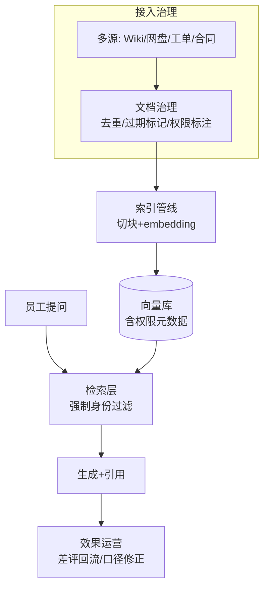

# 企业知识库

> **一句话**：企业知识库问答是 RAG 最普遍的落地形态：技术不难、运营很难——文档治理、权限过滤、口径一致与持续运营决定成败。
> **难度**：入门
> **标签**：`#application` `#rag`

## 先看结论

- 技术骨架就是标准 RAG（→ [RAG 基础](../06-memory-rag/rag-basics.md)），企业级的增量在四件事：权限过滤、文档新鲜度、口径治理、效果运营
- 失败调研的头号原因不是检索算法，是**文档本身烂**：过期、重复、版本混乱——「知识治理先于知识工程」
- 权限过滤必须在检索层做（非生成层），多部门隔离是企业上线的一票否决项
- 引用与溯源是信任基石：每条回答附文档链接 + 版本 + 更新时间

## 企业级架构

## 源码案例

- **LlamaIndex 企业模板**（[docs.llamaindex.ai](https://docs.llamaindex.ai/)）：连接器矩阵（SharePoint/Confluence/飞书/Google Drive）+ 权限感知检索——企业接入的第一站；LlamaCloud 把解析质量（烂 PDF）产品化
- **Qdrant/Weaviate 的多租户过滤**（[GitHub](https://github.com/qdrant/qdrant)）：payload 过滤在检索层强制执行，无权文档根本不进候选——权限即元数据
- **GraphRAG 用于跨文档问题**（[microsoft/graphrag](https://github.com/microsoft/graphrag)）：「我们部门去年 Q3 的整体结论是什么」这类汇总型问题，GraphRAG 的社区摘要比逐条检索更合适（→ [GraphRAG](../06-memory-rag/graphrag.md)）

## 落地要点

- 冷启动策略：先选一个文档质量高、痛点强的域（如 IT 自助）做深，别全公司铺开
- 差评回流：每个「没帮上忙」的提问进入运营队列，补文档或调口径
- 口径仲裁：同一问题多个文档冲突时（报销标准新版旧版），以「版本 + 生效日期」元数据裁决

## 常见误区

- ❌ 先上技术后治文档：烂进烂出，先把 Top 100 高频文档治理好
- ❌ 权限过滤放在生成层（「提示模型别回答无权内容」）：检索层过滤才是硬保障（→ [数据隐私](../10-evaluation-safety/data-privacy.md)）
- ❌ 上线即终点：没有运营闭环的知识库，三个月后答案过时率过半

## 小练习

为公司 IT 自助知识库设计上线方案：选 50 篇种子文档的治理清单（去重/过期/权限标注）、三个权限过滤规则、差评回流流程。

## 相关知识点

- [RAG 基础](../06-memory-rag/rag-basics.md)
- [数据隐私](../10-evaluation-safety/data-privacy.md)
