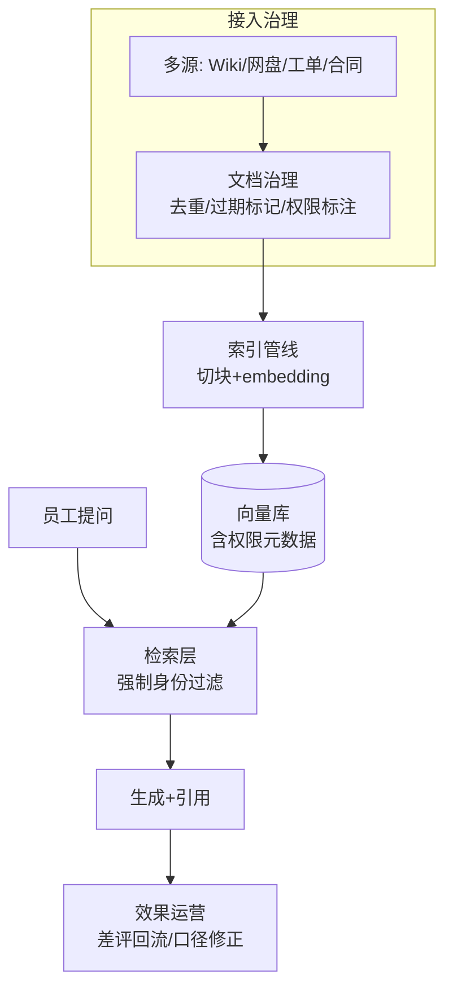

# 企业知识库

> **一句话**：企业知识库问答是 RAG 最普遍的落地形态：技术不难、运营很难——文档治理、权限过滤、口径一致与持续运营决定成败。

## 先看结论

- 技术骨架就是标准 RAG（→ [RAG 基础](../06-memory-rag/rag-basics.md)），企业级的增量在四件事：权限过滤、文档新鲜度、口径治理、效果运营
- 失败的头号原因不是检索算法，是**文档本身烂**：过期、重复、版本混乱——「知识治理先于知识工程」
- 权限过滤必须在**检索层**做（非生成层），多部门隔离是企业上线的一票否决项
- 引用与溯源是信任基石：每条回答附文档链接 + 版本 + 更新时间

## 核心机制

### 1. 权限过滤为什么必须在检索层

正确做法是把「访问控制」写进检索条件，使无权文档根本不进入候选集：

$$
\text{候选集}=\big\{d\in\mathcal{D}\;\big|\;\text{sim}(q,d)\ \text{高}\;\wedge\;\text{ACL}(u,d)=\text{allow}\big\}
$$

对比两种错误做法：

| 做法 | 机制 | 后果 |
|---|---|---|
| 生成层过滤（正确性靠 prompt） | 提示模型「不要回答无权内容」 | 一旦被注入或遗忘，越权信息已进入上下文，等于泄漏 |
| 后过滤（先取 Top-K 再筛） | 检索完再按 ACL 剔除 | 强过滤条件下候选被筛空，召回崩塌 |
| **检索层下推（正解）** | ACL 作为检索过滤条件 | 无权文档从不进入模型可见范围 |

这也是「权限即元数据」的含义：每篇文档入库时带上 ACL 字段，检索时下推（见 [向量数据库](../06-memory-rag/vector-database.md)）。

### 2. 文档新鲜度是可度量的

知识库的答案质量随时间衰减，可以用「过期率」跟踪：

$$
\text{过期率}=\frac{\#\{\text{内容已失效的文档}\}}{\#\{\text{总文档}\}}
$$

需要元数据支撑：每篇文档带 `owner`、`updated_at`、`effective_date`、`review_due`。**没有这些字段，就无法判断哪条答案该被信任**。运营上按过期率设阈值告警，到期文档自动进入复核队列。

### 3. 口径冲突要仲裁，不能靠模型猜

同一问题命中多篇文档且内容冲突时（报销标准的新版与旧版），必须有确定性的裁决规则：

$$
\text{采用}\;\arg\max_{d}\big(\text{effective\_date}(d)\big)\quad\text{在版本可比较的前提下}
$$

工程做法：把「生效日期 + 版本」写进元数据，检索后按此排序取最新生效版本，并在回答里显式标注所依据的版本。指望模型自己挑「更对的那份」是不可靠的。

## 企业级架构

## 工程含义

- **冷启动选一个域做深**：挑文档质量高、痛点强的域（如 IT 自助），别全公司铺开。
- **差评回流是运营闭环**：每个「没帮上忙」的提问进入运营队列，补文档或调口径。
- **引用要带版本**：回答里标注文档版本与更新时间，用户才能判断信息是否仍然有效。
- **解析质量是隐性瓶颈**：烂 PDF、扫描件、跨页表格会直接污染索引，必要时用专门解析服务。

## 源码案例

- **LlamaIndex 企业模板**（[文档](https://docs.llamaindex.ai/)）：连接器矩阵（SharePoint/Confluence/飞书/Google Drive）+ 权限感知检索——企业接入的第一站
- **Qdrant / Weaviate 的多租户过滤**（[Qdrant](https://github.com/qdrant/qdrant)）：payload 过滤在检索层强制执行，无权文档根本不进候选——权限即元数据
- **GraphRAG 用于跨文档问题**（[microsoft/graphrag](https://github.com/microsoft/graphrag)）：「我们部门去年 Q3 的整体结论是什么」这类汇总型问题，GraphRAG 的社区摘要比逐条检索更合适（→ [GraphRAG](../06-memory-rag/graphrag.md)）

## 常见误区

- ❌ 先上技术后治文档：烂进烂出，先把高频文档治理好
- ❌ 权限过滤放在生成层：检索层过滤才是硬保障（→ [数据隐私](../10-evaluation-safety/data-privacy.md)）
- ❌ 上线即终点：没有运营闭环的知识库，答案过时率会快速上升
- ❌ 不做版本仲裁：新旧文档冲突时让模型自由裁量，会给出错误口径
- ❌ 只测「答案对不对」：不分开测检索与生成，无法定位问题出在哪一环

## 小练习

为公司 IT 自助知识库设计上线方案：选 50 篇种子文档的治理清单（去重/过期/权限标注），写出三个权限过滤规则、口径仲裁规则，以及差评回流流程。

## 参考资料

- [Retrieval-Augmented Generation for Knowledge-Intensive NLP Tasks](https://arxiv.org/abs/2005.11401)（Lewis et al., 2020）
- [RAGAS: Automated Evaluation of Retrieval Augmented Generation](https://arxiv.org/abs/2309.15217)（Es et al., 2023）
- [LlamaIndex 文档](https://docs.llamaindex.ai/) / [Qdrant](https://github.com/qdrant/qdrant)

## 相关知识点

- [RAG 基础](../06-memory-rag/rag-basics.md)
- [数据隐私](../10-evaluation-safety/data-privacy.md)
- [向量数据库](../06-memory-rag/vector-database.md)
