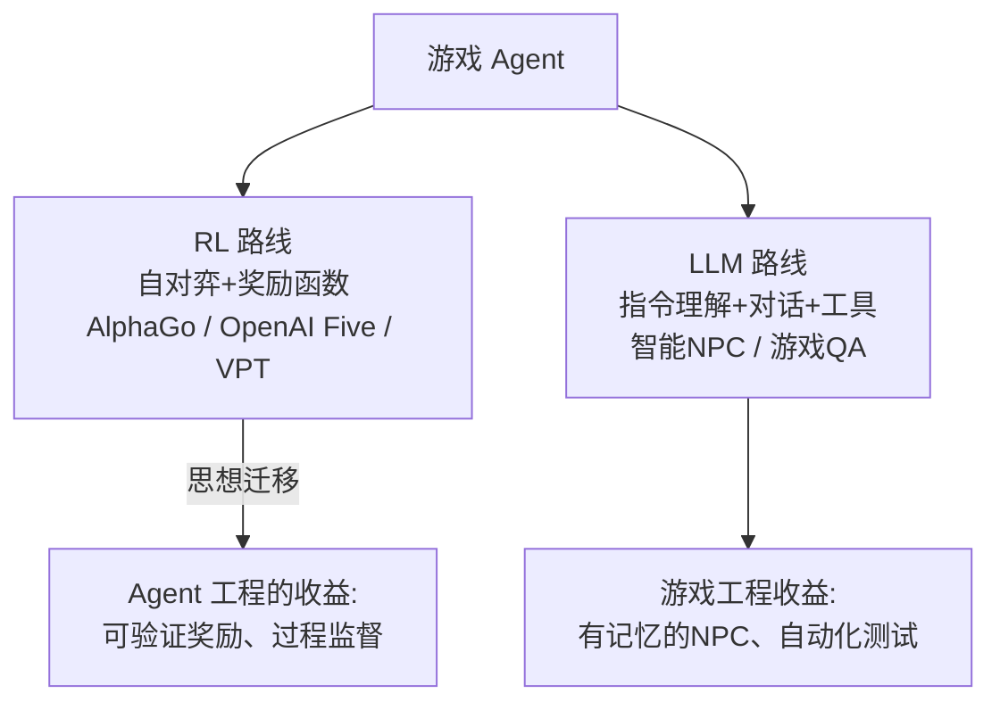

# 💼 游戏 Agent

> **一句话**：游戏是 Agent 的天然试验场（环境封闭、反馈即时、可无限重试）——从 AlphaGo 的 RL 到今天 LLM 驱动的智能 NPC，两条技术路线并存。
> **难度**：⭐️⭐️ 进阶
> **标签**：`#application`

## 📌 先看结论

- 两条路线：**RL 路线**（自对弈训练，AlphaGo/OpenAI Five，专精单游戏、超越人类）与 **LLM 路线**（开放指令理解、自然语言交互，通用但操作精度有限）
- LLM 的游戏应用三方向：智能 NPC（有记忆有性格）、玩家助手/教练、自动化测试（游戏 QA）
- RL 的游戏遗产在 Agent 工程里处处可见：自对弈 = Self-Play、奖励塑形 = 可验证奖励（DeepSeek-R1 的 RL 思想源头之一）
- 成本现实：LLM NPC 的推理成本约束了并发——按角色重要度分级调用

## 🖼️ 两条路线

## 📦 源码案例

- **MineDojo / VPT**（[论文](https://arxiv.org/abs/2206.08853) / [OpenAI VPT](https://openai.com/research/video-pretraining)）：在 Minecraft 上训练通用 Agent——VPT 用 7 万小时视频预训练 + RL 微调完成「砍树→合成工具→挖钻石」长链任务；是「LLM 时代之前」最具启发性的具身 Agent 工作
- **Generative Agents（斯坦福小镇）**（[论文](https://arxiv.org/abs/2304.03442) / 开源实现众多）：25 个 LLM NPC 在虚拟小镇生活——记忆流（情景记忆检索）+ 反思 + 计划三件套，是 [记忆类型](../06-memory-rag/memory-types.md) 的最著名实证，NPC 之间涌现出社交行为
- **Voyager**（[论文](https://arxiv.org/abs/2305.16291)）：Minecraft 里的终身学习 Agent——LLM 写技能代码存入技能库，遇到新任务检索复用并持续扩展，「程序记忆 + 自我扩展」的开源典范（呼应 [记忆类型](../06-memory-rag/memory-types.md) 的程序记忆）
- **游戏 QA 自动化**：LLM 按测试用例操作游戏、观察崩溃与平衡性问题——Computer Use 技术栈在游戏窗口上的直接应用

## ✅ 落地要点

- NPC 记忆分级：核心人设（永不压缩）+ 最近交互（窗口内）+ 生活经历（向量库检索）
- 行为预算：主角 NPC 用旗舰模型、路人 NPC 用小模型或规则，混合调度
- 测试 Agent 的评估：崩溃复现率、覆盖路径数，比「玩得好不好」更可衡量

## ⚠️ 常见误区

- ❌ LLM 能做出 AlphaGo 级操作：实时决策与精确操作仍是 RL/传统 AI 的领域，LLM 擅长的是「理解与对话」层
- ❌ NPC 记忆无上限：不压缩的记忆流会让每个 NPC 的 prompt 成本失控
- ❌ 忽略一致性：NPC 昨天说的事今天忘了，比「笨」更毁沉浸感——记忆检索是刚需

## 🧪 小练习

设计一个酒馆 NPC：人设、记忆结构（人设/近期/经历三层）、说话预算（多少 token/次）；写出它「被问到自己背景故事」时的记忆检索流程。

## 📚 相关知识点

- [记忆类型](../06-memory-rag/memory-types.md)
- [Computer Use / Browser Use](../05-tool-protocol/computer-use-browser-use.md)
