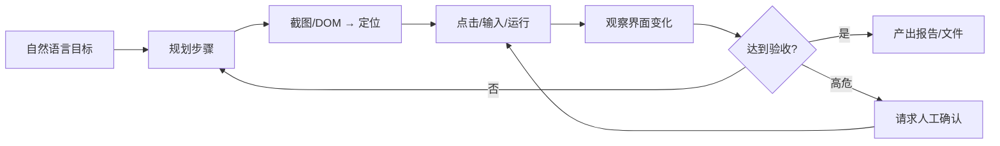

# 通用 Agent 产品

> **一句话**：2025–2026 兴起的「通用助理型 Agent」——在浏览器与桌面里代办研究、行程、采购、办公套件任务——与编程 Agent 同属 harness 竞争，但产品形态与风险面不同。

## 先看结论

- 通用 Agent = **computer use / browser use + 工具 + 长任务会话**，目标是「交给它一件事，回头验收」
- 代表能力线：OpenAI 的 ChatGPT Work / Codex + Astra computer use；Anthropic 的 Claude Cowork、Claude in Chrome；以及 Manus 等独立产品
- 与编程 Agent 的关键差异：环境非确定、成功标准模糊、更依赖 **确认策略与人工验收**
- 工程上仍是 [模型原生 vs 自建 Harness](model-native-vs-harness.md) 问题，只是工具面从 `bash/edit` 换成 **浏览器、Office、日历、CRM**

## 产品形态对比

| 形态 | 例子 | 强项 | 主要风险 |
|---|---|---|---|
| 工作区通用助理 | ChatGPT Work（Astra）、Claude Cowork | 文档/表格/演示 + 桌面应用 | 误操作业务系统、数据外泄 |
| 浏览器代办 | Claude in Chrome、Operator 类 | 网页表单、比价、预约 | 提示注入、钓鱼站、会话劫持 |
| 云端研究/执行舱 | Manus 类、云端沙箱 Agent | 长任务、可分享产物 | 沙箱逃逸面、产物可信度 |
| 企业插件化 | Power BI / Oracle 等 Agent 插件 | 连接已有系统 | 权限过大、审计缺口 |

## 核心机制：通用 Agent 的循环

与 [Computer Use / Browser Use](../05-tool-protocol/computer-use-browser-use.md) 一致；2026 增强在 **更快的视觉定位、更强的任务边界遵守、企业级网站白名单**。

## 工程含义

1. **验收标准必须显式化**：「订最便宜的机票」无法判分；应改成「总价 ≤ X、直飞、日期精确、付款前停”
2. **默认最小权限**：只读浏览 → 需确认的写操作 → 付款/删除单独档
3. **会话隔离**：通用 Agent 比编码 Agent 更容易粘到历史 cookie 与登录态
4. **别和编程 harness 混比 SWE-bench**：考纲不同

## 常见误区

- ❌ 「通用 Agent 可以完全无人值守」：2026 主流产品仍对高后果动作要确认
- ❌ 「computer use 越快越好」：省时间若换来误点率上升，总期望成本更高
- ❌ 「有 API 就不该用 GUI Agent」：许多企业系统仍无 API，这正是 Astra 发布页强调的点

## 参考资料

- [GPT-6 Astra: The next generation in intelligence for work](https://openai.com/index/gpt-6-astra-next-generation-work/)
- [Claude 产品线](https://claude.com/product/overview)
- [Computer Use（Anthropic 文档）](https://docs.anthropic.com/en/docs/agents-and-tools/computer-use)
- [browser-use](https://github.com/browser-use/browser-use)

## 相关知识点

- [Computer Use / Browser Use](../05-tool-protocol/computer-use-browser-use.md)
- [浏览器自动化](browser-automation.md)
- [权限控制与沙箱隔离](../10-evaluation-safety/permission-sandbox.md)
- [2026 前沿模型地图](../18-frontier-2026/frontier-models-2026.md)
