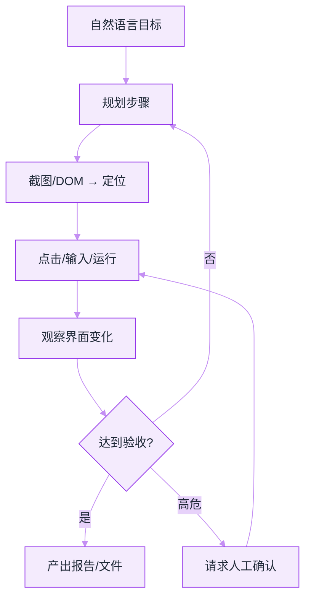
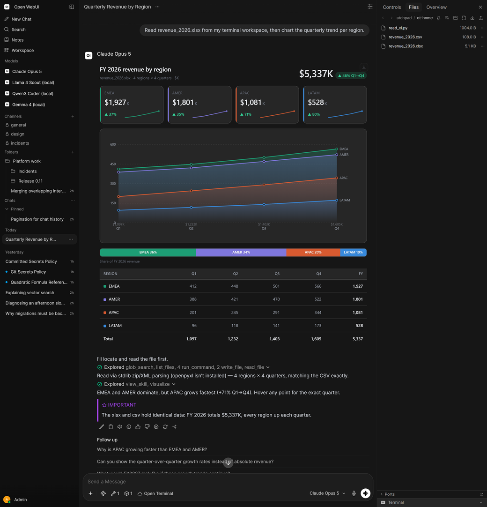

# 通用 Agent 产品


**一句话**：2025–2026 兴起的「通用助理型 Agent」——在浏览器与桌面里代办研究、行程、采购、办公套件任务——与编程 Agent 同属 harness 竞争，但产品形态与风险面不同。


## 先看结论

- 通用 Agent = **computer use / browser use + 工具 + 长任务会话**，目标是「交给它一件事，回头验收」
- 代表能力线：OpenAI 的 ChatGPT Work / Codex + Astra computer use；Anthropic 的 Claude Cowork、Claude in Chrome；以及 Manus 等独立产品
- 与编程 Agent 的关键差异：环境非确定、成功标准模糊、更依赖 **确认策略与人工验收**
- 工程上仍是 [模型原生 vs 自建 Harness](../18-frontier-2026/model-native-vs-harness.md) 问题，只是工具面从 `bash/edit` 换成 **浏览器、Office、日历、CRM**

## 产品形态对比

| 形态 | 例子 | 强项 | 主要风险 |
|---|---|---|---|
| 工作区通用助理 | ChatGPT Work（Astra）、Claude Cowork | 文档/表格/演示 + 桌面应用 | 误操作业务系统、数据外泄 |
| 浏览器代办 | Claude in Chrome、Operator 类 | 网页表单、比价、预约 | 提示注入、钓鱼站、会话劫持 |
| 云端研究/执行舱 | Manus 类、云端沙箱 Agent | 长任务、可分享产物 | 沙箱逃逸面、产物可信度 |
| 企业插件化 | Power BI / Oracle 等 Agent 插件 | 连接已有系统 | 权限过大、审计缺口 |

## 核心机制：通用 Agent 的循环

与 [Computer Use / Browser Use](../05-tool-protocol/computer-use-browser-use.md) 一致；2026 增强在 **更快的视觉定位、更强的任务边界遵守、企业级网站白名单**。

自托管产品里这个循环长这样（Open WebUI）：

*《图：工具调用流水可折叠审计、右侧 Files 面板显式列出工作区、本地与云端模型并列——那句「openpyxl 没装，改用 stdlib zip/XML 解析」正是环境受限时会自己换路、说明理由的分水岭》*

*读图提示：这张是 1040×1082 的竖版截图，排进 608px 列后缩到 0.585，气泡里那句「openpyxl 没装…」会挤成一片——点开图片即可按原始尺寸读全。*

*来源：Open WebUI 官方文档 [docs.openwebui.com](https://docs.openwebui.com) 首页产品图，访问日期 2026-09-22。*

三个通用 Agent 产品的共性被这张图占齐了：**工具调用过程可折叠审计**（`Explored glob_search, list_files, 4 run_command, 2 write_file, read_file` 那行点开就是流水账）、**工作区是显式的**（右侧 Files 面板列出 `read_xl.py` / `revenue_2026.csv` / `revenue_2026.xlsx`，左下角还有 `Open Terminal` 入口）、**本地与云端模型混排**（侧栏 `Llama 4 Scout (local)`、`Qwen3 Coder (local)` 与 `Claude Opus 5` 并列，用户按任务挑）。最值得学的是那句 `Read via stdlib zip/XML parsing (openpyxl isn't installed)`——**沙箱里没有的库，Agent 得自己换条路并说明理由**；这类「环境受限时的降级说明」正是通用 Agent 与 demo 的分水岭。

## 工程含义

1. **验收标准必须显式化**：「订最便宜的机票」无法判分；应改成「总价 ≤ X、直飞、日期精确、付款前停止」
2. **默认最小权限**：只读浏览 → 需确认的写操作 → 付款/删除单独档
3. **会话隔离**：通用 Agent 比编码 Agent 更容易粘到历史 cookie 与登录态
4. **别和编程 harness 混比 SWE-bench**：考纲不同

## 验收件怎么写（可复用模板）

通用 Agent 的「回头验收」要落到文件，否则只能靠人肉点一遍。最小三件套：

| 产物 | 内容 | 判分方式 |
|---|---|---|
| `result.md` | 做了什么、改了哪些外部状态、未决事项 | 人读，但缺段即退回 |
| `evidence/` | 关键截图、下载文件哈希、请求日志 | 可脚本比对 |
| `state.diff` | 业务系统的前后状态差异（订单/日历/工单） | 断言「只出现预期变更」 |

$$
\text{托付度} \;\propto\; \frac{\text{自动可判分的验收项}}{\text{全部验收项}}
$$

比例上不去，产品就只能停在「辅助」而不是「代办」——这是通用 Agent 与编程 Agent 最大的商业化差异：编码有测试当免费判分器，办公与采购没有。

## 常见误区

- ❌ 「通用 Agent 可以完全无人值守」：2026 主流产品仍对高后果动作要确认
- ❌ 「computer use 越快越好」：省时间若换来误点率上升，总期望成本更高
- ❌ 「有 API 就不该用 GUI Agent」：许多企业系统仍无 API，这正是 Astra 发布页强调的点
- ❌ 「截图越多越可信」：证据要的是**能判分的差异**（前后状态、文件哈希），不是全程录屏

## 小练习

挑一件你每周都要做的代办事项（报销、续约、比价），写出它的 `result.md` 段落清单与 3 条可脚本化的验收断言。写不出断言的那条，就是现在还不可以托付给 Agent 的那条。

## 参考资料

- [GPT-6 Astra: The next generation in intelligence for work](https://openai.com/index/gpt-6-astra-next-generation-work/)
- [Claude 产品线](https://claude.com/product/overview)
- [Computer Use（Anthropic 文档）](https://platform.claude.com/docs/en/agents-and-tools/tool-use/computer-use-tool)
- [browser-use](https://github.com/browser-use/browser-use)

## 相关知识点

- [Computer Use / Browser Use](../05-tool-protocol/computer-use-browser-use.md)
- [浏览器自动化](browser-automation.md)
- [权限控制与沙箱隔离](../10-evaluation-safety/permission-sandbox.md)
- [2026 前沿模型地图](../18-frontier-2026/frontier-models-2026.md)

