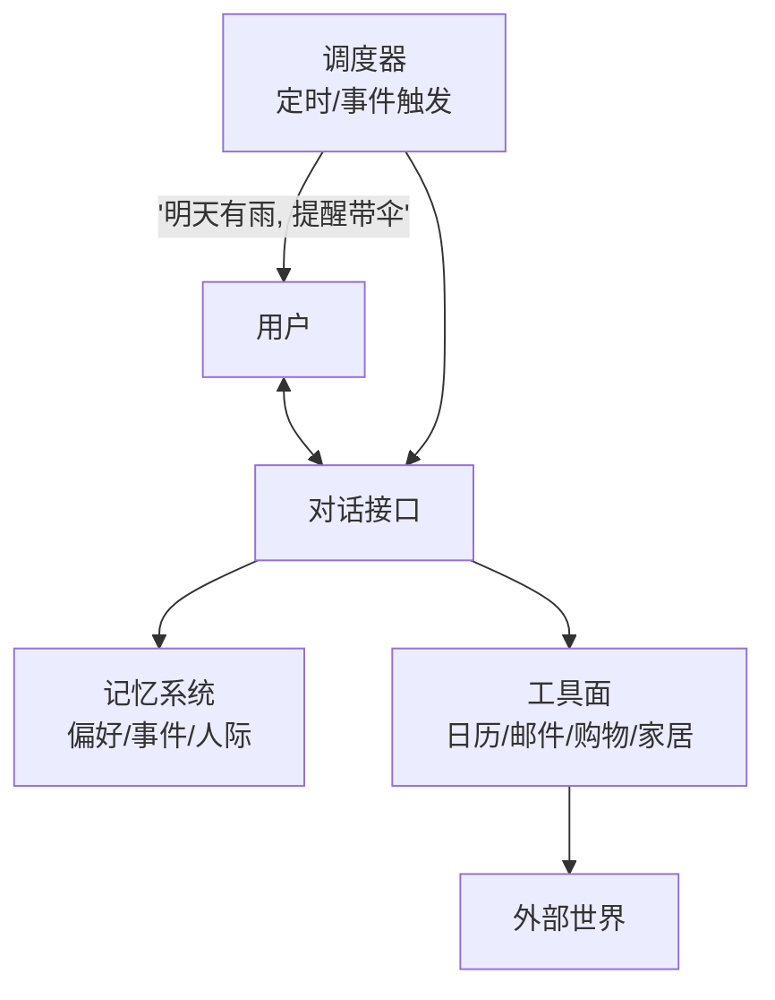

# 个人助理

> **一句话**：个人助理是 Agent 的终极形态之一：长期记忆、跨应用执行、深度个性化——也是隐私、记忆管理与工具权限矛盾最尖锐的场景。
> **难度**：进阶
> **标签**：`#application`

## 先看结论

- 三大技术支柱：长期记忆（偏好/习惯/人际）、工具面（日历/邮件/支付/智能家居）、主动触发（定时与事件驱动）
- 信任阶梯：读（推荐）→ 写（待确认）→ 钱（强确认）——个性化程度与授权深度同步渐进
- 与聊天助手的分水岭：跨会话记忆 + 主动行为。「记得你妈生日并提前提醒订花」才叫助理
- 成本结构特殊：7×24 常驻与主动检查的成本模型，与按需对话完全不同
- 2026 产品面：通用助理（browser/desktop 代办）、实时语音随身口、托管 harness 长任务——三条线在合流，见 [通用 Agent 产品](general-agent-products.md) 与 [实时语音 Agent](voice-agent.md)

## 能力结构

## 源码案例

- **Mem0 / Letta 作为记忆层**（[GitHub](https://github.com/mem0ai/mem0) / [GitHub](https://github.com/letta-ai/letta)）：个人助理的记忆基建首选——Mem0 从对话中抽取事实（「用户对花生过敏」）存档并在合适时机召回；Letta 的虚拟内存管理支撑长期运行
- **Pi 的 Slack bot harness**（[earendil-works/pi](https://github.com/earendil-works/pi)）：把 Agent 接入 IM 作为「随身助理」的轻量参考——消息即界面，工具即能力
- **Claude Code 的 CLAUDE.md 启示**：项目记忆文件的「用户可编辑 + 自动加载」模式，同样适用于个人偏好记忆——用户能直接看、改自己的「AI 认知」，是记忆透明化的好范式；2026 的 agents.md / Skills 把这类约定版本化，见 [2026 协议栈](../18-frontier-2026/protocol-stack-2026.md)
- **OpenClaw 类个人 Agent 生态**（基于 Pi 构建，见 [Pi 文档](https://github.com/earendil-works/pi)）：2026 年个人 Agent 热潮的代表——「常驻 + 多渠道 + 主动服务」的完整形态

## 落地要点

- 偏好记忆要「可查验」：用户能查看/修改 AI 记住的关于自己的一切（透明 + 可纠错）
- 主动行为保守起步：先做「提醒类」主动（低风险），「代办类」主动要确认后执行
- 工具授权分级：日历读写自动、邮件代发待确认、支付永远强确认（→ [自主性等级](../02-agent-basics/autonomy-levels.md)）
- 语音入口单独设计：随身场景的默认模态是语音，打断与延迟预算见 [实时语音 Agent](voice-agent.md)；GPT-Live-1（2026-09-10）类 API 把实时链路产品化
- 桌面/浏览器代办走通用 Agent 路线，不要和编程 harness 混比考纲

## 核心机制：助手类 Agent 的三条硬约束

个人助手与「问答机器人」的差别在于它要长期存在、跨应用行动、并主动介入。这带来三条约束：

**1. 长期记忆的写入判据**。不是所有对话都值得记，写入应满足：

$$
\text{值得记}\iff \underbrace{\text{未来复用概率}}_{\text{会不会再用到}}\times\underbrace{\text{重要度}}_{\text{偏好/事实/承诺}}>\underbrace{\text{存储与隐私成本}}_{\text{越久越贵}}
$$

记「用户不吃辣」有价值，记「用户今天问了下天气」没有价值——后者只会污染检索。

**2. 跨应用权限必须最小化**。助手要接日历、邮件、支付，等于把多个高权限入口聚在一处；一旦被注入或误导，损失面是乘法级的。原则：默认只读、写操作确认、支付类永不自动（见 [权限控制与沙箱隔离](../10-evaluation-safety/permission-sandbox.md)）。2026 主流产品还默认站点/应用白名单与上传下载策略——见 [2026 安全现实](../10-evaluation-safety/safety-incidents-2026.md)。

**3. 主动触发要有打扰预算**。从「被动响应」升级到「主动提醒」时，必须有触发条件与频率上限，否则用户会直接关掉它：

$$
\text{每日主动打扰次数}\le N\quad(\text{如 }2\text{–}3\text{ 次})
$$

这与通知系统的告警疲劳是同一问题。

## 2026 产品面

| 变化 | 对个人助理的含义 |
|---|---|
| 通用 Agent 产品（Cowork / browser 代办等） | 「交给它订行程、整理资料」成真；验收标准必须显式化，高后果动作仍确认 |
| 托管 harness 长任务 | 跨应用多小时代办可异步续跑；压缩会丢偏好细节，关键事实要进记忆层而不是只靠会话 |
| 实时语音运行时 | 随身口（耳机/车机）成为主界面；隐私与录音合规常比模型选型更早卡住项目 |
| 隐私档位 | 企业侧 EFS/零保留与个人侧本地记忆分层；个人数据聚合是单点，见 [数据隐私](../10-evaluation-safety/data-privacy.md) |

选型分叉（买托管还是自建循环）见 [模型原生 vs 自建 Harness](../18-frontier-2026/model-native-vs-harness.md)；模型与价格量级见 [2026 前沿模型地图](../18-frontier-2026/frontier-models-2026.md)。

## 常见误区

- ❌ 记忆越多越贴心：错误记忆（过时偏好）比没记忆更恼人，记忆要有置信度与衰减
- ❌ 全自动代办最酷：擅自帮用户回邮件/下单一次，信任就永久破产
- ❌ 隐私单点：个人助理聚合了最全的个人数据，存储加密与出域控制是生死线（→ [数据隐私](../10-evaluation-safety/data-privacy.md)）
- ❌ 把编程榜当助理能力证明：SWE-bench / Terminal-Bench 考纲不同，通用代办看 OSWorld 类桌面任务与自己的验收集（见 [评估 2026](../18-frontier-2026/eval-2026.md)）

## 小练习

设计「晨间简报」功能：哪些信息源？生成时机？哪些内容主动、哪些等用户问？画出记忆写入（用户反馈「以后别放新闻」）的回路。

## 参考资料

- [Mem0](https://github.com/mem0ai/mem0) · [Letta](https://github.com/letta-ai/letta) · [Pi](https://github.com/earendil-works/pi)
- [通用 Agent 产品](general-agent-products.md) · [实时语音 Agent](voice-agent.md)
- [2026 协议栈](../18-frontier-2026/protocol-stack-2026.md) · [2026 安全现实](../10-evaluation-safety/safety-incidents-2026.md)

## 相关知识点

- [记忆类型](../06-memory-rag/memory-types.md)
- [Human-in-the-loop](../02-agent-basics/human-in-the-loop.md)
- [模型原生 vs 自建 Harness](../18-frontier-2026/model-native-vs-harness.md)
- [权限控制与沙箱隔离](../10-evaluation-safety/permission-sandbox.md)
