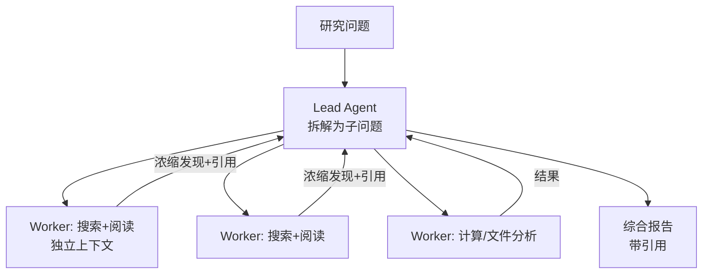

# 研究 Agent

> **一句话**：研究 Agent（Deep Research 类）= 多轮搜索 + 阅读 + 交叉验证 + 长文综合，是「广度优先爬取 + 深度优先阅读」的混合体；Anthropic 的多 Agent 研究系统是公开的最佳参考。
> **难度**：进阶
> **标签**：`#application`

## 先看结论

- 与聊天问答的本质区别：主动规划搜索策略、多源交叉验证、产出带引用的长报告
- 多 Agent 是该场景的「正当理由」：子问题彼此独立、需要并行广度——Anthropic 实测 token 消耗 15 倍于聊天，但质量提升显著
- 关键工程：搜索查询的生成质量（Lead Agent 的任务契约）、来源去重与可信度分级、引用溯源
- 失败模式：过时信息（搜索快照旧）、单一来源偏信、为凑长度灌水

## Anthropic 式架构

## 源码案例

- **Anthropic 多 Agent 研究系统**（[工程博客](https://www.anthropic.com/engineering/built-multi-agent-research-system)，必读）
  - Lead Agent 的任务契约四要素：目标、输出格式、工具指引、边界——子 Agent 产出可合并的关键
  - 实测规律：token 消耗排名前 1% 的对话贡献约 80% 性能 → **并行广度是第一杠杆**
  - 评估用 LLM-as-judge + 人工评估组合，且专门评估「引用忠实度」
- **开源复刻**：多个开源项目复现 Deep Research 模式（如 [gpt-researcher](https://github.com/assafelovic/gpt-researcher)）——计划 → 并行爬取 → 去重 → 报告的完整管线，几百行可读源码
- **DeepSeek Harness 的适配**（[仓库](https://github.com/deepseek-ai/deepseek-harness)）：Supervisor–Worker + 并行编排即研究系统的骨架；append-only 事件流让「这个结论哪来的」可以逐事件回溯——研究场景的可溯源刚需

## 落地要点

- 搜索工具分层：关键词检索（精确）+ 语义检索（模糊）+ 专用源（论文库/专利库）
- 引用强制：每个关键论断绑定 URL + 访问时间；无法溯源的句子在评审阶段删除
- 时间敏感主题注入「当前日期」并要求标注信息时效

## 常见误区

- ❌ 报告长 = 研究深：灌水报告不如 500 字带 10 个可靠引用的摘要
- ❌ 单轮搜索出报告：广度不够是研究 Agent 最大短板，要显式评估「覆盖了几个角度」
- ❌ 忽略成本控制：无预算上限的并行研究一晚上能烧掉一个季度 API 预算

## 小练习

让任意研究 Agent 调查「2026 年 Agent harness 的开源格局」：审阅产出报告的引用质量——多少引用真实有效？多少论断无出处？

## 相关知识点

- [多 Agent 协作](../08-multi-agent/multi-agent-collaboration.md)
- [幻觉问题](../10-evaluation-safety/hallucination.md)
