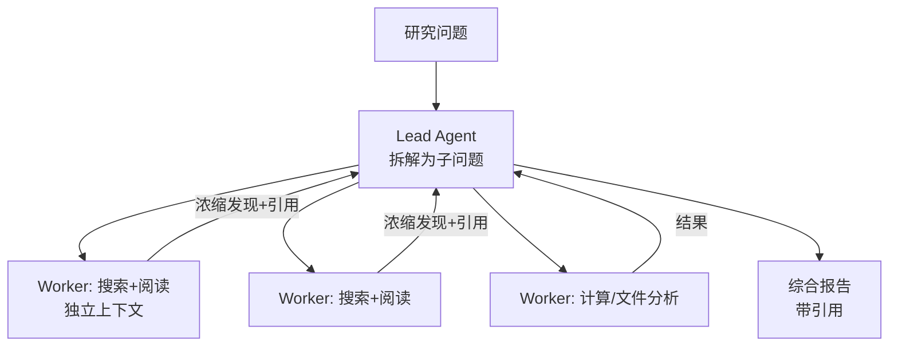

# 研究 Agent

> **一句话**：研究 Agent（Deep Research 类）= 多轮搜索 + 阅读 + 交叉验证 + 长文综合，是「广度优先爬取 + 深度优先阅读」的混合体；Anthropic 的多 Agent 研究系统是公开的最佳参考。

## 先看结论

- 与聊天问答的本质区别：主动规划搜索策略、多源交叉验证、产出带引用的长报告
- 多 Agent 在该场景是**正当用法**：子问题彼此独立、需要并行广度
- 关键工程：搜索查询的生成质量（任务契约）、来源去重与可信度分级、引用溯源
- 失败模式：过时信息、单一来源偏信、为凑长度灌水
- 成本是主要约束：并行研究的 token 消耗可达聊天的十几倍，必须有预算上限

## 核心机制

### 1. 广度与深度的取舍

研究质量由两个维度共同决定，而它们竞争同一份预算：

$$
\text{质量}\;\approx\;f\big(\underbrace{\text{覆盖度}}_{\text{搜了多少角度}},\;\underbrace{\text{深度}}_{\text{每个角度读多透}}\big)
\qquad\text{s.t.}\quad
\text{成本}=\text{角度数}\times\text{每角度成本}\le B
$$

在预算固定时，二者是此消彼长的。工程含义是：**必须显式决定预算如何分配**，而不是让模型自由发挥。经验做法是先保证覆盖（列出应有的角度清单），再有选择地深挖关键角度。

### 2. 查询生成决定上限

检索质量的上限由查询决定——检索器再好，查询错了也召不回。因此 Lead Agent 的**任务契约**是关键产出：

$$
\text{子任务}=\big(\text{目标},\;\text{输出格式},\;\text{工具指引},\;\text{边界}\big)
$$

四要素缺一，子 Agent 就会各自理解跑偏、产出无法合并。这也是多 Agent 研究系统最容易失败的地方（见 [多 Agent 协作](../08-multi-agent/multi-agent-collaboration.md)）。

### 3. 引用忠实度是可度量的

研究报告的信任建立在「每句话都能溯源」上。可以量化：

$$
\text{引用忠实度}=\frac{\#\{\text{有真实来源支持的论断}\}}{\#\{\text{论断总数}\}}
$$

它和 [幻觉](../10-evaluation-safety/hallucination.md) 的忠实度指标同源。工程上要求：每条关键论断绑定 URL + 访问时间；无法溯源的句子在**评审阶段删除**，而不是留着凑字数。

### 4. 去重与可信度分级

多路并行搜索必然产生大量重复来源，需要按来源标识去重，并按来源类型分级：

| 来源类型 | 可信度 | 使用方式 |
|---|---|---|
| 一手资料（论文、官方文档、财报） | 高 | 可作为核心依据 |
| 权威二手（主流媒体、行业报告） | 中 | 交叉验证用 |
| 聚合/不明来源 | 低 | 仅作线索，需回溯一手 |

$$
\text{同一论断的来源数}\ge 2\;\Longrightarrow\;\text{可信度显著提升}
$$

## Anthropic 式架构

## 工程含义

- **搜索工具分层**：关键词检索（精确）+ 语义检索（模糊）+ 专用源（论文库/专利库）。
- **引用强制**：每个关键论断绑定 URL + 访问时间；无法溯源的句子删除。
- **时间敏感主题注入当前日期**，并要求标注信息时效——否则会引用过时快照。
- **成本熔断**：给研究任务设 token/时间预算，超限时收敛为「已有发现的报告」而不是继续搜。
- **可溯源**：用事件流记录「这个结论哪来的」，便于逐条回溯。

## 源码案例

- **Anthropic 多 Agent 研究系统**（[工程博客](https://www.anthropic.com/engineering/built-multi-agent-research-system)，必读）：Lead Agent 的任务契约四要素；实测「token 消耗排名前 1% 的对话贡献约 80% 性能」；评估采用 LLM-as-judge + 人工，并专门评估引用忠实度
- **开源复刻**（[gpt-researcher](https://github.com/assafelovic/gpt-researcher)）：复现 Deep Research 模式——计划 → 并行爬取 → 去重 → 报告，源码可读性好，适合对照学习
- **DeepSeek Harness 的适配**（[仓库](https://github.com/deepseek-ai/deepseek-harness)）：Supervisor–Worker + 并行编排即研究系统的骨架；append-only 事件流让结论可逐事件回溯——研究场景的可溯源刚需

## 常见误区

- ❌ 报告长 = 研究深：灌水报告不如 500 字带 10 个可靠引用的摘要
- ❌ 单轮搜索出报告：广度不够是最大短板，要显式评估「覆盖了几个角度」
- ❌ 忽略成本控制：无预算上限的并行研究能烧掉大量预算
- ❌ 不区分来源可信度：把聚合站与一手资料等同对待
- ❌ 不留访问时间：链接内容会变，没有时间戳就无法判断信息时效

## 小练习

让任意研究 Agent 调查「2026 年 Agent harness 的开源格局」：审阅产出报告的引用质量——统计引用忠实度（多少论断有真实来源）、覆盖了几个角度，并指出哪条论断最需要补一手来源。

## 参考资料

- [How we built our multi-agent research system](https://www.anthropic.com/engineering/built-multi-agent-research-system)（Anthropic Engineering）
- [gpt-researcher](https://github.com/assafelovic/gpt-researcher)
- [Hallucination 综述](https://arxiv.org/abs/2202.03629)（Ji et al., 2022，忠实度评估）

## 相关知识点

- [多 Agent 协作](../08-multi-agent/multi-agent-collaboration.md)
- [幻觉问题](../10-evaluation-safety/hallucination.md)
- [RAG 基础](../06-memory-rag/rag-basics.md)
