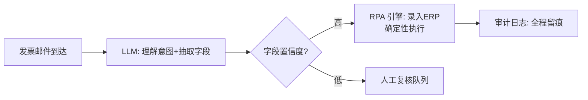

# RPA

> **一句话**：RPA（机器人流程自动化）+ LLM = 从「死板脚本」到「能处理变化的流程自动化」：LLM 负责理解与兜底，RPA 负责精准执行——是传统 RPA 厂商与 Agent 融合的主战场。
> **难度**：入门
> **标签**：`#application`

## 先看结论

- 传统 RPA 痛点：选择器脆弱（页面改版即崩）、异常处理写不完、非结构化数据（邮件/PDF）处理不了——恰好都是 LLM 的强项
- LLM 增强的三层渗透：入口理解（邮件/工单分流）、中间处理（文档抽取/字段映射）、异常兜底（脚本失败时视觉理解接管）
- 与「纯 Agent」的区别：RPA 场景流程基本固定，要的是**确定性的执行 + 智能的例外处理**——编排上更多用 Workflow 少用自由 Agent（→ [工作流编排](../07-planning/workflow-orchestration.md)）
- 落地铁律：财务/合规流程的每一步留审计痕迹，LLM 决策点要有可回放记录
- 2026：computer use 已从实验变成产品能力（白名单、确认策略、自动审查），无 API 的老系统有了可采购路径——读数与闸门见 [Computer Use 2026](../18-frontier-2026/computer-use-2026.md)

## LLM × RPA 分工

## 核心机制：置信度路由与期望成本

LLM 抽取字段后按置信度分流，阈值 $$\tau$$ 由期望成本定，而不是拍脑袋：

$$
\text{accept}\iff \hat{c}\ge\tau,\qquad
\tau^*=\arg\min_\tau\;
\Big(\underbrace{P(\hat{c}\ge\tau)\cdot C_{\text{wrong}}}_{\text{错录代价}}
+\underbrace{P(\hat{c}<\tau)\cdot C_{\text{human}}}_{\text{转人工代价}}\Big)
$$

财务场景 $$C_{\text{wrong}}$$（错账、审计失败）通常远高于 $$C_{\text{human}}$$，因此阈值应更严。与 [权限控制](../10-evaluation-safety/permission-sandbox.md) 的关系：置信度只决定「走哪条路」，写权限仍由策略层强制。

## 源码案例与生态

- **UiPath / Microsoft Power Automate 的 LLM 化**：传统 RPA 双雄都已内置 LLM 活动（文档理解、邮件分类）——「脚本为主、模型为辅」的渐进路线，存量流程平滑升级
- **Computer Use 路线的 RPA**（[Anthropic 文档](https://docs.anthropic.com/en/docs/agents-and-tools/computer-use)）：无 API 的老系统（绿屏、桌面客户端）用视觉路线接管——传统 RPA 啃不动的最硬骨头；配合每日虚拟机快照重置保证环境纯净。2026 前沿模型在桌面 GUI 上的分数与 partial/strict 读法见 [Computer Use 2026](../18-frontier-2026/computer-use-2026.md)（如 Astra 的 OSWorld 2.0 partial 72.6%、Fable 5.1 partial 77.9% / strict 41.7%——配置不同，不可直接混比）
- **browser-use**（[GitHub](https://github.com/browser-use/browser-use)）：Web 流程的轻量替代——比传统 RPA 的浏览器录制的适应性更强
- **Playwright MCP**（[GitHub](https://github.com/microsoft/playwright-mcp)）：把浏览器操作标准化为工具，RPA 场景可直接编排调用
- **DeepSeek Harness 的流水线借鉴**（[仓库](https://github.com/deepseek-ai/deepseek-harness)）：其「Hook → 审批 → 权限 → 沙箱 → 超时」的执行管道 + append-only 审计，正是合规型 RPA 需要的执行骨架
- **托管 harness 作例外处理机**：主流程仍走确定性 RPA，只有「脚本失败后的桌面接管」交给 [Agents API](../18-frontier-2026/openai-agents-api.md) / [Claude Agent SDK](../18-frontier-2026/claude-agent-sdk.md)——避免为偶发异常重写整条流水线

## 2026 产品面

| 变化 | 对 RPA 的含义 |
|---|---|
| computer use 产品化 | 白名单站点/应用、上传下载策略、付款删除确认成为默认配置，而不是自研补丁 |
| 长时程桌面/终端能力 | 跨系统补录、月末结账类多小时任务可试点，但必须可中断、可恢复 |
| MCP 标准化工具面 | 新系统优先接 API/MCP，GUI 路线只留给「真没有接口」的遗产系统 |
| 审计与双用风险 | 视觉 Agent 的每步截图与工具调用要进不可篡改日志；能力阈值治理见 [2026 安全现实](../10-evaluation-safety/safety-incidents-2026.md) |

## 落地要点

- 混合编排：确定性步骤用传统 RPA/脚本（快、准、便宜），理解与例外用 LLM
- 置信度路由：LLM 抽取低于阈值自动转人工，别硬写流程
- 变更监控：目标系统 UI 改版告警，先于用户投诉发现流程断了
- 幂等键进业务单据：重跑不产生重复付款/重复入库
- 视觉接管单独灰度：无 API 系统先只读演练，再开写权限

## 常见误区

- ❌ 用全自主 Agent 重写稳定 RPA 流程：成本翻十倍、确定性下降，老流程跑得好就别动
- ❌ LLM 决策不留痕：财务流程里「模型决定」无法审计 = 审计不通过
- ❌ 忽视幂等：RPA 中途失败重跑，单据重复录入——每步要有业务幂等键
- ❌ 拿 computer use 当第一选择：有 API/MCP 就别硬点 GUI——误点率与 token 成本都不划算

## 小练习

把「供应商发票 → ERP 入库」流程画成混合编排图：哪些步骤保留传统 RPA？哪两个环节用 LLM？置信度阈值定多少、低于阈值去哪？

## 参考资料

- [Computer Use 2026](../18-frontier-2026/computer-use-2026.md) · [GPT-6 Astra](https://openai.com/index/gpt-6-astra/) · [Claude Fable 5.1](https://www.anthropic.com/claude-fable-and-mythos-5-1)
- [Anthropic Computer Use](https://docs.anthropic.com/en/docs/agents-and-tools/computer-use)
- [browser-use](https://github.com/browser-use/browser-use) · [Playwright MCP](https://github.com/microsoft/playwright-mcp)
- [2026 安全现实](../10-evaluation-safety/safety-incidents-2026.md)

## 相关知识点

- [工作流编排](../07-planning/workflow-orchestration.md)
- [Computer Use / Browser Use](../05-tool-protocol/computer-use-browser-use.md)
- [模型原生 vs 自建 Harness](../18-frontier-2026/model-native-vs-harness.md)
- [通用 Agent 产品](general-agent-products.md)
