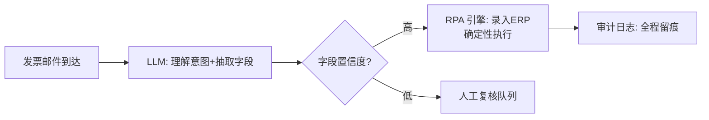

# RPA

> **一句话**：RPA（机器人流程自动化）+ LLM = 从「死板脚本」到「能处理变化的流程自动化」：LLM 负责理解与兜底，RPA 负责精准执行——是传统 RPA 厂商与 Agent 融合的主战场。
> **难度**：入门
> **标签**：`#application`

## 先看结论

- 传统 RPA 痛点：选择器脆弱（页面改版即崩）、异常处理写不完、非结构化数据（邮件/PDF）处理不了——恰好都是 LLM 的强项
- LLM 增强的三层渗透：入口理解（邮件/工单分流）、中间处理（文档抽取/字段映射）、异常兜底（脚本失败时视觉理解接管）
- 与「纯 Agent」的区别：RPA 场景流程基本固定，要的是**确定性的执行 + 智能的例外处理**——编排上更多用 Workflow 少用自由 Agent（→ [工作流编排](../07-planning/workflow-orchestration.md)）
- 落地铁律：财务/合规流程的每一步留审计痕迹，LLM 决策点要有可回放记录

## LLM × RPA 分工

## 源码案例与生态

- **UiPath / Microsoft Power Automate 的 LLM 化**：传统 RPA 双雄都已内置 LLM 活动（文档理解、邮件分类）——「脚本为主、模型为辅」的渐进路线，存量流程平滑升级
- **Computer Use 路线的 RPA**（[Anthropic 文档](https://docs.anthropic.com/en/docs/agents-and-tools/computer-use)）：无 API 的老系统（绿屏、桌面客户端）用视觉路线接管——传统 RPA 啃不动的最硬骨头；配合每日虚拟机快照重置保证环境纯净
- **browser-use**（[GitHub](https://github.com/browser-use/browser-use)）：Web 流程的轻量替代——比传统 RPA 的浏览器录制的适应性更强
- **Playwright MCP**（[GitHub](https://github.com/microsoft/playwright-mcp)）：把浏览器操作标准化为工具，RPA 场景可直接编排调用
- **DeepSeek Harness 的流水线借鉴**（[仓库](https://github.com/deepseek-ai/deepseek-harness)）：其「Hook → 审批 → 权限 → 沙箱 → 超时」的执行管道 + append-only 审计，正是合规型 RPA 需要的执行骨架

## 落地要点

- 混合编排：确定性步骤用传统 RPA/脚本（快、准、便宜），理解与例外用 LLM
- 置信度路由：LLM 抽取低于阈值自动转人工，别硬写流程
- 变更监控：目标系统 UI 改版告警，先于用户投诉发现流程断了

## 常见误区

- ❌ 用全自主 Agent 重写稳定 RPA 流程：成本翻十倍、确定性下降，老流程跑得好就别动
- ❌ LLM 决策不留痕：财务流程里「模型决定」无法审计 = 审计不通过
- ❌ 忽视幂等：RPA 中途失败重跑，单据重复录入——每步要有业务幂等键

## 小练习

把「供应商发票 → ERP 入库」流程画成混合编排图：哪些步骤保留传统 RPA？哪两个环节用 LLM？置信度阈值定多少、低于阈值去哪？

## 相关知识点

- [工作流编排](../07-planning/workflow-orchestration.md)
- [Computer Use / Browser Use](../05-tool-protocol/computer-use-browser-use.md)
