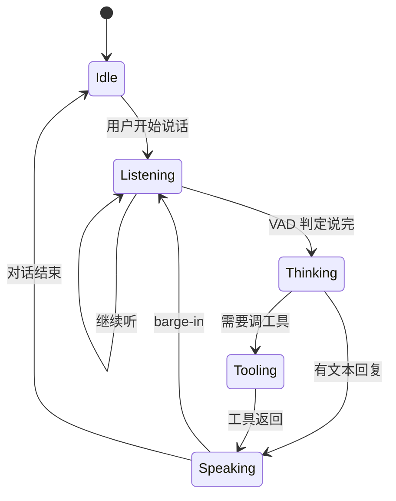

# 实时语音 Agent

> **一句话**：语音 Agent 的瓶颈不在「会不会说话」，而在 **端到端延迟、打断（barge-in）、工具调用时的听感连续性**——2026 已有专用实时模型 API（如 GPT-Live-1）。

## 先看结论

- 目标延迟：人类对话可接受的响应间隙大约 **数百毫秒**；超过 ~1s 就要靠填充音/手势话术
- 架构主流：**语音进 → 实时模型 → 语音出**，工具调用是插在中间的「暂停思考」
- 打断是硬需求：用户说话时必须能停 TTS、丢弃未播放队列、切换意图
- 与文字 Agent 共享工具层，但会话状态机不同（见下）

## 延迟预算

设：

$$
L_{\text{e2e}} = L_{\text{ASR}} + L_{\text{LLM TTFT}} + L_{\text{tool}} + L_{\text{TTS first}} + L_{\text{net}}
$$

工程目标通常是把 $$L_{\text{e2e}}$$ 压到 500–800ms（简单应答）或用 **预生成/填音** 掩盖工具耗时。要点：

| 项 | 优化手段 |
|---|---|
| ASR | 流式识别、领域热词 |
| TTFT | 小模型路由、前缀缓存 |
| Tool | 异步工具 + 口头占位（「我查一下日历」） |
| TTS | 流式合成、句级起播 |
| 网络 | 就近接入、WebSocket 复用 |

## 会话状态机



**Barge-in** 规则：`Speaking` 中检测到用户语音 → 立刻停 TTS、清空播放队列、必要时取消 in-flight 工具。

## 可运行示例（概念）

```javascript
// 伪代码：实时语音会话骨架（伪代码，非完整 SDK）
const session = createRealtimeSession({ model: "gpt-live-1" });

session.on("speech_started", () => {
  session.tts.stop();
  session.clearPlaybackQueue();
});

session.on("response_done", (text) => {
  // 文字 Agent 工具结果可在此写回日志
});

session.on("tool_call", async (call) => {
  session.say("稍等，我查一下。"); // 掩盖延迟
  const result = await runTool(call);
  return result;
});
```

## 工程含义

1. **文字 Agent 工具可复用**，但要把工具超时与「口头占位」绑在一起设计
2. **隐私与录音合规**往往比模型选型更早卡住项目
3. **评测要加听感指标**：打断成功率、填充音占比、口误恢复——SWE-bench 类分数不适用

## 参考资料

- [Build more natural voice experiences with GPT-Live-1 in the API](https://openai.com/index/introducing-gpt-live-1-in-the-api/)（OpenAI, 2026-09-10）
- [多模态模型](../03-llm/multimodal.md)
- [什么是 AI Agent](../02-agent-basics/what-is-agent.md)

## 相关知识点

- [多模态模型](../03-llm/multimodal.md)
- [通用 Agent 产品](general-agent-products.md)
- [状态机与事件驱动](../11-engineering/state-machine-event-driven.md)
