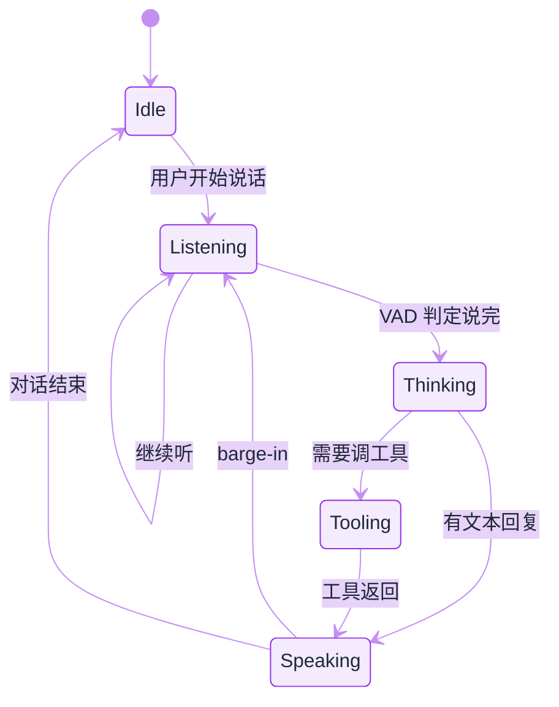

# 实时语音 Agent


**一句话**：语音 Agent 的瓶颈不在「会不会说话」，而在 **端到端延迟、打断（barge-in）、工具调用时的听感连续性**——2026 已有专用实时模型 API（如 GPT-Live-1）。


## 先看结论

- 目标延迟：人类对话可接受的响应间隙大约 **数百毫秒**；超过 ~1s 就要靠填充音/手势话术
- 架构主流：**语音进 → 实时模型 → 语音出**，工具调用是插在中间的「暂停思考」
- 打断是硬需求：用户说话时必须能停 TTS、丢弃未播放队列、切换意图
- 与文字 Agent 共享工具层，但会话状态机不同（见下）

## 延迟预算

设：

$$
L_{\text{e2e}} = L_{\text{ASR}} + L_{\text{LLM TTFT}} + L_{\text{tool}} + L_{\text{TTS first}} + L_{\text{net}}
$$

工程目标通常是把 $$L_{\text{e2e}}$$ 压到 500–800ms（简单应答）或用 **预生成/填音** 掩盖工具耗时。要点：

| 项 | 优化手段 |
|---|---|
| ASR | 流式识别、领域热词 |
| TTFT | 小模型路由、前缀缓存 |
| Tool | 异步工具 + 口头占位（「我查一下日历」） |
| TTS | 流式合成、句级起播 |
| 网络 | 就近接入、WebSocket 复用 |

## 会话状态机



*《图：打断是硬边——Speaking 一检测到用户开口就直退 Listening、跳过重新思考；要调工具才绕道 Tooling 再回 Speaking》*

**Barge-in** 规则：`Speaking` 中检测到用户语音 → 立刻停 TTS、清空播放队列、必要时取消 in-flight 工具。

## 端点判定：语音 Agent 真正的难点

「用户说完了吗」这一步决定了延迟的下限，判早判晚都会难受：

- **判早**（尾静音阈值太短）：用户只是想了想，系统就抢话，体验上等于打断对方。
- **判晚**（阈值太长）：每轮都白等几百毫秒，累积起来比模型本身还慢。

2026 的常见做法是**三层叠加**，而不是调一个魔法常数：

1. **双阈值 VAD**：起音阈值高于止音阈值，避免呼吸与齿音触发；
2. **自适应尾静音窗口**：短句用短窗，检测到「嗯…」「就是…」这类填充词时临时放宽；
3. **语义端点**：拿 ASR 的中间结果问一句「这句话语法上完整吗」，完整就立刻收，不等静音。

$$
\text{endpoint} = \big(\tau_{\text{sil}} > T\big) \;\lor\; \big(\text{complete}(h_t) \;\wedge\; \tau_{\text{sil}} > T_{\text{short}}\big)
$$

其中 $$h_t$$ 是当前 ASR 中间假设。经验上这条能把「明显说完」的那部分请求提前 200–400ms 交棒（**经验口径**，与语种、噪声、领域词表强相关，必须自己回测）。

## 工具调用期间的听感设计

文字 Agent 调工具时用户可以盯着看，语音不行——沉默两秒就会被认为掉线。三条约束：

- **占位话术要短且可被打断**：「我查一下日历」这种一句以内、语义明确的短语最好；说完若工具仍未返回，再补一句进度，而不是重复同一句。
- **占位话术不能承诺结果**：说「找到了」而工具随后失败，比沉默更伤信任。
- **结果要口语化重排**：先给结论再给依据，数字走中文读法（「百分之十二」而不是「12%」），列表最多三条——TTS 念表格是灾难。

```javascript
// 伪代码：工具在飞时的一次性占位（伪代码，非完整 SDK）
const placeholder = setTimeout(() => session.say("我查一下日历。"), 350);
const result = await runTool(call);
clearTimeout(placeholder);          // 350ms 内返回就不占位
session.say(speakFirstThenWhy(result)); // 结论先行，最多三条依据
```

## 评测：听感指标要单独定义

SWE-bench 那类「任务是否完成」的分数在语音里不够用，至少要分开看：

| 指标 | 定义 | 为什么要单列 |
|---|---|---|
| 首音延迟 | 用户停说 → 第一个音频帧播出 | 用户唯一能直接感知的延迟 |
| 误打断率 | 用户并未插话却停了 TTS 的比例 | VAD 阈值调坏的直接后果 |
| 打断响应时间 | 用户开口 → TTS 静音 | barge-in 是否真的可用 |
| 占位话术占比 | 带占位句的轮次比例 | 过高说明工具太慢或在乱承诺 |
| 任务成功率 | 与文字 Agent 同口径 | 防止「听起来很顺但没办成事」 |

采样口径也要写死：同一批话术、同一网络条件、同一设备，否则首音延迟差 200ms 就能被解释成模型差距。

## 常见误区

- ❌ **把语音当成文字 Agent 的一层壳**：状态机不同（要处理打断、部分识别、回声），工具层可复用但会话层必须重写。
- ❌ **只优化 ASR 字准率**：字准率提升 1% 不如把端点判定调对——用户体感来自延迟与打断。
- ❌ **忽略回声与自听**：扬声器播放时麦克风会收到自己的 TTS，不做回声消除就会自己打断自己。
- ❌ **先选模型再谈合规**：录音告知、留存期限、跨境传输往往比模型选型更早卡住项目（见[数据与隐私](../10-evaluation-safety/data-privacy.md)）。

## 小练习

为「电话预约诊所」写一份语音 Agent 的验收表：给出首音延迟、误打断率、任务成功率三项的目标值与测量口径，并说明工具（查排班）超过 1 秒时用户会听到什么。

## 可运行示例（概念）

```javascript
// 伪代码：实时语音会话骨架（伪代码，非完整 SDK）
const session = createRealtimeSession({ model: "gpt-live-1" });

session.on("speech_started", () => {
  session.tts.stop();
  session.clearPlaybackQueue();
});

session.on("response_done", (text) => {
  // 文字 Agent 工具结果可在此写回日志
});

session.on("tool_call", async (call) => {
  session.say("稍等，我查一下。"); // 掩盖延迟
  const result = await runTool(call);
  return result;
});
```

## 工程含义

1. **文字 Agent 工具可复用**，但要把工具超时与「口头占位」绑在一起设计
2. **隐私与录音合规**往往比模型选型更早卡住项目
3. **评测要加听感指标**：打断成功率、填充音占比、口误恢复——SWE-bench 类分数不适用

## 参考资料

- [Build more natural voice experiences with GPT-Live-1 in the API](https://openai.com/index/introducing-gpt-live-1-in-the-api/)（OpenAI, 2026-09-10）
- [Whisper（开源语音识别基线，端侧可用）](https://github.com/openai/whisper)
- [Pipecat（语音 Agent 的开源管道框架：VAD/ASR/LLM/TTS 串成流）](https://github.com/pipecat-ai/pipecat)
- [LiveKit Agents（生产级实时语音与打断处理）](https://github.com/livekit/agents)

## 相关知识点

- [多模态模型](../03-llm/multimodal.md)
- [通用 Agent 产品](general-agent-products.md)
- [状态机与事件驱动](../11-engineering/state-machine-event-driven.md)
- [什么是 AI Agent](../02-agent-basics/what-is-agent.md)
