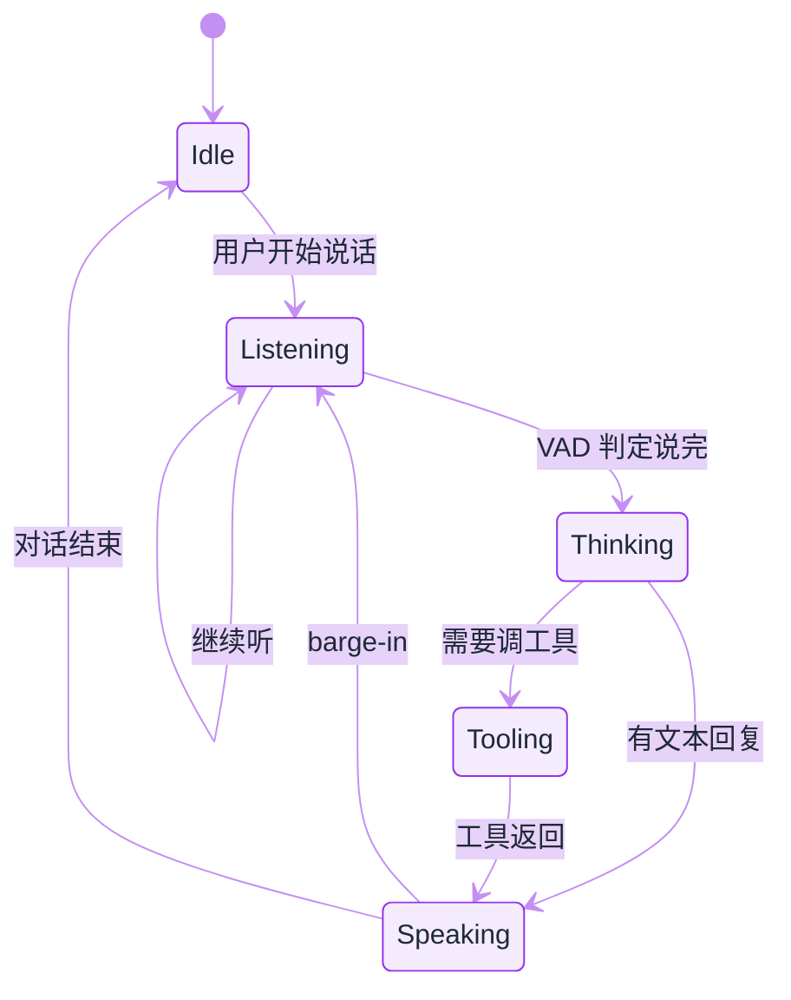
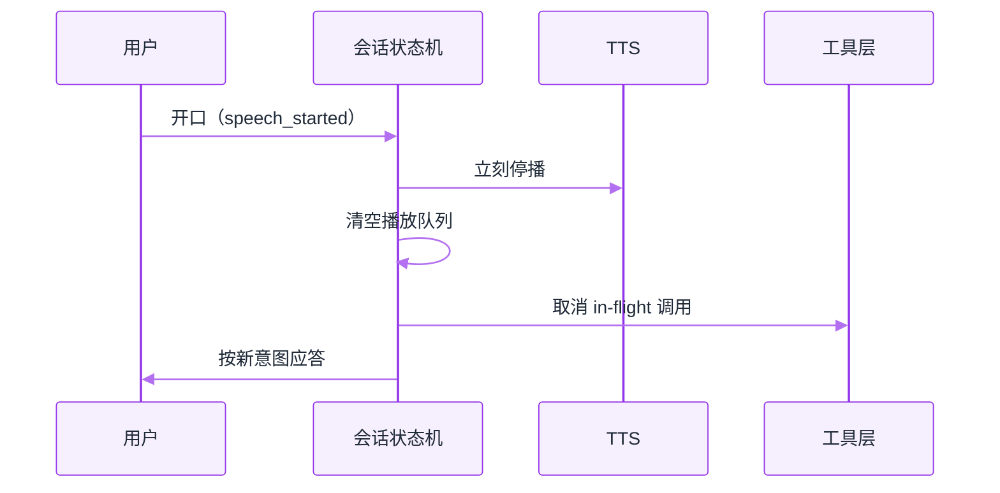

# 实时语音 Agent


**一句话**：语音 Agent 的瓶颈不在「会不会说话」，而在 **端到端延迟、打断（barge-in）、工具调用时的听感连续性**——2026 已有专用实时模型 API（如 GPT-Live-1）。


## 先看结论

- 目标延迟：人类对话可接受的响应间隙大约 **数百毫秒**；超过 ~1s 就要靠填充音/手势话术
- 架构主流：**语音进 → 实时模型 → 语音出**，工具调用是插在中间的「暂停思考」
- 打断是硬需求：用户说话时必须能停 TTS、丢弃未播放队列、切换意图
- 与文字 Agent 共享工具层，但会话状态机不同（见下）

## 延迟预算

设：

$$
L_{\text{e2e}} = L_{\text{ASR}} + L_{\text{LLM TTFT}} + L_{\text{tool}} + L_{\text{TTS first}} + L_{\text{net}}
$$

工程目标通常是把 $$L_{\text{e2e}}$$ 压到 500–800ms（简单应答）或用 **预生成/填音** 掩盖工具耗时。要点：

| 项 | 优化手段 |
|---|---|
| ASR | 流式识别、领域热词 |
| TTFT | 小模型路由、前缀缓存 |
| Tool | 异步工具 + 口头占位（「我查一下日历」） |
| TTS | 流式合成、句级起播 |
| 网络 | 就近接入、WebSocket 复用 |


**先修管线再修模型**：同一份 $$L_{\text{e2e}}$$ 预算下，端点判定的语义捷径能把「明显说完」的请求提前 **200–400ms** 交棒，工具占位计时器的经验值是 **350ms**——这两项都在几百毫秒量级，比换一版模型便宜得多，也更立竿见影。


## 三档管线：延迟、音质与可控性的取舍（点标签切换）

延迟公式里那四项**不是每档管线都要付**：级联付满四项，端到端省掉两段序列化，半端到端省一段。选档之前先想清楚你要的是首音延迟、音质，还是可审计的文本。



四项延迟全付，$$L_{\text{e2e}}$$ 通常最难压进 500–800ms；好处是每一段都能单独换件——ASR 加领域热词、LLM 走小模型路由与前缀缓存、TTS 句级起播。文本旁路天生存在，日志、合规留痕、多渠道复用都不用额外设计。音质最平：模型的情绪与节奏要在 TTS 里重建一遍，打断逻辑（VAD 阈值 + 播放队列清空）也得自己写。



语音进、语音出，省掉 ASR 与 TTS 两段，首音延迟最低，韵律、停顿、笑声这类副语言信息保留得最好（2026 的专用实时模型 API 就是为这一档准备的，如 `gpt-live-1`）。代价有两块：一是**文本要单独拿**——本页事件契约里的 `response_done` 才给出文字，审计与留痕得靠它，不能默认存在；二是可控性与可替换性差，热词、语速、音色只能通过模型给的接口，出问题只能等供应商。



语音进 → 模型出文本 → 本地 TTS（或反过来）。延迟居中，文本工件天然可审计，TTS 还能挑音色与语言。损失集中在最后一段：模型给出的韵律标记常常播不出来，工具在飞时的「暂停思考」也要靠自己的 TTS 队列去演。它是合规要求高、又不甘心纯级联音质时的折中。



寒暄与追问走端到端，要查排班、要落库的走文本管线，好处是把最贵的那段延迟只花在需要的轮次上。难点是**分诊要在第一个 token 之前完成**：判错就得重播，用户会听到半句话被掐掉。经验做法是先按「本轮会不会调工具」分，而不是按句子长短分。



## 会话状态机



*《图：打断是硬边——Speaking 一检测到用户开口就直退 Listening、跳过重新思考；要调工具才绕道 Tooling 再回 Speaking》*

**Barge-in** 规则：`Speaking` 中检测到用户语音 → 立刻停 TTS、清空播放队列、必要时取消 in-flight 工具。

## 端点判定：语音 Agent 真正的难点

「用户说完了吗」这一步决定了延迟的下限，判早判晚都会难受：

- **判早**（尾静音阈值太短）：用户只是想了想，系统就抢话，体验上等于打断对方。
- **判晚**（阈值太长）：每轮都白等几百毫秒，累积起来比模型本身还慢。

2026 的常见做法是**三层叠加**，而不是调一个魔法常数：

1. **双阈值 VAD**：起音阈值高于止音阈值，避免呼吸与齿音触发；
2. **自适应尾静音窗口**：短句用短窗，检测到「嗯…」「就是…」这类填充词时临时放宽；
3. **语义端点**：拿 ASR 的中间结果问一句「这句话语法上完整吗」，完整就立刻收，不等静音。

$$
\text{endpoint} = \big(\tau_{\text{sil}} > T\big) \;\lor\; \big(\text{complete}(h_t) \;\wedge\; \tau_{\text{sil}} > T_{\text{short}}\big)
$$

其中 $$h_t$$ 是当前 ASR 中间假设。经验上这条能把「明显说完」的那部分请求提前 200–400ms 交棒（**经验口径**，与语种、噪声、领域词表强相关，必须自己回测）。

## 工具调用期间的听感设计

文字 Agent 调工具时用户可以盯着看，语音不行——沉默两秒就会被认为掉线。三条约束：

- **占位话术要短且可被打断**：「我查一下日历」这种一句以内、语义明确的短语最好；说完若工具仍未返回，再补一句进度，而不是重复同一句。
- **占位话术不能承诺结果**：说「找到了」而工具随后失败，比沉默更伤信任。
- **结果要口语化重排**：先给结论再给依据，数字走中文读法（「百分之十二」而不是「12%」），列表最多三条——TTS 念表格是灾难。

这三条约束落成一个策略对象，就是「工具在飞时怎么办」的完整答案（**形状示意，非完整 SDK**）。计时器、话术、取消规则、重排格式都在同一份配置里，改哪一项对应哪种体验变化，见下面的分步演示：

```json
{
  "tool_in_flight": {
    "timer_ms": 350,
    "phrase": "我查一下日历。",
    "cancel_rule": "工具在 350ms 内返回则撤掉计时器，整轮不播占位",
    "if_still_running": "再补一句进度，而不是重复同一句",
    "forbidden_phrases": ["找到了", "已经帮你改好了"]
  },
  "result_rendering": {
    "order": "speakFirstThenWhy：结论先行，依据在后",
    "max_points": 3,
    "numbers": "中文读法（百分之十二），不念符号（12%）",
    "no_tables": true
  }
}
```

## 分步演示：一次「查排班」轮次的 350 毫秒分岔




#### 第 1 步：这一轮模型给的不是文本

端点判定收句后，模型这一轮回来的不是文本而是 `tool_call` 事件。此时用户已经停止说话，静音从这一刻开始计——人类对话里可接受的响应间隙只有**数百毫秒**，超过 1 秒就必须有话在播。




#### 第 2 步：计时器和工具同时起跑

起 `timer_ms: 350` 的占位计时器，**并行**发起工具调用 `runTool`。顺序反了就会得到「先说『我查一下』再说正题」的机械感，而且占位句会盖住早返回的结果。




#### 第 3 步：350ms 内返回就什么都不播

工具在阈值内回来 → 撤掉计时器 → 直接播结论。这一轮的听感是「秒答」。别小看这一步：占位句也要合成、也要被听完，播多了「占位话术占比」这项指标会直接暴露工具太慢或在乱说话。




#### 第 4 步：超阈值才播占位，且只播一次

350ms 到点仍未返回 → 播「我查一下日历。」——一句以内、语义明确。再等一阵还没回来就补一句**进度**（「排班表有点长，还在看」），不要重复同一句；也不要说「找到了」，工具随后失败时这句话比沉默更伤信任。




#### 第 5 步：结果按口语形状重排

拿到结果走 `speakFirstThenWhy`：先结论、最多三条依据、数字用中文读法、表格不念。整段文本边生成边喂流式 TTS，句级起播，把 $$L_{\text{TTS first}}$$ 压在首句而不是全文上。




#### 第 6 步：期间任何时刻用户开口就全部作废

`speech_started` 一到：停 TTS、清空播放队列、并取消 in-flight 的工具调用。少了第三条，就会出现「静音但仍在写库」的幽灵轮次——用户以为取消了，排班其实被改了。



## 评测：听感指标要单独定义

SWE-bench 那类「任务是否完成」的分数在语音里不够用，至少要分开看：

| 指标 | 定义 | 为什么要单列 |
|---|---|---|
| 首音延迟 | 用户停说 → 第一个音频帧播出 | 用户唯一能直接感知的延迟 |
| 误打断率 | 用户并未插话却停了 TTS 的比例 | VAD 阈值调坏的直接后果 |
| 打断响应时间 | 用户开口 → TTS 静音 | barge-in 是否真的可用 |
| 占位话术占比 | 带占位句的轮次比例 | 过高说明工具太慢或在乱承诺 |
| 任务成功率 | 与文字 Agent 同口径 | 防止「听起来很顺但没办成事」 |

采样口径也要写死：同一批话术、同一网络条件、同一设备，否则首音延迟差 200ms 就能被解释成模型差距。

## 常见误区

- ❌ **把语音当成文字 Agent 的一层壳**：状态机不同（要处理打断、部分识别、回声），工具层可复用但会话层必须重写。
- ❌ **只优化 ASR 字准率**：字准率提升 1% 不如把端点判定调对——用户体感来自延迟与打断。
- ❌ **忽略回声与自听**：扬声器播放时麦克风会收到自己的 TTS，不做回声消除就会自己打断自己。
- ❌ **先选模型再谈合规**：录音告知、留存期限、跨境传输往往比模型选型更早卡住项目（见[数据与隐私](../10-evaluation-safety/data-privacy.md)）。

## 小练习

为「电话预约诊所」写一份语音 Agent 的验收表：给出首音延迟、误打断率、任务成功率三项的目标值与测量口径，并说明工具（查排班）超过 1 秒时用户会听到什么。

## 一次实时会话的事件与动作契约

会话由 `createRealtimeSession` 建立（模型示例用 `gpt-live-1`，传输走复用的 WebSocket），应用侧真正要写的只有三个事件回调——**这是会话骨架的形状示意，不是完整 SDK**，签名以供应商文档为准。它们各自绑定了哪些动作、少一条会出什么问题，全在这份契约里：

```json
{
  "session": { "create": "createRealtimeSession", "model": "gpt-live-1", "transport": "WebSocket 复用" },
  "events": [
    {
      "name": "speech_started",
      "actions": ["tts.stop", "clearPlaybackQueue"],
      "missing_consequence": "只停播不清队列：当前这帧静音了，排好的句子仍会继续念完，用户等于被打断两次"
    },
    {
      "name": "response_done",
      "payload": "text",
      "actions": ["把本轮文本与文字 Agent 的工具结果写回会话日志"],
      "missing_consequence": "端到端管线下这是唯一的文本落点，不接就没有审计、没有留痕、没有事后评测"
    },
    {
      "name": "tool_call",
      "actions": ["占位话术：稍等，我查一下。", "调工具层 runTool", "把结果交回对话"],
      "missing_consequence": "不占位就是沉默两秒，用户以为掉线；占位过度承诺则比沉默更伤信任"
    }
  ]
}
```

打断这条路径最容易写错，因为它牵涉三个子系统同时收手：



*《图：一次打断要同时停播、清队列、取消在飞工具；少做第三条会得到「静音但仍在写库」的幽灵轮次》*

两条实现细节：**回声消除要在 VAD 之前**，否则扬声器里自己的 TTS 会触发 `speech_started`，系统自己打断自己；`tool_call` 回调里的占位与本页占位策略共用同一个 350ms 计时器，两处各写一套阈值就会出现「说了两遍我查一下」。

## 工程含义

1. **文字 Agent 工具可复用**，但要把工具超时与「口头占位」绑在一起设计
2. **隐私与录音合规**往往比模型选型更早卡住项目
3. **评测要加听感指标**：打断成功率、填充音占比、口误恢复——SWE-bench 类分数不适用

## 参考资料

- [Build more natural voice experiences with GPT-Live-1 in the API](https://openai.com/index/introducing-gpt-live-1-in-the-api/)（OpenAI, 2026-09-10）
- [Whisper（开源语音识别基线，端侧可用）](https://github.com/openai/whisper)
- [Pipecat（语音 Agent 的开源管道框架：VAD/ASR/LLM/TTS 串成流）](https://github.com/pipecat-ai/pipecat)
- [LiveKit Agents（生产级实时语音与打断处理）](https://github.com/livekit/agents)

## 相关知识点

- [多模态模型](../03-llm/multimodal.md)
- [通用 Agent 产品](general-agent-products.md)
- [状态机与事件驱动](../11-engineering/state-machine-event-driven.md)
- [什么是 AI Agent](../02-agent-basics/what-is-agent.md)
