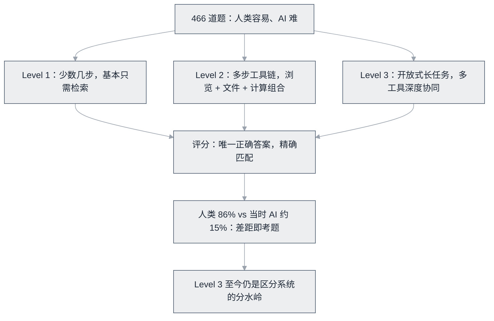

# GAIA


**一句话**：通用助理基准：466 道人类容易、AI 难的题，考多步推理 + 浏览 + 文件 + 计算的综合能力。


| 属性 | 内容 |
|---|---|
| 类型 | 基准测试 |
| 链接 | <https://huggingface.co/papers/2311.12983> · [论文](https://arxiv.org/abs/2311.12983) |
| 来源 | Meta AI + Hugging Face |
| 发布 | 2023-11 |
| 难度 | 进阶 |
| 标签 | `#evaluation` |

## 推荐理由

- 设计哲学独特：「人类 86% 正确率 vs 当时 AI ~15%」的差距映射，专挑 AI 短板
- 三级难度分层，Level 3 至今仍能有效区分系统
- Anthropic 多 Agent 研究系统在此基准上验证了并行多 Agent 的价值（[工程博客](https://www.anthropic.com/engineering/built-multi-agent-research-system)）

## 机制一图看懂

三级难度阶梯，按所需步数与工具分层：

*《图：466 题按步数与工具分三级，全部汇入唯一答案精确匹配；Level 3 开放式长任务的步数与工具协同上限至今仍是分水岭》*

## 上手建议

1. 从 Level 1 抽 10 题手工跑你的 Agent，观察失败模式
2. 对照 [研究 Agent 案例](../../12-applications/research-agent.md) 理解为什么多 Agent 在此有效

## 参考资料

- [GAIA 论文](https://arxiv.org/abs/2311.12983)（Mialon et al., 2023，Meta AI + Hugging Face + AutoGPT）
- [论文页与数据集（Hugging Face Papers）](https://huggingface.co/papers/2311.12983)
- [Anthropic：多 Agent 研究系统的工程实践（GAIA 上的实战数据出处）](https://www.anthropic.com/engineering/built-multi-agent-research-system)

## 相关知识点

- [基准测试总览](../../10-evaluation-safety/benchmarks.md)
- [多 Agent 协作](../../08-multi-agent/multi-agent-collaboration.md)

