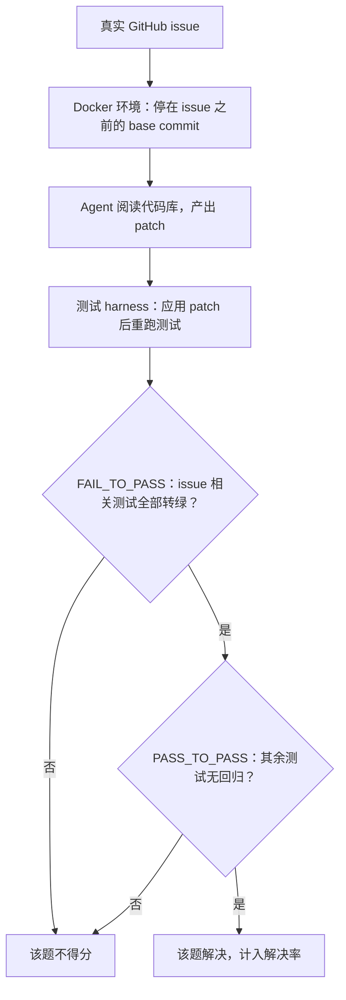

# SWE-bench


**一句话**：编程 Agent 的黄金标准：2294 个真实 GitHub issue，产出通过测试的 patch 才算赢。


| 属性 | 内容 |
|---|---|
| 类型 | 基准测试 |
| 链接 | <https://www.swebench.com/> · <https://github.com/princeton-nlp/SWE-bench> |
| 来源 | Princeton NLP |
| 发布 | 2023-10；Verified 子集（500 题人工核验）2024 |
| 难度 | 高级 |
| 标签 | `#evaluation` `#application` |

## 推荐理由

- 编程 Agent 进步的标尺：2023 年最强系统解决率 ~4%，2026 年头部系统 Verified 上超过 70%——一年顶十年的领域加速器
- 评分完全客观（Fail-to-Pass 测试通过），无 LLM 评判偏差
- 是「模型 + harness」联合成绩，直接反映真实工程能力

## 机制一图看懂

每题的判分闭环，完全客观：

## 上手建议

1. 用 [SWE-agent](https://github.com/SWE-agent/SWE-agent) 或 [OpenHands](../projects/openhands.md) 跑 lite 子集体验完整流程
2. 读 SWE-agent 论文（[arXiv:2405.15793](https://arxiv.org/abs/2405.15793)）理解 ACI 设计
3. 借鉴其协议建内部代码任务评测集

## 相关知识点

- [AgentBench、WebArena、SWE-bench、GAIA、ToolBench](../../10-evaluation-safety/agentbench-webarena-swebench-gaia-toolbench.md)
- [编程 Agent](../../12-applications/coding-agent.md)

