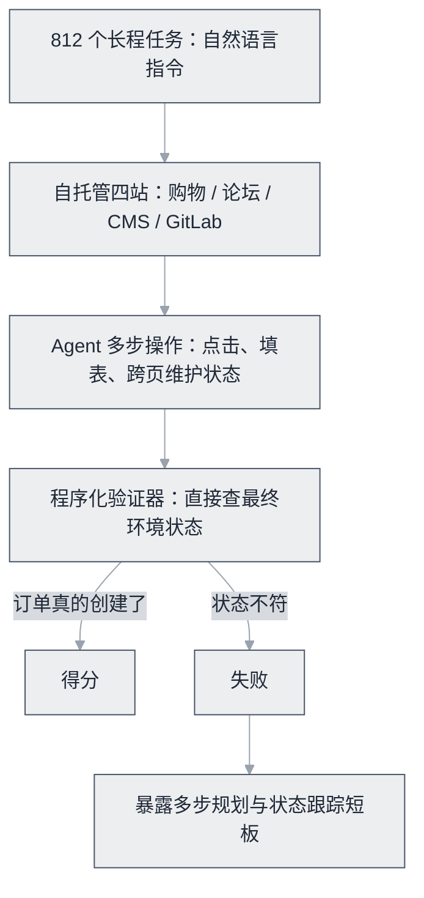

# WebArena


**一句话**：在四个自托管真实网站（购物/论坛/CMS/GitLab）上考长程任务，程序化验证最终环境状态。


| 属性 | 内容 |
|---|---|
| 类型 | 基准测试（环境） |
| 链接 | <https://webarena.dev/> · [论文](https://arxiv.org/abs/2307.13854) |
| 来源 | CMU |
| 发布 | 2023-07 |
| 难度 | 高级 |
| 标签 | `#evaluation` `#application` |

## 推荐理由

- 「环境状态验证」的评分设计最接近真实业务（订单真的创建了才算对）
- 812 个长程任务至今成功率不过半，暴露多步规划与状态跟踪短板
- 自托管环境可安全改造为内网系统测试场

## 机制一图看懂

任务在真实填充的网站上跑，验证器只认最终环境状态：

## 上手建议

1. 本地起 WebArena 环境跑几个任务，观察 Agent 如何维护跨页状态
2. 借鉴其「程序化验证器」思路设计你的自动化测试（→ [浏览器自动化](../../12-applications/browser-automation.md)）

## 相关知识点

- [基准测试总览](../../10-evaluation-safety/benchmarks.md)
- [Computer Use / Browser Use](../../05-tool-protocol/computer-use-browser-use.md)

