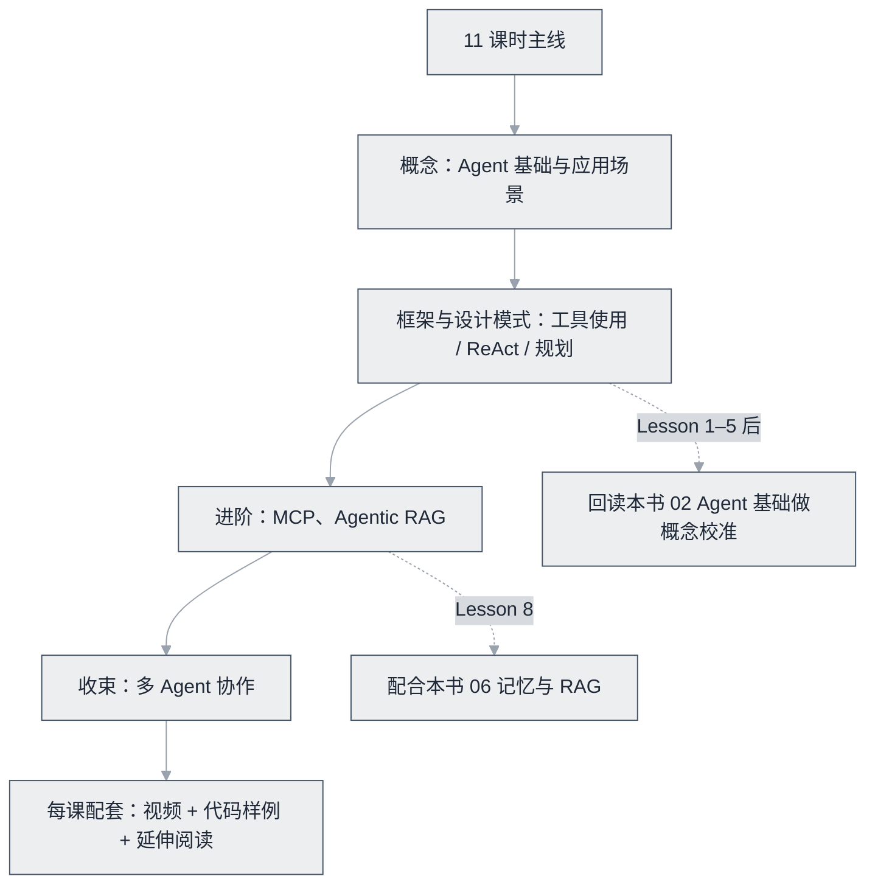

# AI Agents for Beginners


**一句话**：微软出品的 11 课时开源 Agent 入门课：从基础概念到多 Agent、MCP、Agentic RAG，中文翻译完善，入门首选。


| 属性 | 内容 |
|---|---|
| 类型 | 课程 |
| 链接 | <https://github.com/microsoft/ai-agents-for-beginners> |
| 来源 | Microsoft |
| 难度 | 入门 |
| 标签 | `#agent` `#course` |

## 推荐理由

- 结构完整：概念 → 框架 → 设计模式 → MCP → RAG → 规划 → 多 Agent，与本书章节结构高度互补
- 每课配视频 + 代码样例 + 延伸阅读；GitHub 5 万+ Star 的社区验证
- 中文社区翻译完善，零基础友好

## 课程结构一图看懂

11 课的主线与本书章节的呼应：

## 上手建议

1. 学完 Lesson 1–5 后回来读本书 [02 Agent 基础](../../02-agent-basics/README.md) 做概念校准
2. Lesson 8（Agentic RAG）配合本书 [06 记忆与 RAG](../../06-memory-rag/README.md) 食用
3. 每课的代码样例跑一遍比看视频收获大

## 相关知识点

- [学习路线](../../00-index/learning-path.md)
- [什么是 AI Agent](../../02-agent-basics/what-is-agent.md)

