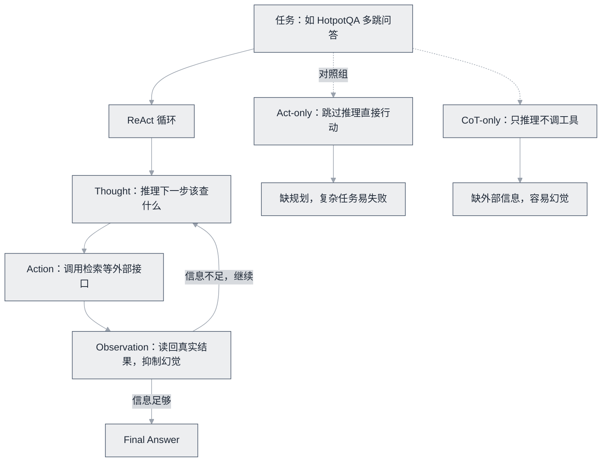

# ReAct 论文


**一句话**：提出「推理轨迹 + 行动」交替的 Agent 范式，是几乎所有现代 Agent 循环的思想原型。


| 属性 | 内容 |
|---|---|
| 类型 | 论文 |
| 链接 | <https://arxiv.org/abs/2210.03629> |
| 来源 | Yao et al., Princeton + Google Brain |
| 发布 | 2022-10（ICLR 2023） |
| 难度 | 进阶 |
| 标签 | `#agent` `#prompt` |

## 推荐理由

- Agent 领域引用量最高的论文之一，「Agent 循环」的学术起点
- 核心实验对比至今有效：纯推理（CoT-only）会幻觉、纯行动（Act-only）缺规划，两者交替最优
- 提供了 HotpotQA、FEVER、ALFWorld、WebShop 四类任务的完整实验，可信度高

## 机制一图看懂

推理与行动交替的循环，以及它赢在何处：

## 上手建议

1. 先读 Figure 1（一张图看懂 Thought→Action→Observation）
2. 精读第 2 节的方法定义（仅一页）
3. 对照 [感知—规划—行动循环](../../02-agent-basics/perception-planning-action.md) 与 Pi 的 agentLoop 源码看工程化差异

## 相关知识点

- [ReAct](../../04-prompt-reasoning/react.md)
- [什么是 AI Agent](../../02-agent-basics/what-is-agent.md)

