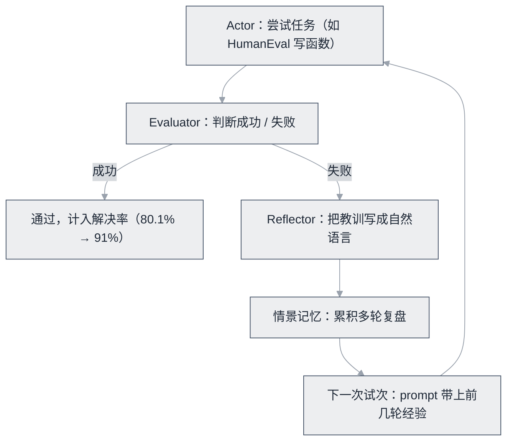

# Reflexion 论文


**一句话**：用「语言化复盘」代替参数更新：失败后总结教训存入记忆，下次尝试带着经验——无需微调的强化学习。


| 属性 | 内容 |
|---|---|
| 类型 | 论文 |
| 链接 | [论文](https://arxiv.org/abs/2303.11366) · [官方实现](https://github.com/noahshinn/reflexion) |
| 来源 | Shinn et al., Northeastern + MIT |
| 发布 | 2023-03（NeurIPS 2023） |
| 难度 | 进阶 |
| 标签 | `#agent` `#memory` |

## 推荐理由

- 「语言 RL」概念优雅：把奖励信号变成自然语言经验，零训练成本
- 实测硬核：HumanEval 80.1% → 91%，ALFWorld +22%
- 官方开源实现仅百余行，是最适合精读复现的 Agent 论文之一

## 机制一图看懂

三组件（Actor / Evaluator / Reflector）构成语言化复盘闭环：

*《图：Evaluator 判失败是唯一的增益来源——成功只累加解决率，失败才走 Reflector 写教训、进情景记忆、回灌下一次 prompt》*

## 上手建议

1. 读方法节的三组件：Actor / Evaluator / Reflector
2. 跑一遍官方实现 [noahshinn/reflexion](https://github.com/noahshinn/reflexion) 的 HumanEval 实验
3. 对照 [Reflexion 知识点](../../04-prompt-reasoning/reflexion.md) 的最佳实践改造你自己的 Agent

## 参考资料

- [Reflexion 论文](https://arxiv.org/abs/2303.11366)（Shinn et al., 2023）
- [官方实现（noahshinn/reflexion）](https://github.com/noahshinn/reflexion)
- [同期对照：Self-Refine 论文](https://arxiv.org/abs/2303.17651)（不用情景记忆，仅靠自我反馈迭代）

## 相关知识点

- [Reflexion](../../04-prompt-reasoning/reflexion.md)
- [记忆类型](../../06-memory-rag/memory-types.md)

