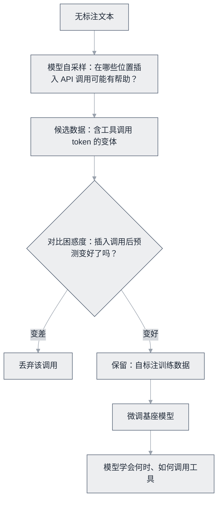

# Toolformer 论文


**一句话**：证明语言模型可以通过自生成的数据学会「何时、如何调用工具」——工具使用从「外挂工程」变成「模型能力」的起点。


| 属性 | 内容 |
|---|---|
| 类型 | 论文 |
| 链接 | <https://arxiv.org/abs/2302.04761> |
| 来源 | Schick et al., Meta AI |
| 发布 | 2023-02 |
| 难度 | 进阶 |
| 标签 | `#tooling` `#llm` |

## 推荐理由

- 自监督数据构造思路精妙：模型自己标注「在哪里插入 API 调用有帮助」
- 677M 的 GPT-J 学会工具调用后胜过数倍大的 GPT-3——工具弥补能力缺口的早期实证
- 理解今天 Function Calling 训练范式的思想源头

## 机制一图看懂

采样 → 过滤 → 微调三步，数据完全由模型自己标注：

## 上手建议

1. 读第 3 节方法（采样 → 过滤 → 微调三步）
2. 关注它选的五个工具（计算器/问答/搜索/翻译/日历）与各自的触发场景
3. 对照现代 [Function Calling](../../05-tool-protocol/function-calling.md)：今天的 API 已把这套训练成果产品化

## 参考资料

- [Toolformer 论文](https://arxiv.org/abs/2302.04761)（Schick et al., 2023，Meta AI）
- 官方未释出训练代码与权重，复现以论文正文与附录的实验设置为准

## 相关知识点

- [Function Calling](../../05-tool-protocol/function-calling.md)
- [Tool Use](../../05-tool-protocol/tool-use.md)

