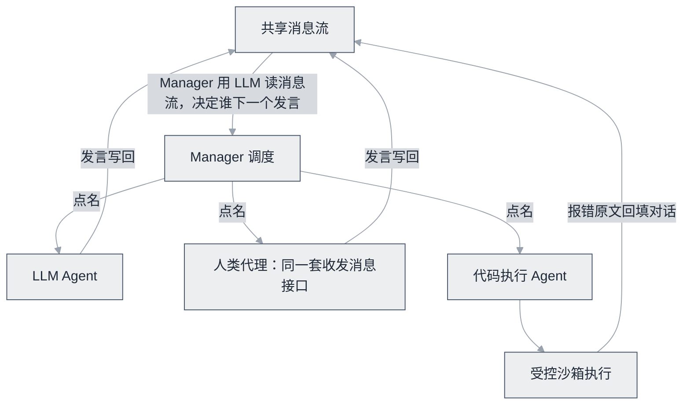

# AutoGen / Microsoft Agent Framework


**一句话**：微软多智能体框架：GroupChat 对话协作的开创者；现与 Semantic Kernel 合流为 Agent Framework，事件驱动架构支撑生产。


| 属性 | 内容 |
|---|---|
| 类型 | 开源项目（框架） |
| 链接 | <https://github.com/microsoft/autogen>（思想与历史）· <https://github.com/microsoft/agent-framework>（合流新版） |
| 来源 | Microsoft Research / Microsoft |
| 协议 | MIT |
| 难度 | 进阶 |
| 标签 | `#framework` `#multi-agent` |

## 架构要点

AutoGen 把协作压成一个统一模型：**Agent 是「能发消息、能收消息、可选能执行代码」的对话参与者，系统 = 共享消息流 + 发言调度**。GroupChat 里由 Manager 用 LLM 读消息流决定下一个发言者，发言写回消息流形成循环——人类代理、LLM 代理、工具代理都走同一套接口，可自由组合。v0.4 用 actor 模型彻底重构：每个 Agent 是独立 actor、经消息队列异步通信，事件驱动且支持 Python/.NET 跨语言，API 分层为 Core（运行时）/ AgentChat（高层会话）/ Extensions（模型与工具生态）；其上还有 AutoGen Studio（低代码原型界面）与 Magentic-One（带 Orchestrator 的通才多 Agent 团队）这类成型方案。

另一半看家本领是**内嵌代码执行沙箱**：「模型写代码 → 框架在受控环境执行 → 报错回填对话 → 模型修正」的闭环被做进了架构，而不是每个使用者自己拼一遍。

## 推荐理由

- 多 Agent 对话范式的学术与工程双料源头（论文 [arXiv:2308.08155](https://arxiv.org/abs/2308.08155)），至今仍是少数带系统评估实验的多 Agent 框架文献
- v0.4 的 actor 模型重构是多 Agent 框架工程化的代表案例——光看这次重构怎么把「群聊」翻译成事件系统就值得读
- 代码执行闭环开箱即用，省掉的恰好是最容易写错、最危险的那一段
- 谱系有去处：与 Semantic Kernel 合流为 Microsoft Agent Framework 后持续演进，企业栈与 Azure 生态打通

## 什么时候选它

- 任务形态天然是「写代码并跑起来」，或要研究对话式协作：AutoGen 的模型最对口
- 微软技术栈的新项目：直接上 Agent Framework，拿 AutoGen 仓库和论文学思想
- 需要显式、可审计的条件分支与循环：LangGraph 的图比消息流守纪律——对话调度的控制流是隐式的，出了问题难复现
- 只是快速组一个角色化流水线：CrewAI 更快

## 上手建议

- 学习思想读 autogen 仓库与论文；新项目用 agent-framework。看教程认准版本——项目经历过彻底重构，旧 API 教程基本不可用
- GroupChatManager 的发言选择实现值得精读（→ [群聊模式](../../08-multi-agent/group-chat.md)），但记住生产共识：用 handoff/定向流程代替自由群聊
- 代码执行务必开 Docker 隔离，别让「沙箱」两个字只停留在配置示例里

## 一句话点评

演示时 GroupChat 最惊艳，上生产时最想拆掉它——把「谁下一个说话」交给模型的嘴，复现性就基本没了；但它教会整个行业「消息流 + 调度」这套抽象和代码执行闭环，这部分遗产在所有后继框架里都还活着。

## 参考资料

- [AutoGen GitHub](https://github.com/microsoft/autogen)
- [Microsoft Agent Framework GitHub](https://github.com/microsoft/agent-framework)
- [AutoGen 论文（arXiv:2308.08155）](https://arxiv.org/abs/2308.08155)
- [Magentic-One 论文（arXiv:2411.04468）](https://arxiv.org/abs/2411.04468)
- [AutoGen 官方文档](https://microsoft.github.io/autogen/)

## 相关知识点

- [AutoGen](../../09-frameworks/autogen.md)
- [群聊模式](../../08-multi-agent/group-chat.md)
