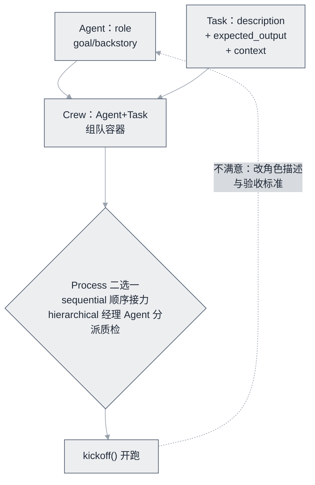

# CrewAI：项目档案与点评


**一句话**：角色扮演式多 Agent 框架：role/goal/backstory 三件套组队干活，上手最快的多 Agent 框架。


| 属性 | 内容 |
|---|---|
| 类型 | 开源项目（框架） |
| 链接 | <https://github.com/crewAIInc/crewAI> · [文档](https://docs.crewai.com) |
| 来源 | CrewAI Inc. |
| 协议 | MIT |
| 难度 | 入门 |
| 标签 | `#framework` `#multi-agent` |

## 架构要点

CrewAI 的设计判断与图式编排正好相反：**多 Agent 的难点不在控制流，而在「把角色和任务说清楚」**。于是它只给四个声明式抽象，把组队变成填空题：

- **Agent**：`role`（是谁）/ `goal`（要什么）/ `backstory`（背景）三件套，本质是结构化的 prompt 片段——「人设」没有魔法，是被模板化织进 system prompt 的
- **Task**：`description` + `expected_output` + `context` 依赖；`expected_output` 把验收标准写进任务定义，是全框架最值钱的字段
- **Crew**：一批 Agent 加一批 Task 的组队容器，`kickoff()` 一键开跑
- **Process**：`sequential` 顺序接力，或 `hierarchical` 内置经理 Agent 负责拆解、分派与质检——后者是监督者模式的开箱实现

需要更自由的控制时，后加的 Flows 提供事件驱动的编排（触发条件、分支处理）；这次补课本身也说明纯角色约定撑不起复杂流程。项目早期依赖 LangChain 组件，后重写为完全独立的轻量运行时，「不背重型依赖」由此成为卖点之一。

## 推荐理由

- 「组一个团队」的心智模型直观，声明式配置几乎零学习成本，教学与原型利器
- hierarchical 流程内置经理 Agent，监督者模式开箱即用
- 社区活跃，模板与案例丰富，从教程到能跑的 demo 路径最短

## 什么时候选它

- 「几个角色按顺序做几件事」（调研报告、内容流水线、资料整理）：CrewAI 最快，一个下午能出能看的 demo
- 需要条件分支、循环、断点恢复：换 LangGraph，别硬扭它
- 任务核心是「模型写代码并执行」：AutoGen 的沙箱闭环更对口
- 给非工程背景的同学讲多 Agent 概念：这套隐喻几乎无门槛

## 上手建议

- 先把每个 Task 的 `expected_output` 当测试断言来写；写不出来，说明任务本身还没拆清楚
- 读源码看 role/goal/backstory 如何被织入 system prompt，理解「角色 = prompt 工程」
- 复杂条件编排力有不逮时迁移 LangGraph（→ [CrewAI 知识点](../../09-frameworks/crewai.md) 的误区节）；Flows 能缓解但不解决控制流问题

## 一句话点评

多 Agent 框架里入门成本几乎最低、天花板也同样明显的：把 prompt 当组织结构用，学习爽、原型快，但别指望它长期当你的生产控制流引擎——它自己也清楚，所以有了 Flows。

## 参考资料

- [CrewAI GitHub](https://github.com/crewAIInc/crewAI)
- [官方文档](https://docs.crewai.com)
- [官网](https://www.crewai.com/)

## 相关知识点

- [CrewAI](../../09-frameworks/crewai.md)
- [角色分配](../../08-multi-agent/role-assignment.md)
