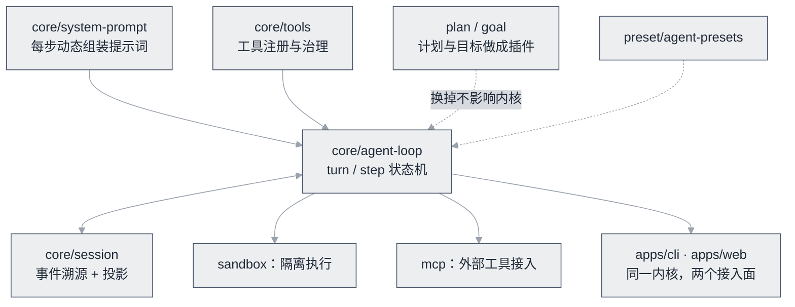

# DeepSeek Harness


**一句话**：DeepSeek 开源的「一切皆插件」生产级 Agent harness——模型、工具、会话、沙箱、甚至 Agent Loop 本身都可替换。


| 属性 | 内容 |
|---|---|
| 类型 | 开源项目（Agent harness / 运行时） |
| 链接 | <https://github.com/deepseek-ai/deepseek-harness> · [官网](https://deepseek.com/harness) |
| 来源/作者 | DeepSeek-AI |
| 发布/更新时间 | 2026-08-13 开源（首次提交） |
| 许可 | MIT |
| 活跃度 | 约 21.8 万 star（2026-09 观测）；最近提交 2026-09 |
| 语言 | TypeScript |
| 难度 | 高级 |
| 标签 | `#framework` `#agent` `#tooling` |

## 推荐理由

它的独特之处是**把 Agent 运行时的每一层都做成了可插拔组件**，而不是又一个框架。仓库结构可以印证：

- `packages/core/agent-loop`：循环实现（turn/step 状态机）
- `packages/core/tools`、`packages/core/system-prompt`、`packages/core/agent`：工具注册与治理、每步动态组装提示词、Agent 作用域
- `packages/plan`、`packages/goal`：计划与目标被做成一等公民插件
- `packages/sandbox`、`packages/mcp`、`packages/preset/agent-presets`：沙箱、MCP 接入、Agent 预设
- `apps/cli`、`apps/web`：同一内核的多接入面

**什么时候值得读**：想理解「生产级 Agent 运行时怎么分层」时，它比读框架文档更有价值——因为分层是被强制暴露出来的，不是被封装掉的。

图里只有中间那个方框是不可替换的，其余全是插槽。对照第 11 章的说法：**恢复、审计、回放三件事都挂在 session 上**，而不是散落在业务代码里——这也是它敢把 Agent Loop 本身做成可替换组件的底气。

## 上手建议

1. 先跑起来：`npx @deepseek-ai/dsh web`，感受「标准/极简/PTC」等模式切换
2. 读源码路线：`docs/architecture` → `packages/core/agent-loop/src/agent.ts` → `packages/core/session` → `packages/core/tools`
3. 带着问题读：它的「事件溯源 + 投影」如何同时满足恢复、审计与回放？（对照 [状态机与事件驱动](../../11-engineering/state-machine-event-driven.md)）
4. 前置知识：[Agent 核心组件](../../02-agent-basics/core-components.md)、[Function Calling](../../05-tool-protocol/function-calling.md)


**提示**：本书多处以它作为「源码案例」，正是因为上述结构可逐层验证；引用路径均可在仓库中对照找到。


## 参考资料

- [仓库](https://github.com/deepseek-ai/deepseek-harness)（README 含架构概览与包说明）
- [官网](https://deepseek.com/harness)

## 相关知识点

- [Agent 核心组件](../../02-agent-basics/core-components.md)
- [状态机与事件驱动](../../11-engineering/state-machine-event-driven.md)
- [工具注册表](../../11-engineering/tool-registry.md)
- [编程 Agent](../../12-applications/coding-agent.md)

