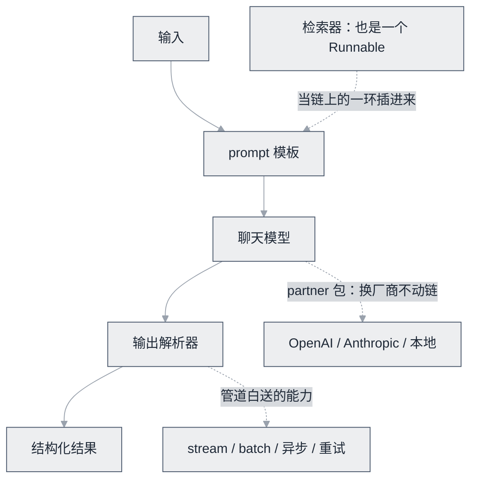

# LangChain：项目档案与点评


**一句话**：最流行的 LLM 应用开发框架：数百个集成 + 统一抽象，生态最大的「全家桶」。


| 属性 | 内容 |
|---|---|
| 类型 | 开源项目（框架） |
| 链接 | <https://github.com/langchain-ai/langchain> · [文档](https://docs.langchain.com/oss/python/langchain/overview) |
| 来源 | LangChain Inc. |
| 协议 | MIT |
| 难度 | 入门 |
| 标签 | `#framework` |

## 架构要点

LangChain 的核心资产是 **Runnable 协议**：模型、prompt 模板、输出解析器、检索器、链，全部实现同一组 `invoke` / `stream` / `batch` 接口，LCEL 用一个 `|` 管道符把它们串成链——所以换模型、换向量库不动链路结构，整条链自动获得流式与批处理。包结构上拆成 `langchain-core`（抽象与协议）、各家厂商的 partner 包、`langchain-community`（社区集成），用哪块装哪块，不必背下全家桶。早年被诟病的「Agent 抽象」（AgentExecutor 那一层）已基本分流给同门的 LangGraph，如今 LangChain 的定位收敛为**组件与集成层**：这既是产品分工，也是对多年批评的正面回应，近几个版本的主旋律就是做减法。



*《图：一条 LCEL 链上只有四个环节，检索器与厂商各自从侧面挂进来——「换」和「插」都发生在虚线处，主干不动》*

这条协议到底值不值，看同一棵链对三种调用的反应就够了：组装是 `chain = prompt | llm | StrOutputParser()`（三个 Runnable 用一个 `|` 串起来），单条是 `chain.invoke({"q": question})`，批量是 `chain.batch([{"q": q} for q in questions])`——**批量这一步，链本身不用改一行**。对外面就这三个动词，其余都是它们的变形。

```json
{
  "runnable_protocol": {
    "interface": ["invoke(input) -> output", "stream(input) -> 增量块", "batch([input]) -> [output]"],
    "composition": "prompt | llm | StrOutputParser()",
    "components": {
      "prompt": "prompt 模板：吃 {\"q\": question}，吐渲染好的消息",
      "llm": "聊天模型：由 partner 包提供（OpenAI / Anthropic / 本地），吐 AIMessage",
      "StrOutputParser": "输出解析器：把 AIMessage 的包装拆掉，只留字符串"
    },
    "free_capabilities": ["stream", "batch", "异步", "重试"],
    "pluggable_side_doors": ["检索器也是 Runnable，可插在任意一环", "换厂商只换 provider 包，不动链"],
    "packages": ["langchain-core（抽象与协议）", "各家 partner 包", "langchain-community（社区集成）"]
  }
}
```

三个动词共享同一棵树，这是它真正的卖点：`stream` 与 `batch` 不需要链的作者重新实现一遍，异步与重试也是管道白送的。**代价同样明确**：树每多一环，出错时的定位路径就长一层，抽象层数偏多是这个项目被批评最久的一点。所以判断标准从来不是「能不能串起来」，而是「这棵树的深度你排障时能不能一眼看完」。

## 三个动词各跑一次时发生了什么




#### 第 1 步：输入 dict 进 prompt 模板

`{"q": question}` 填进模板槽位，产出渲染好的消息。这一步定了整条链的输入形状：`batch` 的每一项都必须是同一种 dict，字段名对不上就在第一环报错——**批量的失败通常是第 1 步的失败**，而且会一次性失败 N 份。




#### 第 2 步：partner 包把厂商差异吃掉

聊天模型这一环由 provider 包实现：请求体格式、鉴权、流式协议各不相同，但链上看到的都是同一个接口、同一个 `AIMessage`。换厂商改的是这一环的构造参数，下游毫不知情——这就是「换模型不动链路结构」的具体落点。




#### 第 3 步：解析器决定下游拿到什么

`StrOutputParser` 把 `AIMessage` 的包装拆掉只留字符串；换成结构化解析器，下游收到的就是 dict 而不是 str。**协议统一不等于业务契约不变**：换解析器要同步改消费方，否则错误会漂到离改动很远的地方才炸。要把输出钉成 schema，正确做法是走模型侧的 tool use / 结构化输出再回填错误，见 [Function Calling](../../05-tool-protocol/function-calling.md)。




#### 第 4 步：stream 与 batch 是同一棵树的两种跑法

`stream` 逐块吐中间结果，适合对话界面；`batch` 把 N 个输入并发跑完，适合离线打标与评估集回归。两者都不需要重写链——**这一格就是框架值那点抽象税的全部理由**，也是它最容易被人忘记的地方：白送的能力如果不使用，成本却一直在付。



## 三处替换试验，一处反例（点标签切换）



只改 provider 包与模型名一处，链的形状、解析器、调用方全不动。但要看清抽象的边界：它统一的是 API 形状，统一不了模型脾气——同一个 prompt 换个厂商，工具调用格式与长度倾向都可能变，**这类回归只有评估集能抓到**，锁版本和跑回归因此是同一件事的两面。



检索器本身就是一个 Runnable，可以当链上的一环插进来：换 Milvus 到 pgvector 只换它的构造参数。这是 LangChain 最划算的用法——几十种数据源的封装是它生态里最难被替代的部分，自己写大概要花掉同样的时间，还少一层兼容。



包结构已经拆成 `langchain-core`（抽象与协议）、厂商 partner 包、`langchain-community`（社区集成）：按集成装、不必背全家桶。依赖树瘦身带来的直接好处是版本冲突面变小，这在锁 `requirements` 的生产环境里比省几兆更重要。



条件分支、循环、断点恢复硬用 chain 扭，会得到一棵越来越怪的 Runnable 树：分支判定被塞进解析器，重试逻辑被塞进自定义 Runnable。这类需求请直接分流给 [LangGraph](langgraph.md)，或者干脆自己写控制流——成熟姿势是「只取薄的」：拿集成与 Runnable 抽象，控制流自己写。




**用它的正确姿势是按层定的**：把它限制在「集成适配」这一层，业务控制流自己写或交给 LangGraph。两个具体动作——`requirements` 里锁死版本（迭代快、存在破坏性变更，这个项目的 API 稳定性口碑是拿教训换来的）；接新数据源前先查 provider 包与文档目录，看清封装边界再决定要不要自己写，别默认「有封装就一定够用」。


## 推荐理由

- **集成生态最大**：模型、向量库、文档加载器、工具适配应有尽有，原型速度极快——需要「接一个从没见过的数据源」时，通常已有现成封装
- **统一抽象（Runnable/LCEL）**：组件可替换（换模型、换向量库不改链路），并自动支持流式与批处理
- **调试链路完整**：与 LangSmith（trace/评估）与 LangGraph（复杂编排）构成工具链

## 注意事项

- 抽象层数偏多，出问题时需要在多层之间定位；建议**把它限制在「集成适配」层**，业务控制流自己写或用 LangGraph
- 迭代快、存在破坏性变更，生产环境务必锁版本

## 什么时候选它

- 要连接大量异构组件（各家模型、几十种向量库、五花八门的文档加载器）：这是它的主战场，现成封装省掉的时间是真金白银
- 需要条件分支、循环、断点恢复：直接用 [LangGraph](langgraph.md)，别拿 chain 硬扭
- 只是「调模型 + 几个工具」的轻应用：直接用厂商 SDK 更轻，框架的抽象成本在小项目里常常高于收益
- 成熟团队的常见姿势是「只取薄的」：拿集成与 Runnable 抽象，控制流自己写

## 一句话点评

LLM 圈争议最多的框架，但价值经常被用错位置：拿它当业务骨架，抽象会一层层烦死你；拿它当「插座适配器库」，它每周帮你省几十小时——好不好用，取决于你把它放在哪一层。

## 上手建议

- 复杂编排分流给 [LangGraph](langgraph.md)；LangChain 用作「集成层」
- 抄教程前先核对版本号，`requirements` 里锁死；这个项目的 API 稳定性口碑是拿教训换来的
- 最佳入门姿势是「集成速查」：遇到要接的数据源或模型，先查它的 provider 包与文档目录，看清封装边界再决定要不要自己写
- 对照 [LangChain 知识点](../../09-frameworks/langchain.md) 理解适用边界

## 参考资料

- [LangChain 文档](https://docs.langchain.com/oss/python/langchain/overview)
- [新版统一文档站](https://docs.langchain.com/)
- [LangChain GitHub](https://github.com/langchain-ai/langchain)
- [LangGraph 文档](https://langchain-ai.github.io/langgraph/)
- [LangSmith（配套 trace 与评估平台）](https://www.langchain.com/langsmith)

## 相关知识点

- [LangChain](../../09-frameworks/langchain.md)
- [LangGraph](langgraph.md)

