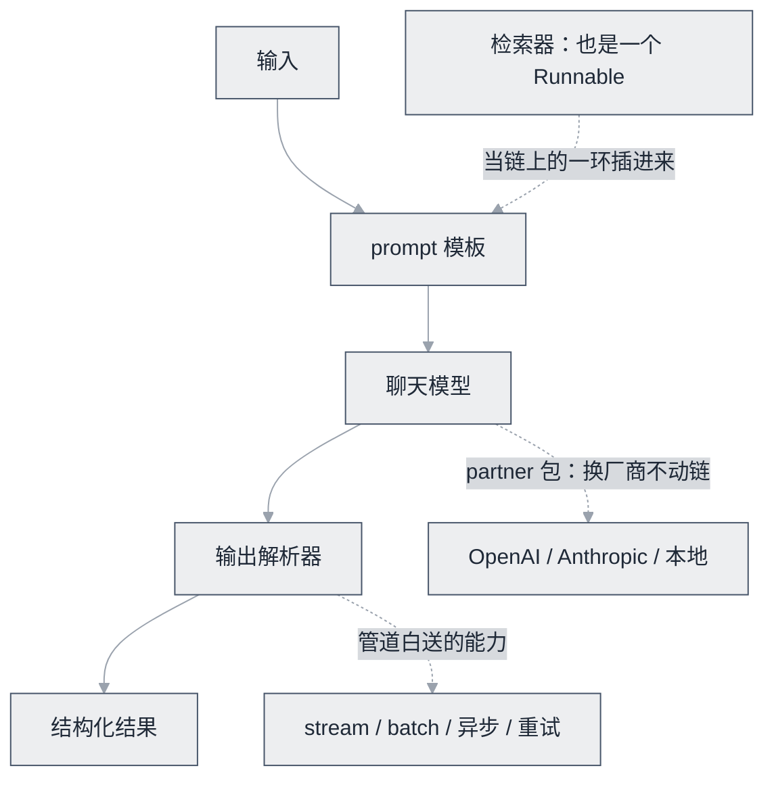

# LangChain


**一句话**：最流行的 LLM 应用开发框架：数百个集成 + 统一抽象，生态最大的「全家桶」。


| 属性 | 内容 |
|---|---|
| 类型 | 开源项目（框架） |
| 链接 | <https://github.com/langchain-ai/langchain> · [文档](https://python.langchain.com) |
| 来源 | LangChain Inc. |
| 协议 | MIT |
| 难度 | 入门 |
| 标签 | `#framework` |

## 架构要点

LangChain 的核心资产是 **Runnable 协议**：模型、prompt 模板、输出解析器、检索器、链，全部实现同一组 `invoke` / `stream` / `batch` 接口，LCEL 用一个 `|` 管道符把它们串成链——所以换模型、换向量库不动链路结构，整条链自动获得流式与批处理。包结构上拆成 `langchain-core`（抽象与协议）、各家厂商的 partner 包、`langchain-community`（社区集成），用哪块装哪块，不必背下全家桶。早年被诟病的「Agent 抽象」（AgentExecutor 那一层）已基本分流给同门的 LangGraph，如今 LangChain 的定位收敛为**组件与集成层**：这既是产品分工，也是对多年批评的正面回应，近几个版本的主旋律就是做减法。



这条协议到底值不值，三行代码就能判断：

```python
chain = prompt | llm | StrOutputParser()   # 三个 Runnable 用 | 串成一条链
chain.invoke({"q": question})              # 单条
chain.batch([{"q": q} for q in questions]) # 批量：链本身不用改一行
```

## 推荐理由

- **集成生态最大**：模型、向量库、文档加载器、工具适配应有尽有，原型速度极快——需要「接一个从没见过的数据源」时，通常已有现成封装
- **统一抽象（Runnable/LCEL）**：组件可替换（换模型、换向量库不改链路），并自动支持流式与批处理
- **调试链路完整**：与 LangSmith（trace/评估）与 LangGraph（复杂编排）构成工具链

## 注意事项

- 抽象层数偏多，出问题时需要在多层之间定位；建议**把它限制在「集成适配」层**，业务控制流自己写或用 LangGraph
- 迭代快、存在破坏性变更，生产环境务必锁版本

## 什么时候选它

- 要连接大量异构组件（各家模型、几十种向量库、五花八门的文档加载器）：这是它的主战场，现成封装省掉的时间是真金白银
- 需要条件分支、循环、断点恢复：直接用 [LangGraph](langgraph.md)，别拿 chain 硬扭
- 只是「调模型 + 几个工具」的轻应用：直接用厂商 SDK 更轻，框架的抽象成本在小项目里常常高于收益
- 成熟团队的常见姿势是「只取薄的」：拿集成与 Runnable 抽象，控制流自己写

## 一句话点评

LLM 圈争议最多的框架，但价值经常被用错位置：拿它当业务骨架，抽象会一层层烦死你；拿它当「插座适配器库」，它每周帮你省几十小时——好不好用，取决于你把它放在哪一层。

## 上手建议

- 复杂编排分流给 [LangGraph](langgraph.md)；LangChain 用作「集成层」
- 抄教程前先核对版本号，`requirements` 里锁死；这个项目的 API 稳定性口碑是拿教训换来的
- 最佳入门姿势是「集成速查」：遇到要接的数据源或模型，先查它的 provider 包与文档目录，看清封装边界再决定要不要自己写
- 对照 [LangChain 知识点](../../09-frameworks/langchain.md) 理解适用边界

## 参考资料

- [LangChain 文档](https://python.langchain.com)
- [新版统一文档站](https://docs.langchain.com/)
- [LangChain GitHub](https://github.com/langchain-ai/langchain)
- [LangGraph 文档](https://langchain-ai.github.io/langgraph/)
- [LangSmith（配套 trace 与评估平台）](https://www.langchain.com/langsmith)

## 相关知识点

- [LangChain](../../09-frameworks/langchain.md)
- [LangGraph](langgraph.md)

