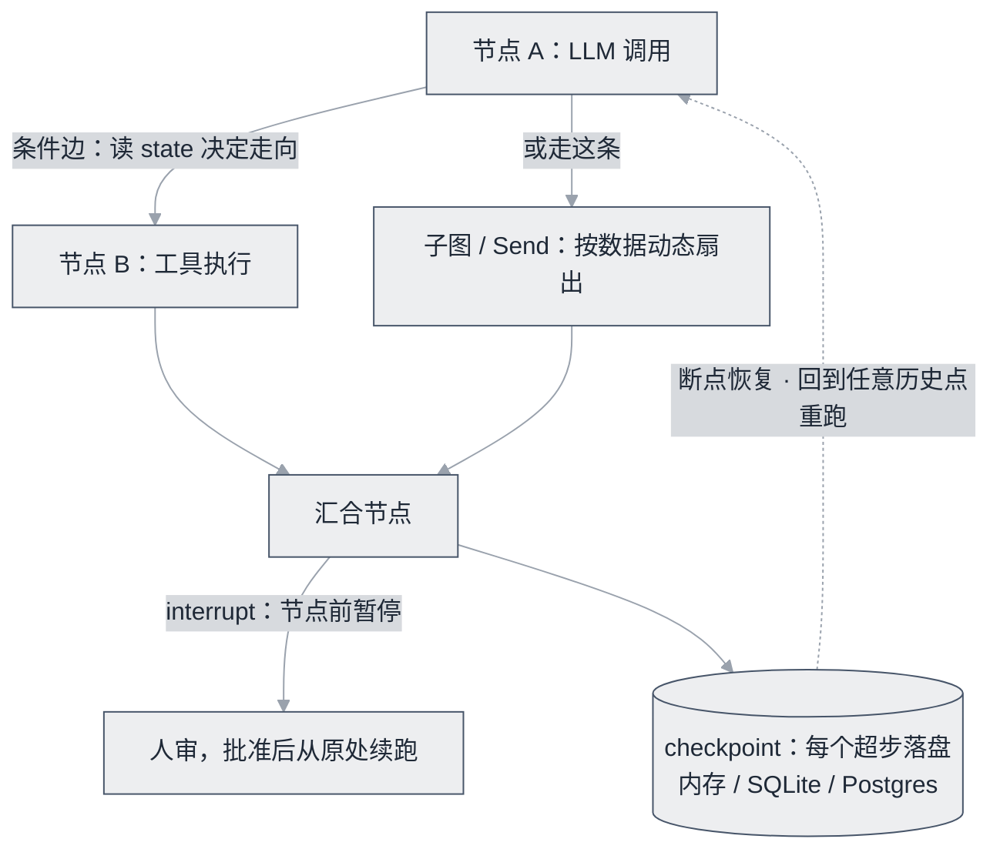

# LangGraph


**一句话**：把 Agent 表达为状态图的主流编排框架：checkpoint、interrupt、条件边，复杂工作流与多 Agent 的当前首选。


| 属性 | 内容 |
|---|---|
| 类型 | 开源项目（框架） |
| 链接 | <https://github.com/langchain-ai/langgraph> · [文档](https://langchain-ai.github.io/langgraph/) |
| 来源 | LangChain Inc. |
| 协议 | MIT |
| 难度 | 进阶 |
| 标签 | `#framework` `#engineering` |

## 架构要点

LangGraph 的出发点是一个明确的判断：**Agent 的难点通常不在调用模型，而在控制流**。于是它把流程显式建模成「状态图」——节点是步骤（函数，可以是 LLM 调用、工具执行或任意代码），边是流转（普通边固定走向、条件边按状态路由），节点之间共享一个显式声明的状态对象，节点只返回增量、由 reducer 决定如何合并。这套三元组立住之后，三件事变得自然：

- **checkpoint**：每个超步把状态持久化到内存/SQLite/Postgres，长任务可断点恢复、可回到任意历史点重跑（时间旅行），调试体验与裸循环完全不同
- **interrupt**：在指定节点前暂停等人审，HITL 成为图内的一等公民，而不是外挂的补丁
- **子图与 Send**：把子流程打包复用、按数据动态扇出并行任务，监督者/层级式等多 Agent 拓扑可以直接表达出来

## 推荐理由

- 官方模板库覆盖监督者/群聊/Plan-and-Execute 等全部主流编排模式——「编排模式的开源图书馆」，学编排等于读模板
- checkpoint + interrupt 是把「长任务容错 + 人机协作」做成生产系统的完整组合
- 生产案例丰富（Klarna、Uber 等公开分享）；与 LangSmith 衔接后，图级 trace 不费吹灰之力
- Python/JS 双语实现、API 对齐，前后端团队可以共用一套心智模型

## 什么时候选它

- 需要条件分支、循环、断点恢复中的任意一项：选 LangGraph，不用犹豫
- 纯线性链路、重集成需求：LangChain 的 LCEL 就够了
- 只是跑一个工具循环：手写循环更透明，别为用框架而付「图思维」的学费
- 想快速组一个「几个角色按顺序做几件事」的团队：先用 CrewAI，流程一复杂再升级到图

## 上手建议

1. 跑通官方 `plan-and-execute` 模板，边跑边对照 [工作流编排](../../07-planning/workflow-orchestration.md) 里的抽象
2. 对照 [多 Agent 编排](../../08-multi-agent/multi-agent-orchestration.md) 逐个读模板：supervisor、hierarchical、multi-agent-chat
3. 生产上线前补齐框架不提供给你的部分：任务队列、节点幂等、checkpoint 清理策略——这三件事不做，长任务迟早爆雷

## 一句话点评

一个逼你「先画流程图再写代码」的框架——图本身就是设计文档，评审时把 mermaid 一贴谁都能看懂；学图思维的学费是真实的，但项目长到需要多人理解流程的那天，你会发现这笔学费是全书最值的。

## 参考资料

- [LangGraph GitHub](https://github.com/langchain-ai/langgraph)
- [LangGraph 官方文档](https://langchain-ai.github.io/langgraph/)
- [官方公告：Launching LangGraph Templates（原 `langgraph-templates` 仓库现已下线，模板入口以这篇公告为准）](https://www.langchain.com/blog/launching-langgraph-templates)
- [Anthropic 多 Agent 研究系统工程实践（监督者/工作者模式的对照读物）](https://www.anthropic.com/engineering/built-multi-agent-research-system)

## 相关知识点

- [LangGraph](../../09-frameworks/langgraph.md)
- [状态机与事件驱动](../../11-engineering/state-machine-event-driven.md)
