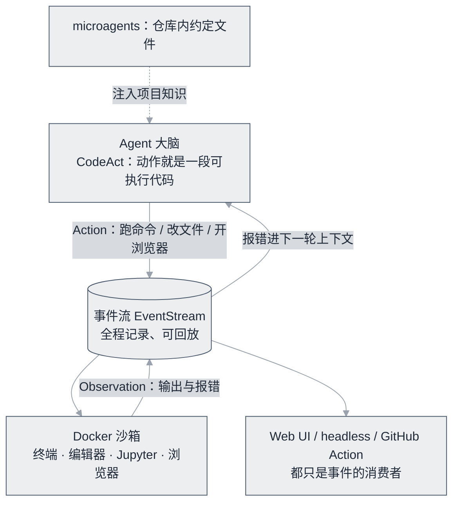

# OpenHands


**一句话**：全功能开源编程 Agent（原 OpenDevin）：SWE-bench 常客、可自部署的「AI 软件工程师」。


*《图：Automate 视图把「会话列表 + 定时任务卡 + 工作流模板」排成产品，而非丢给用户一个 CLI 自己悟》*

*读图提示：Automate 视图的标签与模板名按 1280px 原图排到 608px 正文列，缩放只有 0.475——把图片点开放大回原始尺寸，会话列表那一栏才看得清。*

*来源：OpenHands 官方仓库 README 产品截图（[assets.openhands.dev](https://assets.openhands.dev/screenshot/automation-preview.png)），访问日期 2026-09-22。*

| 属性 | 内容 |
|---|---|
| 类型 | 开源项目（应用） |
| 链接 | <https://github.com/All-Hands-AI/OpenHands> |
| 来源 | All Hands AI |
| 协议 | MIT |
| 难度 | 进阶 |
| 标签 | `#application` `#agent` |

## 架构要点

OpenHands 的骨架是**事件流 + 沙箱运行时**：Agent 与环境的每次交互都是一对 Action/Observation（命令执行、文件编辑、浏览器操作……及其返回结果），全程记录、可回放，审计与调试需求天然满足。动作空间走 CodeAct 那条「可执行代码即动作」的路线——模型要计算或改文件时直接写代码执行，报错信息自然成为下一轮修正的观察输入（见 [arXiv:2402.01030](https://arxiv.org/abs/2402.01030)）。执行全部发生在 Docker 沙箱里，配终端、编辑器、浏览器、Jupyter 一整套能力面；在此之上还有 microagents 机制（仓库内的约定文件，把项目知识注入上下文）、headless 模式和 GitHub Action 接入——这也是它能在 CI 里直接把 issue 变成 PR 的原因。项目论文（[arXiv:2407.16741](https://arxiv.org/abs/2407.16741)）系统描述了这套平台设计，投稿 ICLR 2025。

## 推荐理由

- 开源编程 Agent 里功能最全：代码、浏览器、终端、Jupyter 全能力面，不用自己拼
- SWE-bench Verified 上的开源标杆成绩，对比 Claude Code 类闭源产品的参照系
- 架构清晰（事件流 + Agent 技能 + 沙箱运行时），每一块都有可读的实现，适合魔改自用
- 换模型友好：LLM 配置外挂，接开源模型也能跑，方便做成本实验

## 什么时候选它

- 要一个能自部署、修真实 issue、提 PR 的「AI 软件工程师」：开源选项里的第一梯队
- 想学 coding agent 的工程三件套（沙箱隔离、事件审计、上下文管理）：读它的源码比用它的收益大
- 需要评估「开源 Agent 到底能干什么活」：以它为基线跑你自己的任务集，起点公允
- 只想要轻量的 IDE 补全式助手：它不是这个用途，整套 Docker + 事件流的重量是为自主任务准备的

## 上手建议

1. Docker 部署跑通一个真实 issue 修复，观察事件流里每条 Action/Observation 的形态
2. 读它的事件流架构，与 [DeepSeek Harness](https://github.com/deepseek-ai/deepseek-harness) 的设计对照——两家对「状态放哪、谁可回放」的答案不一样
3. 用 SWE-bench-lite 子集评估你的魔改效果（→ [SWE-bench](../benchmarks/swe-bench.md)）
4. 给仓库写 microagents 文件试试：这是投入产出比最高的一种「调教」

## 一句话点评

把它当 coding agent 的一站式参考答案来读最划算——沙箱怎么隔离、事件怎么审计、报错怎么回填，每块都给你落成了能跑的代码；代价是组件重、迭代快，旧版本的部署笔记很容易过期，生产使用建议锁 tag 而不是追 main。

## 参考资料

- [OpenHands GitHub](https://github.com/All-Hands-AI/OpenHands)
- [官方文档](https://docs.all-hands.dev/)
- [项目论文（arXiv:2407.16741）](https://arxiv.org/abs/2407.16741)
- [CodeAct 论文：可执行代码动作（arXiv:2402.01030）](https://arxiv.org/abs/2402.01030)
- [官网 All Hands AI](https://www.all-hands.dev/)

## 相关知识点

- [编程 Agent](../../12-applications/coding-agent.md)
- [SWE-bench](../benchmarks/swe-bench.md)
