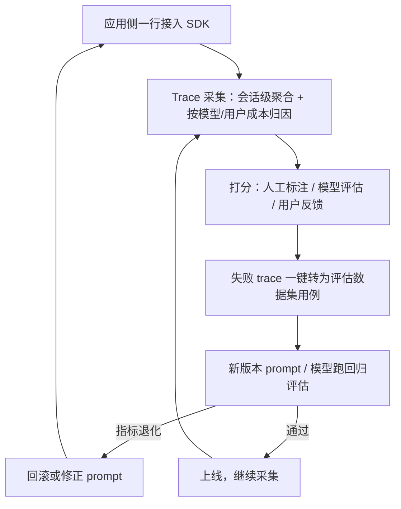

# LangFuse


**一句话**：开源 LLM 可观测平台：trace、成本追踪、评估、prompt 管理一体，可自托管。


| 属性 | 内容 |
|---|---|
| 类型 | 工具（可观测） |
| 链接 | <https://github.com/langfuse/langfuse> · [文档](https://langfuse.com/docs) |
| 来源 | LangFuse |
| 协议 | MIT（核心） |
| 难度 | 进阶 |
| 标签 | `#engineering` `#evaluation` |

## 推荐理由

- 数据主权友好：MIT 核心可自托管，PII 敏感团队首选
- 会话级 trace 聚合 + 按模型/用户成本归因，成本优化利器
- 兼容 OpenTelemetry 导出，不锁生态

## 机制一图看懂

trace 进来到回归评估出去的闭环：

## 上手建议

1. 一行接入（`from langfuse.openai import openai`）跑通 trace
2. 配置按租户/任务类型的成本看板（→ [观测工具选型](../../11-engineering/observability-tools.md)）
3. 失败 trace 一键转评估用例

## 相关知识点

- [日志、追踪与监控](../../11-engineering/logging-tracing-monitoring.md)
- [持续评估](../../11-engineering/continuous-evaluation.md)

