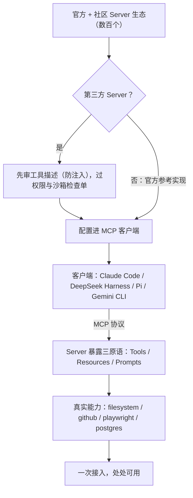

# MCP Servers


**一句话**：MCP 工具生态：官方与社区的数百个现成 Server，Agent 工具的「应用商店」。


| 属性 | 内容 |
|---|---|
| 类型 | 工具生态 |
| 链接 | <https://github.com/modelcontextprotocol/servers> · 目录：<https://mcp.so> |
| 来源 | Anthropic + 社区 |
| 协议 | MIT（参考实现） |
| 难度 | 入门 |
| 标签 | `#mcp` `#tooling` |

## 推荐理由

- **参考实现质量高**：filesystem / github / playwright / postgres 等 Server 源码结构清晰，读一个就能学会 MCP 的 Server 端写法
- **可按场景检索**：目录站（mcp.so 等）支持按用途找社区 Server，不必自己从零封装
- **一次接入处处可用**：主流 MCP 客户端（Claude Code / DeepSeek Harness / Pi / Gemini CLI）通用，避免为每个客户端重复适配

## 注意事项

- 第三方 Server 是**供应链风险点**：其工具描述可能被注入恶意指令，接入前须审查并纳入权限管道
- 参考实现以「演示与起步」为主，生产使用要自行补错误处理、限流与输入校验

## 机制一图看懂

从 Server 生态到客户端接入，中间隔着审查这一关：

## 上手建议

1. 先读 [MCP 知识点](../../05-tool-protocol/mcp.md) 理解三原语（Tools/Resources/Prompts）
2. 接入一个 filesystem Server 跑通最小闭环
3. 生产接入前过 [权限与沙箱](../../05-tool-protocol/tool-permission-sandbox.md) 检查单

## 参考资料

- [MCP 官方文档](https://modelcontextprotocol.io/docs/learn/architecture)
- [modelcontextprotocol/servers](https://github.com/modelcontextprotocol/servers)

## 相关知识点

- [MCP](../../05-tool-protocol/mcp.md)
- [工具选择与路由](../../07-planning/tool-selection-routing.md)

