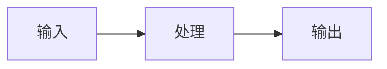

# 🧩 知识点模板

> 新增知识点页面时，复制下方模板使用，保持全书格式统一。
> 行文风格（emoji、图示、类比、提示块）遵循 [风格指南](style-guide.md)。

## 使用说明

1. 复制「模板正文」到新页面（如 `02-agent-basics/xxx.md`）
2. 填好 frontmatter（`tags` / `type` / `status` / `updated`）
3. 在 `docs/SUMMARY.md` 中登记该页面
4. 完成后将 `status` 从 `draft` 改为 `published`

## 模板正文

````markdown
---
tags: [agent, basics, beginner]
type: knowledge
status: draft
updated: 2026-09-10
---

# 🤖 【知识点名称】

> **一句话**：用一句话说清楚这是什么。
> **难度**：⭐️ 入门 / ⭐️⭐️ 进阶 / ⭐️⭐️⭐️ 高级
> **标签**：`#agent` `#基础`

## 📌 先看结论

- 结论一（最重要的放最前面）
- 结论二
- 结论三

## 🤔 为什么需要它？

先讲问题，再讲定义：没有它时会遇到什么麻烦？

## 🧩 核心概念

| 组件 | 作用 | 类比 |
|---|---|---|
| A | 做什么 | 像什么 |
| B | 做什么 | 像什么 |

## 🖼️ 图示



## 🍜 生活类比

用一个日常生活场景类比，让读者秒懂。

## ⚙️ 工作流程

1. 步骤一
2. 步骤二
3. 步骤三

## 💻 代码示例

（可选，尽量可直接运行）

```python
# 最小可运行示例
```

## ⚠️ 常见误区

- ❌ 误区一
- ❌ 误区二

## 🧪 小练习

留一道思考题，帮读者检验是否真的理解了。

## 🔗 相关资源

- [论文/课程/项目名称](../13-resources/README.md)

## 📚 相关知识点

- [相关概念](./相对路径.md)
````

## Frontmatter 字段说明

| 字段 | 说明 | 取值 |
|---|---|---|
| `tags` | 小写英文短标签，2–5 个 | `agent`、`llm`、`rag`、`mcp`、`multi-agent`、`evaluation`、`safety`、`framework`、`tooling` |
| `type` | 页面类型 | `knowledge`（知识点）/ `resource`（资源）/ `index`（索引） |
| `status` | 写作状态 | `draft`（编写中）/ `reviewing`（待审）/ `published`（已发布） |
| `updated` | 最后更新日期 | `YYYY-MM-DD` |

## 写作检查清单

写完一篇后逐项自检：

- [ ] 有一句话结论，读者只看第一屏就能懂
- [ ] 至少 1 张图（Mermaid）或 1 个对比表格
- [ ] 至少 1 个例子（生活类比或代码）
- [ ] 有「常见误区」小节
- [ ] 底部有相关资源与相关知识点的双向链接
- [ ] 一级标题最多 1 个主 emoji，二级标题用功能 emoji，正文不加
- [ ] 术语第一次出现给出中英文对照
- [ ] 入门文章 800–1200 字，核心文章 1500–2500 字
- [ ] 文件名英文小写 + 连字符，已在 `SUMMARY.md` 登记
