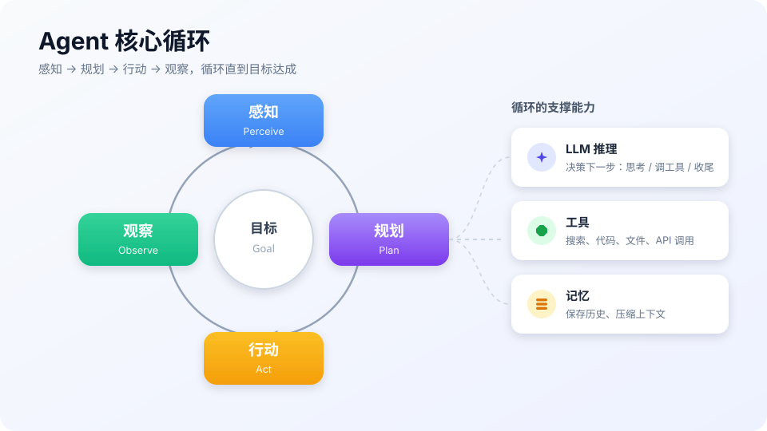

# 风格指南

> **一句话**：这本手册的写作契约——原理要能推导、结论要有出处、图片要能解释信息；emoji 是调味品，不是主菜。

## 为什么有这版指南

初版全书由单一模板批量生成，出现了四个系统性问题，本版逐条纠正。写新页面或改旧页面前，先读这一节：

| 问题 | 初版的表现 | 本版要求 |
|---|---|---|
| 模板单一化 | 144 篇里 114 篇有「相关知识点」、96 篇有「常见误区」，顺序完全一致 | 按**体裁**分型，不同体裁结构不同，见第三节 |
| 篇幅注水或过短 | 正文中文字数中位数 521，仅 2 篇 ≥800，无一篇达到自己定的 1500 字 | 按体裁设定**硬下限**，不达标不得标 `published`，见第八节 |
| emoji 泛滥 | 全书 3182 个 emoji，平均每篇 22 个、约每 2.6 行一个 | 硬预算：**每页标题最多 1 个**，正文 0 个，见第二节 |
| 泛泛而谈 | 全书 **0 个数学公式**；核心概念只给类比不给机制；28 处数字断言大多无出处 | 原理型必须给**机制与公式**；事实必须**可溯源**，见第四、五节 |

## 一、总原则

**先讲清楚，再讲漂亮。** 判断一段文字该不该留的标准是：删掉它，读者是否少懂了一点？如果不会，就删。

三条底线：

1. **可验证**：每个数字、每条 API 行为、每个性能结论，都要能点到一个一手来源（论文、官方文档、源码）。
2. **可复现**：涉及"怎么做"的内容，给最小可运行示例或明确的操作步骤，而不是"可以使用 X 实现"。
3. **不重复**：同一个案例、同一张图、同一句类比，不要在多篇里反复出现充数。

## 二、Emoji 规范（硬预算）

初版的教训是：**只要允许标题挂 emoji，就一定会泛滥**。因此本版收紧为：

| 位置 | 允许数量 | 说明 |
|---|---|---|
| 页面一级标题 `#` | 0–1 个 | 整个页面最多 1 个，也可以完全没有；优先不加 |
| 二级/三级标题 | **0 个** | 一律纯文字，便于搜索、锚点稳定、目录整洁 |
| 正文 | **0 个** | 表情不能替代论证 |
| 提示块标记 | 每页 ≤3 个 | 仅限 `💡 提示`、`⚠️ 注意`、`✅ 最佳实践` 三种 |

> **注意**：GitBook 侧边栏由 `SUMMARY.md` 渲染。`SUMMARY.md` 的章节标题**可以**保留 1 个模块 emoji，但条目层级不要滥用。

反例（初版真实写法）：

```markdown
## 📌 先看结论
## 🧩 核心概念
## 🍜 生活类比
## ⚙️ 工作流程
## 💻 伪代码
## ⚠️ 常见误区
## 🧪 小练习
```

正例：

```markdown
## 先看结论
## 核心机制
## 一个可运行的例子
## 常见误区
```

## 三、体裁分类：不要用一套结构套所有文章

初版最大的问题是"每篇都必须是一句话 + 图 + 类比 + 误区 + 练习"。但资源卡片和原理论文根本不是一种东西。写之前先选体裁：

### A. 原理型（`type: knowledge`，难度 ⭐️⭐️/⭐️⭐️⭐️）

讲"为什么"和"怎么算"。应包含：

1. 问题动机（没有它会怎样）
2. **核心机制**——给出公式、推导或伪代码，不能只给类比
3. 直觉解释（类比放在机制之后，用来巩固，不要用来替代）
4. 工程含义（这个原理对构建 Agent 意味着什么）
5. 出处（原始论文/官方文档）

### B. 概念型（`type: knowledge`，难度 ⭐️）

讲"是什么、和什么不同"。应包含：

1. 定义 + 边界（什么算、什么不算）
2. 与相邻概念的对比表
3. 一个具体场景的例子
4. 出处

### C. 实战型（`type: knowledge`，偏工程）

讲"怎么做"。应包含：

1. 适用场景与前置条件
2. **可运行代码**（真实依赖、真实函数签名，不是伪代码）
3. 常见故障与排查
4. 出处

### D. 资源卡片（`type: resource`）

收录一手资源。应包含属性表（链接、来源、许可、活跃度）和**具体**推荐理由（不要"生态最大""体验好"这类空话）。

> 体裁决定结构，**不要求**每篇都有"生活类比""常见误区""小练习"。这些小节按需出现，不是打卡项。

## 四、深度要求：原理必须有机制

这是本版最重要的新增规范。

- 涉及数学、算法、评分、采样、损失、注意力的页面，**必须给出核心公式**。用 KaTeX 语法（GitBook 与 GitHub 都能渲染）：

  ```markdown
  行内：注意力权重为 $\mathrm{softmax}(QK^\top/\sqrt{d_k})$

  块级：
  $$
  \mathrm{Attention}(Q,K,V)=\mathrm{softmax}\!\left(\frac{QK^\top}{\sqrt{d_k}}\right)V
  $$
  ```

- 公式之后必须解释**每一项在做什么**，以及**为什么需要它**（例如：为什么除 $\sqrt{d_k}$——防止点积随维度增大而方差膨胀、softmax 饱和）。
- 允许在给出公式后补生活类比，但**不能只有类比没有公式**。
- 涉及工程行为的，优先给**真实代码**而非伪代码。伪代码必须标注为伪代码，且不得与真实代码混用。

## 五、引用与事实核查

初版有 28 处"论文数据：提升约 20%"这类断言，却没有一处给出可点的论文编号。本版规定：

1. 任何数字（准确率、成本、比例、star 数、延迟）都要紧跟来源链接，或指向本手册的资源卡片页。
2. 引用论文用 `[标题](arXiv 链接)` 或 `[作者, 年份]` 形式；**每篇原理型/概念型页面底部必须有「参考资料」小节**（可含论文、官方文档、源码），没有则视为未完成。
3. 性能数字必须带**条件**（数据集、模型、harness），因为同一模型换 harness 成绩可能差很多。
4. 不要用"业界普遍认为""众所周知"来支撑结论。

> **注意**：GitHub star 数是会变的。写具体数字时标注**观测日期**，例如"约 21.8 万 star（2026-09）"。

## 六、图片规范：形象、生动、且能解释信息

图片的目的是**降低理解成本**，不是装饰。优先级从高到低：

1. **能自己画就自己画**：结构图、流程图、时序图、状态机用 Mermaid（GitHub 与 GitBook 原生渲染，可版本管理）。这类图改起来方便，永远和正文同步。
2. **概念插图用自绘 SVG**：需要"形象生动"的直觉图（如 Agent 循环、RAG 检索、记忆分层、多智能体协作）放在 `docs/assets/diagrams/`，用 SVG（矢量、体积小、缩放不糊）。**自绘 = 无版权风险**。
3. **真实截图/照片**：仅在必须展示真实界面时使用，必须确认许可并注明来源，放 `docs/assets/screenshots/`。
4. **不要**使用来源不明的网图、带水印的图，或用装饰性 emoji 拼贴冒充配图。

数量：原理型 1–3 张（其中至少 1 张 Mermaid），概念型至少 1 张。**图要准，不要多。**

引用方式（相对路径）：

```markdown

```

> **提示**：图片文件名用「章节-主题」英文小写，如 `02-agent-loop.svg`；不要用 `截图1.png`、`image.png`。

## 七、案例配给：防止单一项目刷屏

初版把 DeepSeek Harness / Pi / Claude Code 三个案例塞进了大量页面，`DeepSeek Harness` 出现在 **71/144** 个文件里，很多页面（如"向量数据库"）本身和它关系很弱，属于模板凑数。本版规定：

1. 案例必须**与页面主题直接相关**。写向量库就讲 FAISS/Qdrant/pgvector，不要为了填「源码案例」小节硬塞一个 harness。
2. 一个项目在全书出现次数应与其重要性匹配；**尽量避免同一个项目出现在超过约 10 个页面**，除非它在该主题上确为权威来源。
3. 引入项目案例时给出**为什么是它**，而不是只列名字。

## 八、篇幅与"发布"门槛

初版 `status: published` 被滥用：38 篇正文不足 300 字却标为已发布。本版规定：

| 体裁 | 正文中文字数下限 | 说明 |
|---|---|---|
| 原理型 | 1200 | 含公式与推导 |
| 概念型 | 600 | |
| 实战型 | 900 | 含可运行代码 |
| 资源卡片 | 150 | 但推荐理由必须具体 |
| 索引/导航页 | 不限 | |

**不达标不得标 `published`**，用 `status: draft` 或 `reviewing`。宁可少发，不要注水。

## 九、写作检查清单

发布前逐项自检：

- [ ] 体裁明确，结构符合对应体裁（见第三节），没有硬凑无关小节
- [ ] 页面内 emoji ≤1（标题），二级标题与正文无 emoji，提示块 ≤3
- [ ] 涉及原理的页面给出核心公式，并解释每一项的作用
- [ ] 每个数字/结论都能点到一手来源；文末有「参考资料」
- [ ] 至少 1 张 Mermaid 或自绘 SVG 配图（概念型起）
- [ ] 案例与主题相关，没有出现"任何页面都塞同一个项目"
- [ ] 达到对应体裁的字数下限
- [ ] 术语首次出现给出中英文对照，如：检索增强生成（RAG，Retrieval-Augmented Generation）
- [ ] 文件名英文小写 + 连字符；已在 `docs/SUMMARY.md` 登记
- [ ] 底部双向链接：知识点 ⇄ 资源

## 十、常见反模式（明确禁止）

1. ❌ **emoji 当标题装饰**：`## 🧩 核心概念` → `## 核心概念`
2. ❌ **只有类比没有机制**：解释注意力只写"像大脑在关注"，不写计算公式
3. ❌ **无出处的数字**："论文显示提升 20%"（哪篇？什么任务？）
4. ❌ **万能案例**：每个主题都拿同一个项目举例
5. ❌ **伪代码冒充代码**：`llm.think(goal)` 这种不可运行的片段标成"代码示例"
6. ❌ **占位内容发布**：用空壳小节凑数还标 `published`
7. ❌ **机械打卡小节**：每篇都硬写"常见误区""小练习"，哪怕没有真内容
