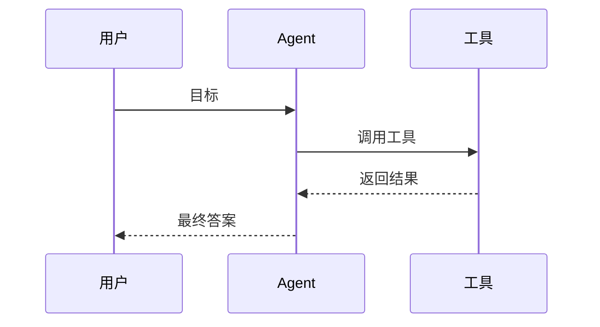

# 🧩 风格指南

> 全书统一的写作风格规范。目标：**能扫、能查、能看懂**——写成手册，不写成论文。
> 核心公式：**一篇好文章 = 一句话结论 + 生活类比 + 一张图 + 一个例子 + 常见误区 + 资源链接。**

## 一、Emoji 使用规范

Emoji 只做视觉锚点，不要每行都加：

- 一级标题：加 1 个主 emoji（按章节模块取，见下表）
- 二级标题：加 1 个功能 emoji（如 📌 ⚠️ 💻）
- 提示块：用 💡（提示）⚠️（注意）✅（最佳实践）
- 正文：尽量不加
- 目录（SUMMARY）：章节标题可以加，条目不要太多

统一模块 emoji：

| 模块 | Emoji | 模块 | Emoji |
|---|---|---|---|
| 导航索引 | 🧭 | 多智能体 | 👥 |
| AI 基础 | 🌱 | 框架 | 🧰 |
| Agent 基础 | 🤖 | 评估 | 📊 |
| LLM | 🧠 | 工程化 | 🚀 |
| Prompt / 推理 | 💬 | 应用 | 💼 |
| 工具 / 协议 | 🔌 | 资源 | 🔗 |
| 记忆 / RAG | 📚 | 模板 | 🧩 |
| 规划 | 🗺️ | 术语 | 📖 |

> ⚠️ **注意**：文件名不要带 emoji，保持英文小写 + 连字符（如 `what-is-agent.md`）；emoji 只出现在标题和 SUMMARY 中。

## 二、图文规范

### 1. 优先用 Mermaid 画图

GitHub 和 GitBook 都原生支持 Mermaid，适合流程图、时序图、状态图、架构图：

```markdown

```

### 2. 复杂图用图片

Mermaid 画不下的复杂架构图，用 draw.io / Excalidraw / ProcessOn / Figma 绘制，导出 SVG 或 PNG，放到 `docs/assets/`：

```text
docs/assets/
├─ diagrams/      # 架构图、流程图
├─ screenshots/   # 截图
├─ covers/        # 封面
└─ icons/         # 图标
```

引用方式（相对路径）：

```markdown

```

> 💡 **提示**：文章在 `docs/02-agent-basics/`，图片在 `docs/assets/`，跨目录引用要写 `../assets/...`。GitBook 编辑器上传的图片默认存放在 `docs/.gitbook/assets/`，自制图表统一放 `docs/assets/`。

### 3. 截图规范

- 工具：Snipaste、Flameshot
- 压缩：TinyPNG、Squoosh（先压缩再提交）
- 命名：`章节-主题.png`，如 `02-agent-basics-agent-loop.png`
- ❌ 不要用 `截图1.png`、`image.png`

### 4. 多用表格对比

表格最适合表达「区别」和「对比」：

```markdown
| 概念 | 是否自主规划 | 是否调用工具 | 例子 |
|---|---|---|---|
| Chatbot | 否 | 否 | 客服问答 |
| Workflow | 固定 | 可能 | 审批流 |
| Agent | 是 | 是 | 编程 Agent |
```

### 5. 善用提示块

```markdown
> 💡 **提示**：先理解 ReAct，再看 LangGraph。
> ⚠️ **注意**：Agent 一定要限制最大循环次数。
> ✅ **最佳实践**：工具返回结果要做校验。
```

### 6. 图的数量

每篇 1～3 张图。入门文章 800～1200 字，核心文章 1500–2500 字。图不要多，要准。

## 三、通俗易懂的写法：先问题，后定义

不要一上来就「Agent 是一种基于 LLM 的自治系统」。
要先问：「为什么普通 LLM 做不了多步骤任务？」

### 常用生活类比速查

| 概念 | 类比 |
|---|---|
| Agent | 实习生 |
| LLM | 大脑 |
| 工具 | 手脚 |
| 记忆 | 笔记本 |
| RAG | 开卷考试 |
| MCP | USB-C 接口 |
| 多智能体 | 团队协作 |

### 术语规范

术语第一次出现给出中英文对照，例如：检索增强生成（RAG，Retrieval-Augmented Generation）。

## 四、写作规则清单

- ✅ 每篇必须有：一句话、图、例子、误区、资源
- ✅ 每篇最多 1 个主 emoji，二级标题可加功能 emoji
- ✅ 能表格就表格，能图就图，能类比就类比
- ✅ 文件名纯英文小写，标题可带中文和 emoji
- ✅ 图片统一放 `docs/assets/`，用相对路径
- ✅ 资源页反向链接回知识点，知识点页底部链接资源（双向导航）
- ✅ 新页面必须登记到 `docs/SUMMARY.md`
