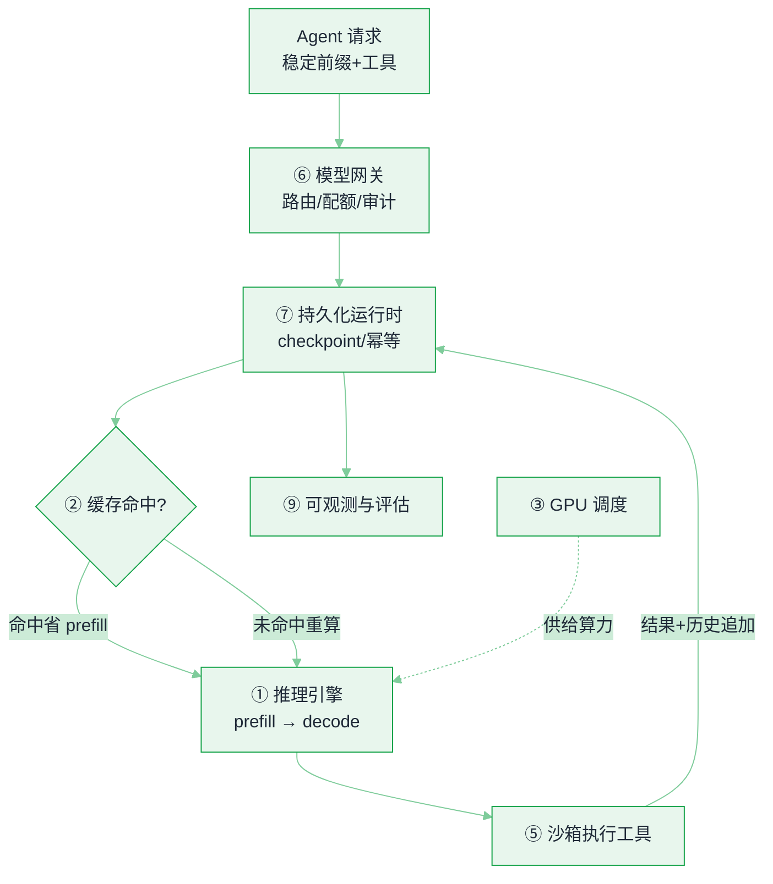

# 16 AI 基础设施 · 本章导读


**一句话**：Agent 产品的体验上限，往往不在 prompt，而在基础设施——推理引擎决定「多快多贵」，缓存决定「上下文能做多长」，沙箱决定「你敢让 Agent 干什么」，网关与运行时决定「崩了能不能救回来」。


## 先看结论

- **一次 LLM 调用 = 两个瓶颈相反的阶段**：prefill（算力瓶颈，决定 TTFT）与 decode（显存带宽瓶颈，决定 TPOT）。所有推理优化都在对付这两件事，选型前先问自己卡在哪个。
- **缓存是 Agent 的隐形成本杠杆**：Agent 每轮都重发同一份长前缀（system + 工具 + 历史），前缀缓存命中率能把输入成本砍掉一半以上——所以「稳定前缀 + 只追加尾部」是工程纪律，不是微优化。
- **工具执行必须有隔离层**：Agent 会执行模型现写的代码，这等于把 shell 交给一个不可信的实习生。沙箱（容器 / gVisor / microVM）+ 出口网络白名单是底线配置。
- **长任务需要 durable 运行时**：一次跑 40 分钟的 Agent，用「进程内存里 for 循环」必然被一次重启全量报废。checkpoint / 事件重放 / 幂等工具调用是运行时的事，不是业务代码的事。
- **本章面向「要上线的人」**：每页都有选型表 + 可跑的验收动作（压测脚本、命中率观测、故障演练）。

## 技术栈分层地图

| 层 | 解决什么 | 代表方案 | 页面 |
|---|---|---|---|
| ① 推理引擎 | 吞吐 / 延迟 / 显存 | vLLM、SGLang、TensorRT-LLM、LMDeploy、llama.cpp | [推理服务化](inference-serving.md) |
| ② 缓存与上下文 | 重复 prefill、长上下文成本 | PagedAttention、RadixAttention、Prompt Caching | [前缀缓存与上下文工程](prefix-cache-context-engineering.md) |
| ③ 算力与调度 | GPU 分给谁、怎么弹性 | K8s + device plugin / DRA、MIG、Ray、KEDA | [GPU 调度与多租户](gpu-scheduling-multitenancy.md) |
| ④ 训练与微调 | 私有模型、行为定制 | LoRA/QLoRA、FSDP/DeepSpeed、RL/DPO 流水线 | [训练与微调基础设施](training-finetune-infra.md) |
| ⑤ 执行环境 | 安全地跑代码与浏览器 | Docker、gVisor、Firecracker、E2B/Modal | [沙箱与执行环境](sandbox-execution-environments.md) |
| ⑥ 模型接入 | 统一 API、路由、配额、审计 | LiteLLM、Envoy AI Gateway、OpenRouter | [模型网关与路由](model-gateway.md) |
| ⑦ Agent 运行时 | 状态、恢复、并发、重放 | Temporal、Restate、LangGraph checkpoint、队列 | [持久化执行与运行时](agent-runtime-durable-execution.md) |
| ⑧ 数据与检索 | 语料、向量、索引、飞轮 | 对象存储、pgvector/Qdrant/Milvus、湖仓 | [数据与检索基础设施](data-vector-storage.md) |
| ⑨ 可观测与评估 | 知道慢在哪、错在哪 | OTel GenAI、Langfuse、离线评估集、回放 | [可观测性与评估平台](llm-observability-eval-platform.md) |
| ⑩ 成本与形态 | 自研还是买 API | token 经济学、端侧/本地、量化蒸馏 | [推理经济学与部署形态](inference-economics-deployment.md) |

## 一次调用穿过的栈

下面的编号对应上表的分层。把十层放到「一次 Agent 调用」的时间线上：请求经网关进来、由运行时管状态、命中缓存则跳过 prefill、引擎出 token、工具在沙箱里执行、结果回写并全程可观测。

## 动态图示

本章配了三张可动的 SVG（点开页面即可看到动画，仓库文件：`docs/.gitbook/assets/`）：

| 图示 | 说明 |
|---|---|
| [连续批处理 vs 静态批处理](../.gitbook/assets/16-continuous-batching.svg) | 为什么 decode 阶段 GPU 会被「等最长的那条」拖空 |
| [前缀缓存命中与重算范围](../.gitbook/assets/16-prefix-cache.svg) | Agent 多轮对话里，缓存能省掉哪一段、什么改动会让它整段失效 |
| [沙箱分层与出口闸门](../.gitbook/assets/16-sandbox-layers.svg) | 一次工具调用穿过 runc / gVisor / microVM 与网络白名单的过程 |

## 阅读建议

- **只想跑起来**：[模型网关](model-gateway.md) → [沙箱](sandbox-execution-environments.md) → [可观测](llm-observability-eval-platform.md)
- **自建推理 / 私有化**：[推理服务化](inference-serving.md) → [GPU 调度](gpu-scheduling-multitenancy.md) → [推理经济学](inference-economics-deployment.md)
- **做平台给别人的 Agent 用**：全部，重点 [持久化执行](agent-runtime-durable-execution.md)
- 与 [11 工程化与可观测性](../11-engineering/README.md) 的分工：11 章讲「应用侧怎么写」，本章讲「下面的平台怎么搭」

## 相关知识点

- [缓存与成本优化](../11-engineering/caching-cost-optimization.md)
- [部署与弹性伸缩](../11-engineering/deployment-scaling.md)
- [工具权限与沙箱](../05-tool-protocol/tool-permission-sandbox.md)
- [推理、量化、蒸馏与部署](../03-llm/inference-quantization-deployment.md)
- [17 具身智能](../17-embodied-ai/README.md)（把同一套栈搬到物理世界的形态）

## 读完能做到

- [ ] 说清 TTFT 和 TPOT 分别撞在哪个瓶颈（算力 vs 显存带宽），能从 p95 指标判断该管 prefill 还是 decode
- [ ] 把自己的 Agent 上下文改成「稳定前缀 + 只追加尾部」，并实测改造前后的前缀缓存命中率变化
- [ ] 按威胁模型选出沙箱档位（加固容器 / gVisor / microVM），并说明为什么出口网络白名单比文件系统隔离更要紧
- [ ] 为一个跑 40 分钟的长任务设计 checkpoint 与工具调用幂等键，通过一次「kill -9 后恢复」演练
- [ ] 用十层分层地图定位故障归属：「换模型要改 40 处代码」「供应商限流全站 500」各归哪一层管

## 章末自测

1. **回忆**：prefill 与 decode 各是什么瓶颈？各决定哪个延迟指标？（提示：见 inference-serving.md）
2. **应用**：system prompt 里嵌了「当前时间戳」，为什么前缀缓存几乎必然失效？该怎么改？（提示：见 prefix-cache-context-engineering.md）
3. **判断**：多租户 SaaS 要跑模型现写的代码，有人主张「加固 Docker 容器就够了」。按本章的威胁模型分档，这个方案漏掉了哪一档、为什么？（提示：见 sandbox-execution-environments.md）

## 本章术语速查

基础设施层的用词大多来自 GPU 机房，搞清哪个环节在捉襟见肘，选型表就突然不玄学了。

| 英文术语 | 中文 | 白话一句话 |
|---|---|---|
| Prefill | 预填充阶段 | 吐出第一个字之前，把整份提示词一口气喂给模型，是拼算力的阶段，决定「第一个字多久出来」。 |
| Decode | 解码阶段 | 之后一个字一个字往外蹦，每蹦一个都要拖着全套上下文走一遍，是拼显存带宽的阶段，决定「字出来密不密」。 |
| TTFT | 首字延迟 | 从发出请求到第一个字蹦出来的等待，用户嫌「反应慢」时说的就是它。 |
| TPOT | 每字输出耗时 | 首字之后每个字要花的时间，打字机效果顺不顺滑看它。 |
| Continuous Batching | 连续批处理 | 一批请求里谁先做完谁的坑立刻补新请求，别让 GPU 干等着最长那条。 |
| PagedAttention | 分页注意力 | 把显存切成小块按需拼给每条请求，不再一人包一整间房，浪费的空间省出一大截吞吐。 |
| RadixAttention | 基数树注意力 | 前缀缓存长成一棵树：一百条请求开头相同，公共枝丫上只算一遍。 |
| Prompt Caching | 提示词缓存 | 每轮重发的同一份开头直接复用、跳过重算，代价是要求字节级一致——夹个时间戳就全盘作废。 |
| gVisor | 用户态内核沙箱 | 表面是个容器，里面替你接系统调用的其实另有一套内核：模型乱写的代码翻不出这层天。 |
| Firecracker / microVM | 微型虚拟机 | 几百毫秒就能起一台「薄虚拟机」，用硬件虚拟化把 Agent 整个关进笼子，比传统 VM 轻得多。 |
| Durable Execution | 持久化执行 | 跑 40 分钟的 Agent 一路存档，kill -9 之后从断点续跑，而不是整间房子重来。 |
| Idempotency Key | 幂等键 | 给每次工具调用挂个编号，重发一百遍效果只算一次，是崩溃重放机制的护身符。 |

