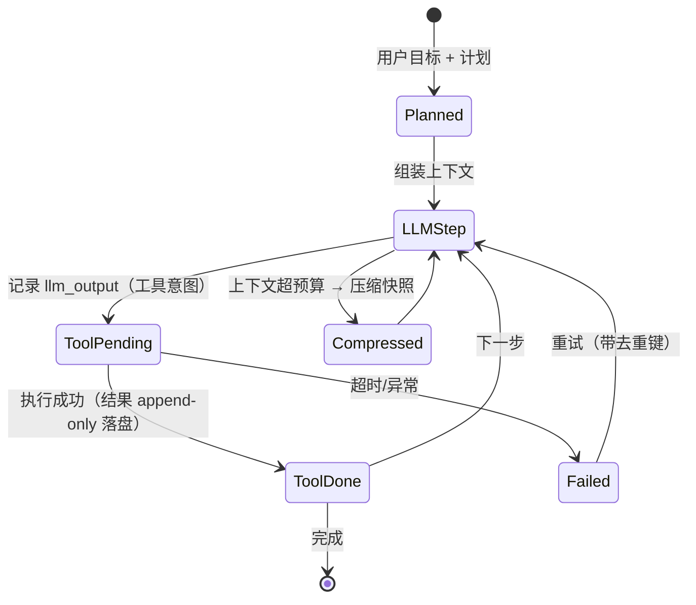

# 持久化执行与 Agent 运行时

> **一句话**：长任务的可靠性不靠「写得仔细」，靠「运行时能重放」——把每一步的输入输出作为事实落盘，崩溃后从最后一个确定的状态继续，而不是从头再烧 40 分钟 token。
> **难度**： 高级
> **标签**：`#infrastructure` `#engineering` `#agent`

## 先看结论

- **Agent = 状态机 + 副作用**：LLM 决策是纯计算（可重放），工具调用是副作用（不可重放）。运行时设计的核心就是「把不可重放的东西单独记账」。
- **三种持久化强度**：只存会话消息（能续聊，不能续跑）→ 存检查点（能恢复到最后一步）→ 事件溯源（能重放、能审计、能时间旅行）。选哪档取决于任务时长与合规要求。
- **工具调用必须幂等或带去重键**：重试时重复「转账/下单/发信」是这类系统最贵的 bug。
- **Durable execution 不是框架广告词**：Temporal、Restate 这类引擎把「代码即状态机」变成现实（函数里 await 的每个步骤自动落盘），代价是必须遵守确定性约束（不能在 workflow 代码里读时间/随机数）。
- **并发要有闸**：子 Agent 并行 50 个很酷，直到它们同时打满模型池配额并互相写同一份文件。运行时负责信号量、租约与冲突隔离。

## 事件溯源的 Agent 状态



**关键**：`llm_output` 与 `tool_result` 是两条独立事件。恢复时：若已有 `llm_output` 但没有 `tool_result` → 只重放工具调用；两者都有 → 直接进下一步。**这就是崩溃后不重复烧 token 的原理。**

## 运行时职责边界

| 关注点 | 归运行时 | 归业务/Agent 代码 |
|---|---|---|
| 状态持久化与恢复 | ✅ checkpoint / 事件表 | 提供 `state` 的序列化方法 |
| 重试与退避 | ✅ 步骤级策略 | 声明哪些步骤可重试（幂等性） |
| 副作用去重 | ✅ 提供 idempotency key 机制 | 生成合理的键（如 `run_id + step_id`） |
| 并发与配额 | ✅ 信号量、租户配额、公平调度 | 决定哪些步骤可并行 |
| 取消与超时 | ✅ 取消传播、硬超时 | 处理 `CancelledError`，做清理 |
| 可观测 | ✅ span 关联、重放接口 | 打语义化属性（任务 id、工具名） |
| 上下文管理 | ⚠ 共同 | 压缩策略属语义，落盘格式属运行时 |
| 沙箱生命周期 | ✅ 与运行时同库存活 | 只申请「我需要 shell + 60 分钟」 |

## 两种实现路线

**路线 A：自己写一个最小「append-only 事实表」（推荐先做这个）**

```python
import json, sqlite3, time, uuid
from dataclasses import asdict

db = sqlite3.connect("runs.db"); db.execute("""
CREATE TABLE IF NOT EXISTS events(
  run_id TEXT, seq INTEGER, ts REAL, kind TEXT, payload TEXT,
  PRIMARY KEY(run_id, seq))""")

def append(run_id, seq, kind, payload):
    db.execute("INSERT INTO events VALUES(?,?,?, ?, ?)",
               (run_id, seq, time.time(), kind, json.dumps(payload)))
    db.commit()

def replay(run_id):
    rows = db.execute("SELECT seq,kind,payload FROM events WHERE run_id=? ORDER BY seq",
                      (run_id,)).fetchall()
    state = {k: json.loads(p) for _, k, p in rows if k != "tool_result"}
    done_tools = {r[0] for r in rows if r[1] == "tool_result"}
    return state, done_tools

async def run(goal: str, run_id: str | None = None):
    run_id = run_id or uuid.uuid4().hex
    seq = len(db.execute("SELECT 1 FROM events WHERE run_id=?", (run_id,)).fetchall())
    if seq == 0:
        append(run_id, 0, "plan", {"goal": goal})
    while True:
        _, done = replay(run_id)
        step = await llm_decide(run_id)                     # 决策
        append(run_id, seq, "llm_output", asdict(step)); seq += 1
        if step.final: break
        key = f"{run_id}:{step.idempotency_key or seq}"
        if key in done: continue                            # 已执行过 → 跳过副作用
        result = await execute_tool(step, idempotency_key=key, timeout=step.timeout)
        append(run_id, seq, "tool_result", {"key": key, **asdict(result)}); seq += 1
```

有了这张表，你免费获得：崩溃续跑、审计查询（「谁在第 12 步让它去删库的」）、离线回放评估、时间旅行调试。

**路线 B：上 Durable Execution 引擎**

| 引擎 | 心智模型 | 适配点 | 代价 |
|---|---|---|---|
| Temporal | Workflow 代码即状态机，事件历史自动持久化 | 长事务、跨天任务、SLA 严格 | 确定性约束严格，本地开发/测试链路要搭；运维一个集群不轻 |
| Restate | 轻量 durable promise / journal | 中小团队，单进程也能起步 | 生态比 Temporal 小 |
| LangGraph checkpoint | 图状态快照 + `interrupt` 做人工确认 | 与 [LangGraph](../09-frameworks/langgraph.md) 心智一致，最省事的「能恢复」 | 重放与审计要自己补 |
| Inngest / Cloud Functions 队列化 | 每步一个函数，事件驱动 | 无服务器团队、事件源多 | LLM 会话状态要自己外置 |
| DeepSeek Harness 事件流 | append-only 事件 + 投影重建状态 | 学习「一切皆插件 + 事件溯源」的干净范式 | 需要理解其 Cordis 框架抽象 |

> 💡 **提示**：判断标准很简单——**任务时长 × 单价 > 一次重启的损失，就上 durable**。5 秒的请求不需要，50 分钟的批量重构任务几乎必须。

## 常见误区

- ❌ 把 LLM 调用当纯函数重放：模型输出会变。恢复策略应是「已有结果直接复用」，不是「重新调用一遍」（要重现就破坏语义，也要破坏缓存经济性）
- ❌ workflow 代码里写 `datetime.now()` / `random()`：非确定操作会让 durable 引擎重放错位（Temporal 会直接报错，自研的会静默腐坏）
- ❌ 只 checkpoint 模型对话不 checkpoint 工具副作用：恢复时重复执行写操作 = 生产事故
- ❌ 事件表不限量、不归档：Agent 一个任务能写几十万行 JSON，要设上限 + 冷热分层（大输出放对象存储，表里放指针）
- ❌ 无取消传播：用户点了停止，但沙箱里那条 `while true` 还在跑，钱和 CPU 都在流
- ❌ 「加个 retry 就容错了」：没有幂等键的重试是放大故障的开关

## 小练习

给你的 Agent 做一次「随手中断测试」：跑一个 15 步的任务，在第 3、7、11 步分别 `kill -9` 进程，然后重启。检查三件事：① 是否从断点继续（没有重跑已完成的工具）；② 有没有重复副作用（发重复消息/重复提交）；③ 审计表能否解释「发生了什么」。三条都过，才算有运行时。

## 相关资源

- [Temporal](https://temporal.io/)、[Restate](https://restate.dev/)、[Inngest](https://www.inngest.com/)
- [LangGraph 持久化文档](https://langchain-ai.github.io/langgraph/concepts/persistence/)
- [12-Factor Agents](https://github.com/humanlayer/12-factor-agents)

## 相关知识点

- [状态机与事件驱动](../11-engineering/state-machine-event-driven.md)
- [Agent 状态管理](../02-agent-basics/state-management.md)
- [错误处理、重试与降级](../11-engineering/error-handling-retry-fallback.md)
- [沙箱与执行环境](sandbox-execution-environments.md)
