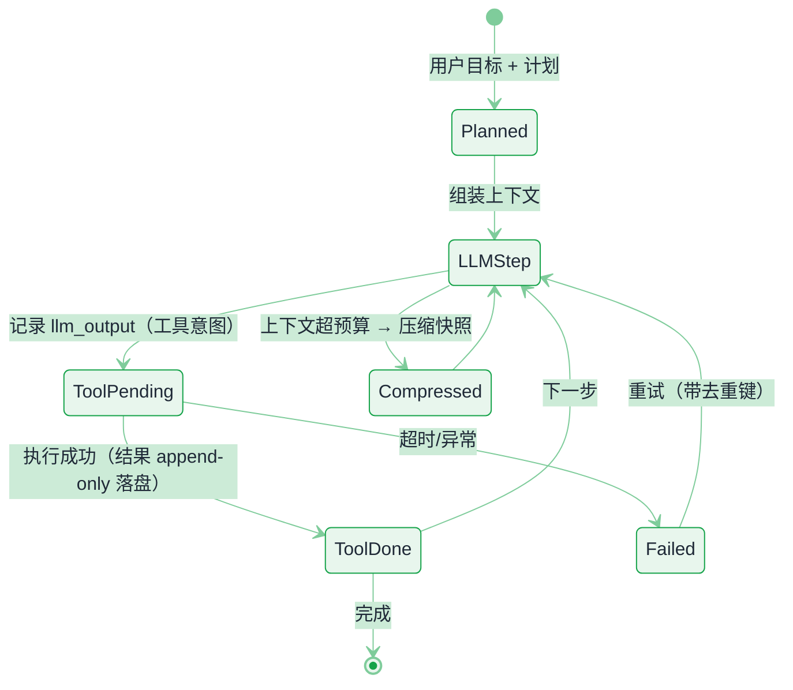
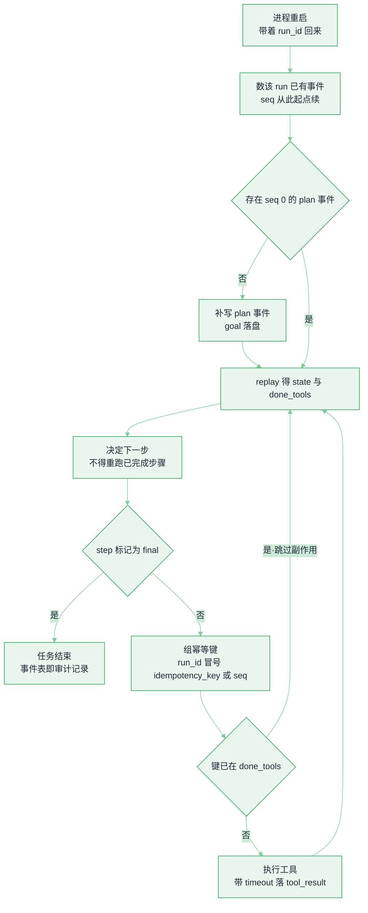

# 持久化执行与 Agent 运行时


**一句话**：长任务的可靠性不靠「写得仔细」，靠「运行时能重放」——把每一步的输入输出作为事实落盘，崩溃后从最后一个确定的状态继续，而不是从头再烧 40 分钟 token。
  **难度**： 高级


## 先看结论

- **Agent = 状态机 + 副作用**：LLM 决策是纯计算（可重放），工具调用是副作用（不可重放）。运行时设计的核心就是「把不可重放的东西单独记账」。
- **三种持久化强度**：只存会话消息（能续聊，不能续跑）→ 存检查点（能恢复到最后一步）→ 事件溯源（能重放、能审计、能时间旅行）。选哪档取决于任务时长与合规要求。
- **工具调用必须幂等或带去重键**：重试时重复「转账/下单/发信」是这类系统最贵的 bug。
- **Durable execution 不是框架广告词**：Temporal、Restate 这类引擎把「代码即状态机」变成现实（函数里 await 的每个步骤自动落盘），代价是必须遵守确定性约束（不能在 workflow 代码里读时间/随机数）。
- **并发要有闸**：子 Agent 并行 50 个很酷，直到它们同时打满模型池配额并互相写同一份文件。运行时负责信号量、租约与冲突隔离。

## 事件溯源的 Agent 状态



*《图：状态机的关键是 llm_output 与 tool_result 两条独立迁移；ToolPending 超时退到 Failed，带去重键回 LLMStep 才不会重烧 token》*

**关键**：`llm_output` 与 `tool_result` 是两条独立事件。恢复时：若已有 `llm_output` 但没有 `tool_result` → 只重放工具调用；两者都有 → 直接进下一步。**这就是崩溃后不重复烧 token 的原理。**

## 运行时职责边界

| 关注点 | 归运行时 | 归业务/Agent 代码 |
|---|---|---|
| 状态持久化与恢复 | ✅ checkpoint / 事件表 | 提供 `state` 的序列化方法 |
| 重试与退避 | ✅ 步骤级策略 | 声明哪些步骤可重试（幂等性） |
| 副作用去重 | ✅ 提供 idempotency key 机制 | 生成合理的键（如 `run_id + step_id`） |
| 并发与配额 | ✅ 信号量、租户配额、公平调度 | 决定哪些步骤可并行 |
| 取消与超时 | ✅ 取消传播、硬超时 | 处理 `CancelledError`，做清理 |
| 可观测 | ✅ span 关联、重放接口 | 打语义化属性（任务 id、工具名） |
| 上下文管理 | ⚠ 共同 | 压缩策略属语义，落盘格式属运行时 |
| 沙箱生命周期 | ✅ 与运行时同库存活 | 只申请「我需要 shell + 60 分钟」 |

## 两种实现路线

**路线 A：自己写一个最小「append-only 事实表」（推荐先做这个）**

整套东西的真相源就是下面这一张表。它的结构可以照抄：一个 run 一个 `run_id`，事件按 `seq` 递增，只有 INSERT、没有 UPDATE。前半是建表约定，后半是一次真实 run 的头五行——看清 `llm_output` 和 `tool_result` 是怎么一一配对的。

```json
{
  "table": "events",
  "columns": {
    "run_id": "TEXT — 一次任务的唯一标识，取 uuid4().hex，32 位十六进制",
    "seq": "INTEGER — 该 run 内的事件序号，从 0 开始递增",
    "ts": "REAL — 落盘时刻，time.time() 的秒级浮点",
    "kind": "TEXT — 枚举，只有三种：plan / llm_output / tool_result",
    "payload": "TEXT — 事件体，json.dumps 后的字符串"
  },
  "primary_key": ["run_id", "seq"],
  "write_mode": "append-only：只 INSERT，不 UPDATE、不 DELETE",
  "rows": [
    {
      "run_id": "9f3c1a7b8e4d2c0a5f6b1d3e7c9a0b2d",
      "seq": 0,
      "ts": 1790121637.42,
      "kind": "plan",
      "payload": { "goal": "把 docs/ 下所有失效链接列出来并修掉" }
    },
    {
      "run_id": "9f3c1a7b8e4d2c0a5f6b1d3e7c9a0b2d",
      "seq": 1,
      "ts": 1790121641.08,
      "kind": "llm_output",
      "payload": {
        "step_id": "s1",
        "thought": "先跑一次全量链接扫描",
        "tool": "sandbox.exec",
        "args": { "cmd": "check_links --root docs" },
        "idempotency_key": "s1",
        "timeout": 120
      }
    },
    {
      "run_id": "9f3c1a7b8e4d2c0a5f6b1d3e7c9a0b2d",
      "seq": 2,
      "ts": 1790121668.71,
      "kind": "tool_result",
      "payload": {
        "key": "9f3c1a7b8e4d2c0a5f6b1d3e7c9a0b2d:s1",
        "ok": true,
        "exit_code": 0,
        "stdout_len": 4820
      }
    },
    {
      "run_id": "9f3c1a7b8e4d2c0a5f6b1d3e7c9a0b2d",
      "seq": 3,
      "ts": 1790121672.33,
      "kind": "llm_output",
      "payload": {
        "step_id": "s2",
        "thought": "48 个失效链接，先修前 20 个",
        "tool": "sandbox.edit_files",
        "args": { "paths": 20, "mode": "rewrite_link" },
        "idempotency_key": "s2",
        "timeout": 60
      }
    },
    {
      "run_id": "9f3c1a7b8e4d2c0a5f6b1d3e7c9a0b2d",
      "seq": 4,
      "ts": 1790121690.15,
      "kind": "tool_result",
      "payload": {
        "key": "9f3c1a7b8e4d2c0a5f6b1d3e7c9a0b2d:s2",
        "ok": true,
        "files_changed": 7
      }
    }
  ],
  "replay_returns": {
    "state": "kind 不等于 tool_result 的事件按 kind 建索引，seq 大的覆盖小的",
    "done_tools": "所有 tool_result 的 key 集合——决定哪些副作用绝对不许再执行"
  }
}
```

这张表里有四个设计决定值得单独拎出来：

- **主键 `(run_id, seq)` 就是去重的第一道闸**。同一序号写第二次会被数据库拒绝，所以「双写同一步」在存储层就不可能静默发生。序列号必须由 run 内计数推导（重启时 `SELECT` 数一下已有事件条数），不能让进程自己拍。
- **`kind` 只留三种，`payload` 什么都能装**。枚举少才好用 SQL 直接查（一条 `WHERE seq = 12` 就能捞出第 12 步的决策原文）；把细节塞进 JSON，扩展就不需要改表结构。
- **`payload` 放指针，不放正文**。模型的一次工具输出可能有几 MB，全塞进表里，事件表很快就会成为你数据库最大的表。约定是：大输出写对象存储，表里放 `stdout_len` 和对象键，冷热分层。
- **`replay()` 返回两样东西，而不是一份「状态」**。`state`（非工具结果的事件）+ `done_tools`（已执行副作用的键集合）。恢复逻辑真正需要的信息就是「哪些事已经发生过了」，把这两样分开返回，比把整个 state 反序列化出来更贴近事实。

有了这张表，你免费获得：崩溃续跑、审计查询（「谁在第 12 步让它去删库的」）、离线回放评估、时间旅行调试。

## 崩溃之后：重启进程要走的那条判定链



*《图：恢复不是「从头再跑一遍」——先补 seq、再查 plan、然后每个副作用都拿幂等键问一次 done_tools》*




#### 第 1 步：先领 `run_id`，再把 `seq` 对齐到表尾

调用方没传 `run_id` 就生成一个（`uuid4().hex`，32 位十六进制）；传了说明这是重放。接着数表：`SELECT 1 FROM events WHERE run_id = ?` 的行数就是本次要写的起始 `seq`。新 run 拿到 0，崩溃在 12 条事件后重启则拿到 12——**序号连续，`(run_id, seq)` 主键才保得住**。




#### 第 2 步：第一条事件永远是 `plan`

只有起始 `seq == 0` 时才 `append(run_id, 0, "plan", {"goal": goal})`。这条事件是「目标原文」的唯一副本：审计和回放都从它开始。重放时**不许再写一条 plan**——否则同一个 run 会出现两个目标，时间旅行调试会看到任务中途改目标。




#### 第 3 步：决策落盘为 `llm_output`，和副作用彻底分开

`llm_decide(run_id)` 读表组装上下文，产出的那一步（工具名、参数、`idempotency_key`、`timeout`）整条 `asdict` 后写进 `payload`，`seq` 加 1。这一步之后再崩，恢复时**只需要重放工具调用，模型那一次不用重新问**。注意这里有个坑：朴素实现每轮循环都会再问一次模型，生产运行时要把「已有未执行的 `llm_output` 就直接复用」做成硬约束，否则「恢复」会重新烧掉一整轮 token，还会破坏前缀缓存的经济性。




#### 第 4 步：动手之前先把幂等键算出来

`key = f"{run_id}:{step.idempotency_key or seq}"`。工具自己声明了幂等键（比如「同一订单号只能创建一次」）就用它，跨 run 也去得重；没声明就退回 `seq`，只能保证同一个 run 内不重。这个 key 会同时写进请求和 `tool_result` 的 `payload.key`——**两边都有，才算真去了重**。




#### 第 5 步：命中 `done_tools` 就跳过，绝不重复副作用

`if key in done: continue`。这是整套机制里唯一真正防住「重复转账」的一行判断，代价只是多读一次表。反过来说：`ToolPending` 状态下崩掉（工具已执行、`tool_result` 还没落盘）时，这次**一定会重跑工具**——所以外部写操作还得带自己的幂等键，把去重交给下游而不是交给你的表。




#### 第 6 步：`tool_result` 落盘后回到第 3 步，直到 `final`

工具结果 append 之后循环继续；某一步 `step.final` 为真就 break。此时表里留下的是一条完整因果链：`plan` → `llm_output` → `tool_result` → ……**审计、离线回放、评测集采样三件事都直接读这张表**，不需要业务代码再打一遍日志。



## 四种崩溃时刻，四种恢复结局（点标签切换）



表里有决策、没有副作用。**理想恢复是一次模型调用都不用重发**：`replay` 看到未执行的 `llm_output`，直接从第 4 步继续。这是事件溯源相对「只存会话消息」最实在的收益——省掉的正是最贵的 40 分钟 token。前提是把第 3 步那条「已有结果直接复用」做成硬约束；朴素实现每轮都重新问一次模型，恢复时就多烧一轮钱、多留一条重复事件。



副作用可能已经发生（HTTP 请求发出去了、文件已经改了），但表里没有 `tool_result` → 去重失效 → 重放会**再执行一次**。对策只有两条：工具侧接受幂等键（下游去重），或者把该步标成不可重试、直接升级人工。这条路径是「只 checkpoint 模型对话」的运行时最容易被忽略的漏洞。



起始 `seq` 数到 0，等价于一个全新的 run，唯一损失是这一次重启前的几十毫秒。**这是为什么第一版就该有事件表**：任何一步崩掉，损失都被压到「当前这一步」，而不是「整个任务」。



退回 `run_id:seq`。听起来也能去重，但重放时同一步的 `seq` 可能已经因为多写/少写事件而漂移，键就对不上了——**去重悄悄失效，且没有任何报错**。所以「让工具声明幂等键」必须是接入门槛，而不是可选字段。




**恢复不是零成本**：恢复开销 ≈ 快照读取（固定项） + `k × 单事件重放成本`，`k` 是最后一个快照之后的事件条数（推导见下文「恢复时间是有成本的」）。一个 15 步任务崩 3 次还能接受，跑几小时、攒下几十万条事件的任务必须定期打快照，否则恢复时间随任务时长线性上升，「可恢复」就成了纸面承诺。把「恢复到可继续执行」当成一项 SLO 来监控。


**路线 B：上 Durable Execution 引擎**

| 引擎 | 心智模型 | 适配点 | 代价 |
|---|---|---|---|
| Temporal | Workflow 代码即状态机，事件历史自动持久化 | 长事务、跨天任务、SLA 严格 | 确定性约束严格，本地开发/测试链路要搭；运维一个集群不轻 |
| Restate | 轻量 durable promise / journal | 中小团队，单进程也能起步 | 生态比 Temporal 小 |
| LangGraph checkpoint | 图状态快照 + `interrupt` 做人工确认 | 与 [LangGraph](../09-frameworks/langgraph.md) 心智一致，最省事的「能恢复」 | 重放与审计要自己补 |
| Inngest / Cloud Functions 队列化 | 每步一个函数，事件驱动 | 无服务器团队、事件源多 | LLM 会话状态要自己外置 |
| DeepSeek Harness 事件流 | append-only 事件 + 投影重建状态 | 学习「一切皆插件 + 事件溯源」的干净范式 | 需要理解其 Cordis 框架抽象 |

> 💡 **提示**：判断标准很简单——**任务时长 × 单价 > 一次重启的损失，就上 durable**。5 秒的请求不需要，50 分钟的批量重构任务几乎必须。

## 常见误区

- ❌ 把 LLM 调用当纯函数重放：模型输出会变。恢复策略应是「已有结果直接复用」，不是「重新调用一遍」（要重现就破坏语义，也要破坏缓存经济性）
- ❌ workflow 代码里写 `datetime.now()` / `random()`：非确定操作会让 durable 引擎重放错位（Temporal 会直接报错，自研的会静默腐坏）
- ❌ 只 checkpoint 模型对话不 checkpoint 工具副作用：恢复时重复执行写操作 = 生产事故
- ❌ 事件表不限量、不归档：Agent 一个任务能写几十万行 JSON，要设上限 + 冷热分层（大输出放对象存储，表里放指针）
- ❌ 无取消传播：用户点了停止，但沙箱里那条 `while true` 还在跑，钱和 CPU 都在流
- ❌ 「加个 retry 就容错了」：没有幂等键的重试是放大故障的开关

## 恢复时间是有成本的

恢复不是免费的，其代价与需要重放的事件数成正比：

$$
\text{恢复成本}\approx\underbrace{\text{快照读取}}_{\text{固定}}+\underbrace{k\times\overline{\text{单事件重放成本}}}_{\text{快照后的尾部事件}}
$$

因此长任务必须定期打快照（见 [状态机与事件驱动](../11-engineering/state-machine-event-driven.md)），否则事件越积越多，一次崩溃的恢复时间会随任务时长线性上升，最终失去「可恢复」的意义。工程上应把「恢复到可继续执行状态」的时间作为一项 SLO 来监控。

## 小练习

给你的 Agent 做一次「随手中断测试」：跑一个 15 步的任务，在第 3、7、11 步分别 `kill -9` 进程，然后重启。检查三件事：① 是否从断点继续（没有重跑已完成的工具）；② 有没有重复副作用（发重复消息/重复提交）；③ 审计表能否解释「发生了什么」。三条都过，才算有运行时。

## 参考资料

- [Temporal](https://temporal.io/)、[Restate](https://restate.dev/)、[Inngest](https://www.inngest.com/)
- [LangGraph 持久化文档](https://langchain-ai.github.io/langgraph/concepts/persistence/)
- [12-Factor Agents](https://github.com/humanlayer/12-factor-agents)

## 相关知识点

- [状态机与事件驱动](../11-engineering/state-machine-event-driven.md)
- [Agent 状态管理](../02-agent-basics/state-management.md)
- [错误处理、重试与降级](../11-engineering/error-handling-retry-fallback.md)
- [沙箱与执行环境](sandbox-execution-environments.md)
