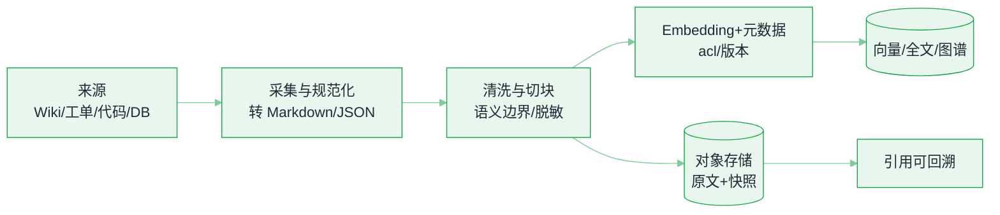
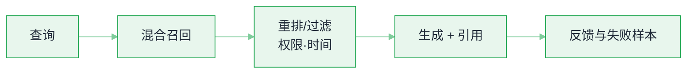

# 数据与检索基础设施


**一句话**：RAG 的效果上限由数据基础设施决定——语料怎么进（采集/清洗/切块）、怎么放（索引/分片/元数据）、怎么新（增量更新与失效）、怎么评（检索质量与端到端归因），四件事缺一件，换多贵的模型都救不回来。
  **难度**： 进阶


## 先看结论

- **向量库不是数据库的替代品，是它的一个索引**：生产形态通常是「主库（Postgres + pgvector）+ 可选的专用向量索引（Qdrant/Milvus/pgvectorscale 等）+ 对象存储放原文 + 全文检索（BM25/tsvector）做混合召回」。
- **切块与元数据比 embedding 模型更影响效果**：结构化文档按语义边界切、带上来源/时间/权限标签，收益通常大于换 embedding 模型。
- **混合检索 + 重排是当前默认答案**：稀疏（BM25）保精确词命中，稠密保语义近似，rerank（cross-encoder）把 top-50 精排到 top-5，端到端准确率差距经常是 10–30 个百分点量级。
- **索引新鲜度要有 SLA**：知识库里最危险的错误不是「答得不像」，是「引用了昨天的过期政策」。删除/更新必须传播到向量索引与图索引。
- **权限必须在检索层过滤**：文档 ACL 要写进元数据并在查询时强制过滤，绝不能在 prompt 里写「只参考有权限的文档」。

## 数据管线全景



*《图：入库侧——清洗切块之后一分二：Embedding 带元数据进索引，原文快照进对象存储，后者是「引用可回溯」的底账》*



*《图：查询侧——上图入库完成的索引在这里被混合召回，权限与时间在过滤层强制执行；末端攒下的反馈与失败样本回流到入库侧的「清洗与切块」，这一回流正是检索质量迭代的主循环》*

## 选型对照

| 组件 | 常见选择 | 什么时候需要它 | 别在这里翻车 |
|---|---|---|---|
| 向量索引 | pgvector、Qdrant、Milvus、Weaviate、Chroma、LanceDB | ≤千万级：pgvector 足够；上亿或高 QPS：专用库 | 只看 recall@k，不看过滤性能（ACL 过滤会把暴力扫描打爆） |
| 索引算法 | HNSW（默认）、IVF-PQ、DiskANN | HNSW 内存换速度；量化省显存但降精度 | `ef_search`/`M` 不调，延迟与召回双输 |
| 稀疏检索 | Postgres tsvector、Elasticsearch/OpenSearch、Tantivy | 有精确术语、编号、代码标识符时必开 | 以为向量能记住「错误码 X-1042」这种字面量 |
| 重排 | bge-reranker、Cohere Rerank、自训 | top-50 → top-5，精度不足时优先加 | 对全库重排（成本爆炸）而不是对召回候选重排 |
| 图索引 | Neo4j、Kuzu、LightRAG 类 | 多跳关系问题（谁依赖谁、影响面分析） | 图谱构建没做实体消歧，检索到「幽灵关系」 |
| 特征/数据版本 | DVC、lakeFS、自研 manifest | 训练与评测要可复现 | 数据每天在变，评估分数无法横向比较 |


先跑「无 RAG 基线」和「只有关键词检索基线」，再上向量与重排——很多团队发现自己缺的是**清洗**，不是**模型**。混合检索 + 重排那 10–30 个百分点的端到端差距，只有在基线立起来之后才量得出来。


## 工程要点清单

**切块（chunking）**

- 按结构切：标题/段落/函数/表格行，不要固定 512 硬切；块内保留「面包屑」（`文档 > 章节 > 小节`）
- 表格与代码单独成块，并把摘要写进块头（否则 embedding 抓不到语义）
- 保留 parent-child：召回用小块（精准），喂给模型用父块（上下文完整）

**元数据（每个块都要有）**

```json
{
  "id": "kb:2026:ops:runbook-42#a3",
  "text": "…",
  "source": "https://wiki/ops/runbook-42",
  "title": "数据库主从切换手册",
  "acl": ["team:ops", "role:sre"],
  "tenant": "acme",
  "updated_at": "2026-08-11T02:00:00Z",
  "version": "sha1:9f3c…",
  "token_len": 412,
  "embedding_model": "embed-v3@2026-05"
}
```

四个字段是这套元数据真正的承重墙，缺一个就会出事：

- `acl`：检索层强制过滤的依据，缺失等于把越权内容交给召回排序去守
- `updated_at`：时效性排序与过期失效都读它，没有就只能全库一起变旧
- `version`：与索引对齐的幂等键，删除/更新靠它才不会重复或漏删
- `embedding_model`：换模型后必须重建，留着这个字段才能校验库里是不是混了两代向量

**增量更新与失效**

- 以 `(source, version)` 为幂等键：重跑采集不产生重复块（重复块会同时污染召回与统计）
- 删除要三处同步：向量索引、全文索引、图谱；只删主库是常见事故源
- embedding 模型或切块策略升级 = 全量重建到新集合（alias 切换），不要混库

**权限与合规**

- ACL 在检索时用过滤表达式下推（`filter: acl ∈ user.groups`），而不是召回后再筛（后者会把敏感内容先取出到应用层，审计不合规）
- PII 在「入索引前」脱敏或分域存储（→ [数据与隐私](../10-evaluation-safety/data-privacy.md)）；日志与向量库都是数据落盘点

**成本与性能**

- 量化（SQ8/PQ/FP8）能把向量存储压到 1/4–1/8，代价是召回率下降，需在评估集上验证
- 热集合常驻内存、冷集合放盘（HNSW + DiskANN 混合）；按租户分片可避免「大租户饿死小租户」
- Embedding 批处理 + 缓存（同一文本哈希只算一次），重跑管线的成本差距很大

## 一个能上线的最小检索栈

这条管线从 Postgres 单栈起步（pgvector + tsvector）够撑到千万级。不用背 SQL，但每一站的**参数契约**要钉死：稠密与稀疏两路并行召回、过滤下推、RRF 按名次融合、重排截断。一次查询长这样：

```json
{
  "request": {
    "tenant": "acme",
    "user_groups": ["team:ops", "role:sre"],
    "query": "数据库主从切换的前提条件",
    "query_embedding": "embed-v3@2026-05 产出，必须与块里 embedding_model 字段同模型"
  },
  "stages": [
    {
      "stage": "dense_recall",
      "operator": "<=>（余弦距离升序）",
      "top_k": 50,
      "pre_filter": "tenant = 'acme' AND acl && user_groups"
    },
    {
      "stage": "sparse_recall",
      "operator": "tsv @@ websearch_to_tsquery('simple', query)，ts_rank 打分",
      "top_k": 50,
      "pre_filter": "同样先过 tenant + ACL，过滤发生在打分之前"
    },
    {
      "stage": "fuse",
      "method": "RRF",
      "formula": "score(id) = Σ 1/(k + rank)",
      "k": 60,
      "output_top_n": 8
    },
    {
      "stage": "rerank",
      "model": "cross-encoder（bge-reranker / Cohere Rerank 一类）",
      "input_top_n": 8,
      "output_top_n": 3
    },
    {
      "stage": "assemble",
      "context": "父块 + 面包屑（文档 > 章节 > 小节）",
      "attach": ["source", "updated_at", "version"]
    }
  ]
}
```

这份契约里有三条铁律：**ACL 是 `pre_filter` 不是 post_filter**——召回后再筛等于把敏感内容先捞到应用层，审计不合规；**融合只用名次不用分数**——余弦相似度与 `ts_rank` 根本不在一个量纲上，按分数加权就是调参地狱；**条数是合同**（50/50 → 8 → 3），每一档改动都有可观测的后果，动了就要在评估集上重测。

**为什么用 RRF（倒数排名融合）**：稠密与稀疏分数不可比，用名次而不是分数融合，一行公式解决「权重调参地狱」（`k=60` 是常用平滑值）。`k` 调大，头部名次差异被压平、两路更平均；`k` 调小，第 1 名的优势被放大、更信头部。60 是社区默认，动它要在自己的评估集上验证。

## 索引参数：建库时就锁死的契约

```json
{
  "index": {
    "algorithm": "hnsw",
    "m": 16,
    "ef_construction": 64,
    "ef_search": 100,
    "metric": "cosine",
    "quantization": "none | sq8 | fp8 | pq",
    "partial_index": "按租户 / ACL 分片，防「大租户饿死小租户」"
  }
}
```

`m` 与 `ef_construction` 是建库时一次付清的钱：调大图谱质量好、构建慢、更吃内存；`ef_search` 是每次查询都在付的钱，是线上延迟/召回的第一旋钮——**`ef_search`/`M` 不调就上线，延迟与召回双输**是最常见的事故形态。embedding 模型输出归一化时，`<=>`（cosine）、`<#>`（负内积）、`<->`（L2）三种度量的排序基本等价；没做归一化就不等价——所以 `metric` 必须写进建库契约，而不是查询时凭手感换。量化（SQ8/PQ/FP8）能把向量存储压到 1/4–1/8，代价是召回下降，必须在评估集上量过才敢推生产。

## 不同索引与度量的取舍（点标签切换）



`ef_search: 100 → 200`：recall@50 涨几个点，p95 几乎线性上去——HNSW 的速度是拿内存和遍历宽度换的。≤千万级 pgvector + HNSW 足够，别为想象中的规模先上专用库；真正该先做的是清洗与切块。



`nlist=4096, nprobe=16`：内存降一个量级，recall 掉 3–8 个点，且 `nprobe` 每次调都同时动延迟和召回。量化参数（PQ 子空间数、8-bit）与切块策略一样，是「上线前必须在评估集上重测」的那类改动——省下的显存是真的，丢掉的召回也是真的。



热集合常驻内存、冷集合放盘：单位成本最低，冷查询多 1–2 次 SSD 往返。多租户库的典型形态——按租户分片后，长尾租户的数据没必要占内存；但要配 SLA：冷查询的 p95 单独盯，混在全局分位数里看不见。



百万行以内，精确检索常常比调好的近似还快，而且 recall=100%、没有旋钮要调。陷阱在过滤：ACL 过滤会把暴力扫描打爆——敏感块占比高的库，先看带过滤的延迟再谈「我们数据量小」。



## 一次文档更新，怎么传遍全链




#### 第 1 步：发现变更，先立版本

采集器 diff 出 `runbook-42` 变了，算出新 `version`（`sha1:9f3c…`）。幂等键 `(source, version)` 从这一刻定下：重跑采集不产生重复块——重复块会同时污染召回与统计。





#### 第 2 步：重新切块与 embedding

同一套切块策略重跑：语义边界、块内面包屑、表格与代码单独成块；`embedding_model` 字段（示例里 `embed-v3@2026-05`）必须与查询侧一致，不一致就是在拿新旧向量做减法。原文快照进对象存储，这是「引用可回溯」的底账。





#### 第 3 步：三处索引同步 upsert

向量、全文（tsvector）、图谱，一个都不能少；只删主库是常见事故源——文档撤了，向量索引还在把它排进 top-3。upsert 按幂等键执行，中途失败重跑整个管线也不会有脏块。





#### 第 4 步：失效传播与引用兜底

`updated_at` 推进旧的派生块；策略类文档要能回答「这条引用过期了没有」——知识库里最危险的错误不是答得不像，是引用了昨天的过期政策。embedding 模型或切块策略升级则是全量重建到新集合、alias 原子切换，绝不新旧混库。




## 工程现场笔记

- **代码检索的特殊性**：AST 级切块 + 标识符归一化 + 符号图（call graph）比通用文本 RAG 效果好一截；纯 embedding 检索代码库经常被同名函数与复制粘贴污染（→ [编程 Agent](../12-applications/coding-agent.md)）。
- **GraphRAG 的成本现实**：构图与社区摘要是离线 LLM 密集任务，索引一版可能比 embedding 贵 1–2 个数量级。适合「多跳 + 全局问答」，不适合「找那条配置说明」。
- **飞轮闭环**：线上失败样本（用户追问「没找到」）→ 标注 → 进评估集 → 反哺切块与索引策略。没有这条回路，RAG 会长期停在「演示能用」。
- **可观测**：检索侧必须留 `query → 召回列表 → 重排后 → 实际进入 prompt 的片段 → 模型引用`，否则「模型幻觉」和「检索没召回」永远分不清（→ [可观测性与评估平台](llm-observability-eval-platform.md)）。

## 常见误区

- ❌ 上向量库当第一动作：先做数据清洗与切块，收益往往更大且免费
- ❌ top-k 越大越好：k 增大引入噪声，模型「被拽偏」，一般 3–8 段足够，配合 rerank
- ❌ 换 embedding 模型只改配置不改索引：新旧向量混在一起，相似度毫无意义（用 `embedding_model` 字段兜住）
- ❌ 忽略「检索为空」这条路径：没召回就该明确说「没找到」，而不是让模型硬答（→ [幻觉](../10-evaluation-safety/hallucination.md)）
- ❌ 离线评估只看 recall@k：用户看到的是端到端答案质量，必须同时测「引用正确率 / 时效性 / 拒答正确率」

## 小练习

准备 30 个真实问答（含 5 个「知识库里确实没有答案」的陷阱题），对比三套配置：① 纯向量 top-5；② 混合 + RRF top-8 + rerank top-3；③ 配置 ② + 父块扩展。统计端到端正确率与「空手乱答率」——第二项通常掉得最狠，也最影响信任。

## 参考资料

- [pgvector](https://github.com/pgvector/pgvector)、[Qdrant](https://github.com/qdrant/qdrant)、[Milvus](https://github.com/milvus-io/milvus)、[LanceDB](https://github.com/lancedb/lancedb)

## 相关知识点

- [RAG 基础](../06-memory-rag/rag-basics.md)
- [上下文工程](../06-memory-rag/context-engineering.md)
- [训练与微调基础设施](training-finetune-infra.md)
- [可观测性与评估平台](llm-observability-eval-platform.md)
- [向量数据库](../06-memory-rag/vector-database.md)
- [Embedding 与相似度](../06-memory-rag/embedding-similarity.md)
- [GraphRAG](../06-memory-rag/graphrag.md)
