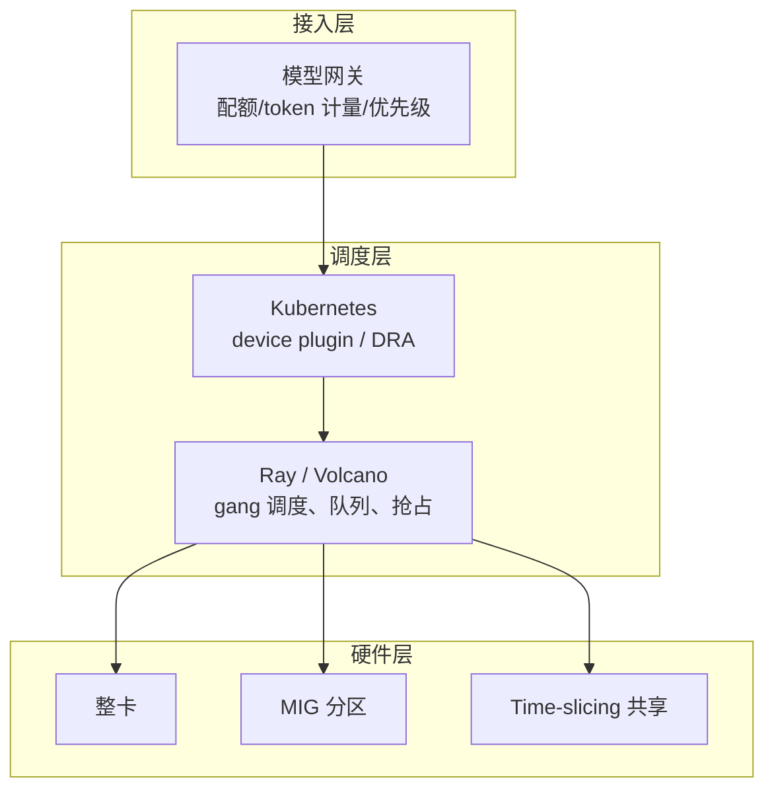

# GPU 调度与多租户

> **一句话**：GPU 是 AI 基础设施里最贵的资源，调度层的任务是「让每张卡的显存和算力都被用起来，同时不让人人互抢」——切分（MIG/时分）、隔离（配额与优先级）、弹性（按队列长度扩缩容）三件事。
> **难度**： 高级
> **标签**：`#infrastructure` `#engineering`

## 先看结论

- **推理和训练是两类调度问题**：训练要「整块、长时间、可抢占、可断点续训」；推理要「快速扩容、缩到 0、启动慢」。同一套队列策略硬套两类负载一定翻车。
- **切分显存优先于分时切片**：多租户小模型场景，硬件级分区（如 NVIDIA MIG）能给出可预测的性能；软件时分复用（time-slicing）省显存但延迟抖动大。
- **冷启动决定弹性上限**：70B 权重加载 + 显存分配是分钟级的。要弹性就得配合权重缓存/流式加载（镜像化对象存储挂载）、留最小副本，或者接受「扩容不等于 5 分钟内可服务」。
- **配额要打在两层**：网关层的 token/QPS 配额（防止某个租户把 GPU 打满）+ 调度层的资源配额（K8s requests/limits、优先级与抢占）。只有一层时，故障会跨租户传播。

## 一张图看三层



| 需求 | 方案 | 代价 |
|---|---|---|
| 一个租户、一个模型、跑满 | 整卡 / 整机（NVLink 域内） | 利用率低，靠超卖别的时间片 |
| 多个小模型共存（7B–13B） | MIG 分区、FP8/INT4 量化提并发 | 灵活性差，分区一旦划好不易改 |
| 突发流量 | autoscale（按队列深度 / 并发 / TTFT，而非 CPU） | 冷启动窗口期需要排队与降级 |
| 训练任务批量提交 | gang 调度（要么全给要么都不给）+ 队列优先级 | 排队时间长，需要抢占策略 |

## 实操清单

**Kubernetes 侧**

- GPU 通过 device plugin 暴露为可请求资源；K8s 1.32+ 引入 **DRA（Dynamic Resource Allocation）** 动态资源分配，用 `ResourceClaim` 表达「我要一张至少 80GB 显存、支持 MIG 的卡」这类结构化需求，比「整数个 nvidia.com/gpu」精细得多（版本进度以你的集群为准）
- 推理服务用 `statefulset/deployment + HPA/KEDA 自定义指标`：扩缩容信号取「等待队列长度」「p95 TTFT」「并发请求数」，而不是 CPU/内存
- 训练用 volcano / Kueue / Ray 之类的队列与 gang 调度，避免「一半 worker 起来等着、卡死」
- 权重不进镜像：放对象存储 + CSI 挂载 / 镜像预热，副本冷启动差距可以到 5–10 倍

**多租户治理**

1. 命名空间级配额：每租户 GPU 卡时上限、并发请求上限、max_tokens 上限
2. 优先级与抢占：在线对话（延迟敏感）> 批量离线（吞吐敏感）；离线任务用低优先级 + 可抢占，闲时填谷
3. 计量：按 `input/output/cached token` 分别计量并计费，别只按请求数
4. 隔离故障：某租户的 128k 长上下文请求单独走一条「长上下文池」，防止把别人 TTFT 拖崩（chunked prefill 是缓解，不是豁免）
5. 逃生通道：网关侧 fallback 到 API 供应商 / 小模型，配「容量耗尽时降级」策略（见 [错误处理与降级](../11-engineering/error-handling-retry-fallback.md)）

## 最小可跑的「按队列长度扩缩容」（KEDA 思路）

```yaml
# 关键：用引擎暴露的排队指标，而不是 CPU
apiVersion: keda.sh/v1alpha1
kind: ScaledObject
metadata:
  name: vllm-decode-scaler
spec:
  minReplicaCount: 2          # 在线服务别缩到 0：冷启动会打到用户身上
  maxReplicaCount: 16
  triggers:
    - type: prometheus
      metadata:
        serverAddress: http://prometheus:9090
        query: |
          sum(rate(vllm:num_requests_waiting[1m]))   # 等待队列（指标名随版本变化，先在面板里确认可用序列）
        threshold: "8"
```

## 工程现场笔记

- **vLLM 生产栈**（Production Stack）与 **llm-d**：都在把「引擎 + 路由 + K8s 原生分离式部署」打包；前者偏全家桶，后者偏在 K8s 生态里做 prefill/decode 分离与 cache-aware 路由。
- **NVIDIA Dynamo**：坐落在引擎之上的编排/路由层，负责把 prefill 与 decode 派发到不同 worker 池、用 NIXL 传 KV（NVLink / RDMA / TCP 回退）。定位是「几十卡以上的大规模推理」，别拿来给三卡团队添麻烦。
- **云上 GPU**：按需实例适合突增，节省计划/预留适合稳态基线，Spot 适合可抢占的训练与离线评测——混合使用（基线 + Spot 填谷）是常见省钱结构。
- **沙箱也算力**：Agent 的代码执行沙箱是 CPU 密集而非 GPU 密集，别塞进 GPU 节点池，两者弹性曲线完全不同（→ [沙箱与执行环境](sandbox-execution-environments.md)）。

## 常见误区

- ❌ 「GPU 利用率 100% = 优化好了」：SM 占用高不代表算力用满，要看显存带宽、batch 内 padding 浪费；利用率高的时候可能全在等 I/O
- ❌ 用整卡跑 3B 模型：显存大部分闲置，正确做法是并发打满或分区给别的租户
- ❌ autoscale 用 CPU：LLM 服务 CPU 几乎不动，等发现时已经排队爆了
- ❌ 训练与在线服务混池不分优先级：一次夜间训练把在线 TTFT 打崩，事后还查不到「谁干的」
- ❌ 不做抢占与断点续训就跑长训练：Spot 回收一次 = 白烧一周卡时

## 小练习

把你集群里最近的 GPU 使用情况按「整卡闲置 / 分区可用 / 排队等待」三类各列出前 5 个任务，然后决定：哪三个适合合并到同一张卡的多个副本？哪一个是「必须独占但不能超 6 小时」的（给它加抢占与自动 checkpoint）？

## 相关资源

- [Kubernetes DRA 文档](https://kubernetes.io/docs/concepts/scheduling-eviction/dynamic-resource-allocation/)、[NVIDIA GPU Operator / MIG 指南](https://docs.nvidia.com/datacenter/tesla/mig-user-guide/)
- [KEDA](https://keda.sh/)、[Volcano](https://volcano.sh/)、[Kueue](https://kueue.sigs.k8s.io/)、[Ray](https://github.com/ray-project/ray)

## 相关知识点

- [推理服务化](inference-serving.md)
- [训练与微调基础设施](training-finetune-infra.md)
- [推理经济学与部署形态](inference-economics-deployment.md)
- [部署与弹性伸缩](../11-engineering/deployment-scaling.md)
